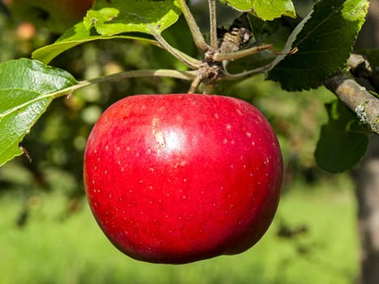
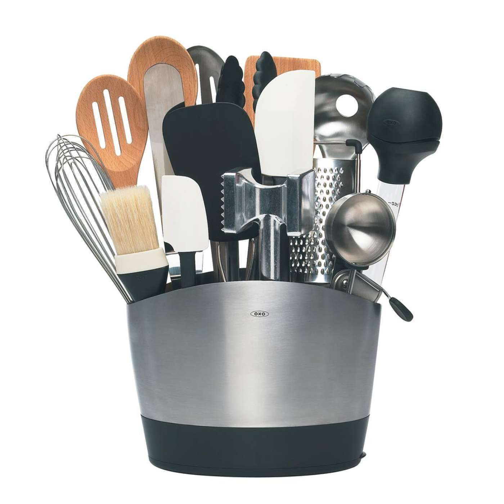

***************
English Notes 2
***************

**业精于勤，荒于嬉；行成于思，毁于随。**

| headroom
| Definition: the space above a driver's head in a vehicle.
| Definition: the space or clearance between the top of a vehicle and the underside of a bridge.
| Usage: There's a lot of headroom for such a small car.
| 
| subsume
| subsumable
| subsumption
| Definition: include or absorb something in something else.
| Usage: Most of these phenomenan can be subsumed under two broad catagories.
|
| superset
| Definition: a set that includes another set or sets.
|
| by/in virtual of
| Synonyms: because of; as a result of.
| Usage: older 32-bit software may be supported by virtue of the 64-bit instruction set being a superset of the 32-bit one.
|
| abound
| Definition: exists in large number or amount.
| Usage: Rumors of a further scandal abound.
| Phrase: abound in/with
| Usage: This land abounds with wildlife.
| 
| doppelganger
| Definition: a person's doppelganger is another person who looks exactly like them.
| Usage: He has a doppelganger named Donald, his invented twin brother.
| 
| invent
| Definition: make up (an idea, name, story, etc.), especially so as to deceive.
| Usage: I didn't have to invent any tales about my past.
| 
| imposter
| Definition: a person who pretends to be someone else so as to deceive others, especially for fraudulent gain.
| 
| margin
| marginal
| Definition: relating to or suited at the edge or margin of something.
| Usage: Margin notes.
| Definition: of secondary or minor importance; not central.
| Usage: It seems to make only a marginal difference.
| 
| avalanche
| Definition: a mass of snow, ice, or rocks falling rapidly down a mountainside.
| Usage: An avalanche of mud. [泥石流]
| Definition: a sudden arrival or occurrence of something in overwhelming quantities.
| Usage: We received an avalanche of letters to replay our advertisement.
| 
| jersey [ジャージー服]
| Definition: a knitted garment with long sleeves worn over the upper body.

.. image:: images/jersey.jpg

| coffer
| Definition: a strongbox used to store money or valuable things. [保险柜，金库]
| Definition: the funds or the finacial reserves of an institution or organization.
| Usage: The ferderal government's empty coffer.
| 
| strongbox
| Definition: a small lockable box, typically made of metal, in which valuables are kept.
| 
| crimson
| Definition: something is crimson is deep red in color.
| Definition: if someone goes crimson, their face becomes red because they are angry or embarrassed.
| Usage: I used to refuse invitations to parties because I knew I'd go crimson every time someone talked to me.
| 
| slicker
| Definition: a raincoat made of smooth material.
| Definition: a person who is smooth and persuasive but untrustworthy.
| Usage: A permatanned slicker who involves her in embezzlement and fraud.

.. image:: images/slicker.jpg

| macintosh
| mackintosh
| Definition: a full-length waterproof coat.
| Origin: named after Charles Macintosh (1766–1843), the Scottish inventor who originally patented the cloth.
| Definition: from Macintosh, the brand name of a range of computers manufactured by Apple Inc.

.. image:: images/macintosh.jpg

| permatanned
| perma-tanned
| Definition: permanently suntanned.
| 
| suntan
| suntanned
| Definition: a browning of skin caused by exposure to the sun. [古铜色肤色]
| Usage: He had acquired quite a suntan.
| Usage: A suntanned face.

.. image:: images/suntanned_skin.jpg

| McIntosh
| McIntosh red
| Definition: a dessert apple of a variety native to North America, with deep red skin.
| Origin: named after John McIntosh (1777–1845), the American-born Canadian farmer on whose farm the apple was discovered as a wild variety.

| clarify
| clarification
| Definition: to explain something in detail.
| Usage: A bank spokeman was unable to clarify the situation.
| Usage: The union has written to the minister asking for clarification of the government's controversial decision.
| 
| bog
| Definition: a bog is an area of land which is very wet and muddy.
| Definition: toilet.
| Phrase: bog down
| Definition: if a plan or process is bogged down or something bogs it down, it is delayed and no progress is made.
| Usage: The talk has been bogged down over the issue os military reform.
| 
| opportunist
| opportunity
| opportunistic [机会主义，投机者]
| Definition: exploiting chances offered by immediate circumstances without reference to a general plan or moral principle.
| Usage: The change was cynical and opportunistic.
| Definition: (of a plan or animal) able to spread quickly in a previously unexploited habit.
| Definition: (of a microorganism or an infection caused by it) rarely affecting patients except in unusual circumstances, typically when the immuine system is depressed.
| Usage: Most burglaries are committed by casual opportunists.
| Usage: The calculating and opportunistic politician.
| Phrase: opportunity knocks.
| Definition: a changce for success or advancement occurs.
| 
| allusion
| Definition: an indirect reference to somebody or something.
| Usage: The last point was understood to be an allusion to the long-standing hostility between the two leaders.
| 
| synthesize
| synthesise
| Definition: to produce something by means of chemical or biological reactions.
| Synonyms: manufacture.
| Definition: If you synthesize different ideas, facts, or experiences, you combine them to form a single idea or impression.
| Synonyms: fuse.
| Usage: Darwinian theory has been synthesized with modern genetics.
| 
| wrap
| Definition: cause (a word or sentence) to be carried over to a new line automatically as the margin is reached, to fit around embedded features such as pictures.
| Usage: Words are wrapped to the next line if they are too long.
| Definition: finish filming or recording. [杀青]
| Usage: We wrapped on schedule three days later.
| Definition: a veil of secrecy maintained about something, especially a new project.
| Usage: Details of the police operation are being kept under wraps.
| Phrase: wrap something up
| Definition: win a game or competition.
| Synonyms: trounce; thrash.
| Usage: Australia wrapped up the series 4-0.
| Definition: complete or conclude a discussion or agreement.
| Usage: They hope to wrap up negotiations within sixty days.
| Phrase: be wrapped up in.
| Definition: be so absorbed in (something) that one doesn't notice other people or other things.
| Usage: He was too wrapped up in the historic importance of his compaign.
| Phrase: wrap up
| Definition: (also wrap someone up) put on (or dress someone in) warm clothes.
| Usage: Tim was well wrapped up against the weather.
| Definition: (also wrap it up) be quite; stop talking or making a noise. 
| 
| top-notch
| top-notcher
| Definition: of the highest quality.
| Usage: a top-notch hotel.
| 
| atrocious
| Definition: of a very poor quality; extremely bad or unpleasant.
| Usage: He attempted an atrocious imitation of my English accent.
| Definition: horrifyingly wicked.
| Usage: Atrocious cruelties.
| 
| back-burner
| Definition: postpone consideration of or an action on.
| Usage: A planned test of new ale has been back-burnered.
| 
| silver bullet
| Definition: a bullet made of silver, used in fiction as a supposedly magical method of killing werewolves.
| Definition: a simple and seemingly magical solution to a complicated problem.
| Usage: There is no silver bullet here that will make the biosimilar market go gangbusters.
|
| low-hanging fruit [唾手可得]
| Definition: a thing or person that can be won, obtained, or persuaded with little effort.
| Usage: we know mining our own customer base is low-hanging fruit.
|
| salvage
| Definition: rescue (a wrecked or disabled ship or its cargo) from loss at sea.
| Definition: If you manage to salvage a difficult situation, you manage to get something useful from it so that it is not a complete failure.
| Usage: Diplomats are still hoping to salvage something from the meeting.
| 
| oxymoron
| oxymoronic [自相矛盾]
| Definition: a figure of speech in which apparently contradictory terms appeared in conjunction.
| Usage: Faith unfaithful kept him falsely true.
| 
| compendium
| Definition: a short but detailed collection of information, usually in a book.
| Usage: The Roman Catholic Church has issued a compendium of its teachings.
| 
| blindside
| blind side [盲点]
| Definition: a direction in which a person has a poor view of approaching traffic or danger.
| Definition: hit or attack (someone) on their blind side.
| Usage: A punch delivered on the referee's blind side.
| Definition: make (someone) unable to perceive the truth of a situation.
| Usage: We got blindsided by our own government.
| 
| stumble
| Definition: trip or momentarily lose one's balance; almost fall. [蹒跚，踉跄]
| Usage: I stumbled into the telephone box and dialed 911.
| Definition: make a mistake or repeated mistakes in speaking.
| Usage: She stumbled over the words. [结结巴巴]
| Definition: stumble across/on/upon
| Usage: A policeman stumbled across a gang of youths.
| 
| extol
| Definition: to praise (someone or something) enthusiastically.
| Usage: He extolled the virtues of the Russian people.
| 
| one-stop
| Definition: a one-stop shop is a place where you can buy everything you need for a particular purpose.
| 
| streak
| Definition: a long stipe or mark on a surface which contrasts with the surface because it's a different color.
| Usage: There are dark streaks on the surface of the moon.
| Usage: A streak of oil. [油迹线]
| Definition: a narrow line of bacteria smeared on the surface of a solid culture medium. [固态培养基]
| 
| show-stopping
| Definition: a show-stopping performance or product is very impressive.
| 
| roadblock [路障]
| Definition: a barrier or barricade on a road, especially one set up by the authorities to stop and examine traffic.
| Definition: a hindrance or obstruction.
| Usage: The biggest roadblock to solar power is its price tag.
|  
| wreak
| Definition: cause (a large amount of damage or harm).
| Usage: Torrential rainstorm wreaked havoc yesterday.
| Definition: inflict (vengeance).
| Usage: He swore to wreak vengeance on those who had betrayed him.
| 
| kitchen sink
| Definition: a sink in a kitchen, used for washing dishes and preparing food. [水池]
| Usage: The traditional view of women as dedicated housewives tied to the kitchen sink is all but extinct.
| Definition: (in art forms) characterized by great realism in the depiction of drab or sordid subjects.
| Usage: a kitchen-sink drama. [极端现实主义戏剧]
| Pharse: everything but the kitchen sink
| Usage: everything imaginable.

.. sidebar:: Kitchen-sink drama

   .. image:: images/kitchen-sink-drama.jpg

Kitchen sink realism (or kitchen sink drama) is a term coined to describe a British cultural movement
that developed in the late 1950s and early 1960s in theatre, art, novels, film and television plays,
whose protagonists usually could be described as "angry young men" who were disillusioned with modern
society.

|
| drab [单调乏味]
| Definition: lacking brightness or interest; drearily dull.
| Usage: the landscape was drab and gray. 
| 
| sordid
| Definition: involving ignoble actions and motives; arousing moral distaste and contempt.
| Usage: The story paints a sordid picture of bribes and scams.
| Definition: very dirty and unpleasant. [污秽不堪]
| Usage: The overcrowded housing conditions were sordid and degrading.
| 
| proverbial
| Definition: (of a word or phrase) referred to in a proverb or idiom.
| Usage: I'm going to stick out like the proverbial sore thumb.
| Definition: well known, especially so as to be stereotypical.
| Usage: The Welsh people, whose hospitality is proverbial.
| 
| stick/stand out like a sore thumb
| Definition: to be very obvious or noticeable.
| Usage: Do you think I would stick out like a sore thumb at the party if I wear this coat?
| 
| glean 
| Definition: extract (information) from various sources.
| Usage: The information is gleaned from press clippings.
| Definiton: gather (leftover grain or other produce) after a harvest (as noun gleaning). 
| Usage: The conditions of farm workers in the 1890s made gleaning essential. [捡拾麦穗]
|

Gleaning is the act of collecting leftover crops from farmers' fields
after they have been commercially harvested or on fields where it is
not economically profitable to harvest. It is a practice described in
the Hebrew Bible that became a legally enforced entitlement of the poor
in a number of Christian kingdoms.

.. figure:: images/The_Gleaners.jpg
   :align: center

   The Gleaners by Jean-François Millet, 1857

| 
| gyrate
| gyrator
| Definition: move or cause to move in a circle or spiral, especially quickly.
| Usage: Their wings gyrate through the water like paddle wheels.
| Definition: dance in a wild or suggestive manner.
| Usage: Strippers gyrated to rock music on a low stage. [脱衣舞]
| 
| axiom
| axiomatic
| Definition: self-evident or unquestionable.
| Usage: Tt is axiomatic that dividends have to be financed.
| Definition: chiefly Mathematics relating to or containing axioms. [公理]
| 
| comforter
| Definition: (North American) a warm quilt. [床被]
| Definition: a person or thing that provides consolation.
| 
| solace
| Definition: to give comfort or cheer to (a person) in time of sorrow or distress.
| Usage: His grandchildren were a solace in his old age. [安慰，慰藉]
| Usage: He tried to seek solace in the whisky bottle. [借酒浇愁]
|
| surefire
| Definition: a surefire thing is something that is certain to succeed or win.
| Synonyms: guaranteed.
| Usage: A surefire best seller.
| 
| backfire
| Definition: (of an engine) undergo a mistimed explosion in the cylinder or exhaust
| Usage: a car backfired in the road. [抛锚]
| Definition: (of a plan or action) rebound adversely on the originator; have the opposite effect to what was intended.
| Usage: overzealous publicity backfired on her. [适得其反]
| Definition: a fire set intentionally to arrest the progress of an approaching fire by creating a burned area in its path, thus depriving the fire of fuel.
| 
| disposition
| Definition: the way someone tends to behave or feel.
| Synonyms: character.
| Usage: The rides are unsuitable for people of a nervous disposition.
| 
| tweak
| Definition: If you tweak something, especially part of someone's body, you hold it between your finger and thumb and twist it or pull it.
| Usage: He tweaked Guy's ear roughly. [拧耳朵]
| Usage: "A handsome offer", she replied, tweaking his cheek. [捏脸颊]
| Definition: If you tweak such as a system or a design, you improve it by making a slight change.
| Synonyms: tune.
| Usage: He expects the system to get even better as the engineers tweak its performance.
| 
| abhore
| Definition: If you abhor something, you hate it very much, especially for moral reason.
| Synonyms: detest.
| Usage: If nature abhors a vacuum, journalists abhor a transition, when there is little news to cover.
|
| by no means
| Synonyms: not at all; certainly not.
| Antonyms: by all means.
| Usage: The result is by no means guaranteed.
| Usage: "May I make a suggestion?", "By all means." 
| 
| utensil
| Definition: an implement, container, or other article, especially for household use.
| Usage: Cooking / kitchen utensils. [炊具；厨房用具]

| pee
| Definition: urinate.
| Usage: The puppy was peeing on the caret.
| Usage: I really need to take a pee.
| Phrase: pee in one's pants
| Definition:  Literally, to urinate while still wearing one's clothing. 
| Usage: I need you to pull over the car right now, or else I'm going to pee my pants!
| Definition: To be absolutely petrified with terror; to be scared out of one's wits.[吓尿了]
| Usage: I was peeing my pants when that huge burly guy started threatening me and my girlfriend.
| Definition: To laugh in a hysterical or uncontrollable manner. [笑尿了]
| Usage: The joker had the audience peeing their pants!
|
| blister
| Definition: a small bubble on the skin filled with serum and caused by friction, burning, or other damage. [水泡，瘀伤]
| Usage: He had blistered feet.
| Definition: a small bubble or swelling, filled with air or fluid, on the surface of a plant, heated metal, painted wood, or other object.
| Usage: The surface of the door began to blister.
| Definition: British informal, dated an annoying person.
| Usage: the child is a disgusting little blister. [烦人精]
|
| rascal
| Definition: a mischievous or cheeky person, especially a child or man (typically used in an affectionate way).
| Usage: Come here, you little rascal. [淘气鬼，捣蛋鬼]
| 
| mischievous
| Definition: (of a person, animal, or their behavior) causing or showing a fondness for causing trouble in a playful way. 
| Usage: two mischievous kittens had decorated the bed with shredded newspaper.
| Definition: (of an action or thing) causing or intended to cause harm or trouble. 
| Usage: a mischievous allegation for which there is not a shred of evidence.
| 
| shred
| Definition: a strip of some material, such as paper, cloth, or food, that has been torn, cut, or scraped from something larger.
| Usage: Her beautiful dress was torn to shreds.
| 
| wistful 
| Definition: having or showing a feeling of vague or regretful longing.
| Usage: She sighed wistfully. [伤感地]
| Usage: “If only I had known you then,” he said wistfully.
|
| vague
| Definition: of uncertain, indefinite, or unclear character or meaning. 
| Usage: many patients suffer vague symptoms.
| Definition: thinking or communicating in an unfocused or imprecise way. 
| Usage: he had been very vague about his activities.
|

   
   Sucking finger

| 
| sidestep
| Definition: avoid (someone or something) by stepping sideways.
| Definition: avoid dealing with or discussing (something problematic or disagreeable).
| Usage: He neatly sidestepped the questions about riots.
| Usage: He cleverly sidestepped the tackle.
|
| tartar
| Definition: a hard calcified deposit that forms on the teeth and contributes to their decay. [齿垢]
| Definition: a deposit of impure potassium(钾) hydrogen tartrate formed during the fermentation of wine.
| 

   toothpaste and toothbrush

   
