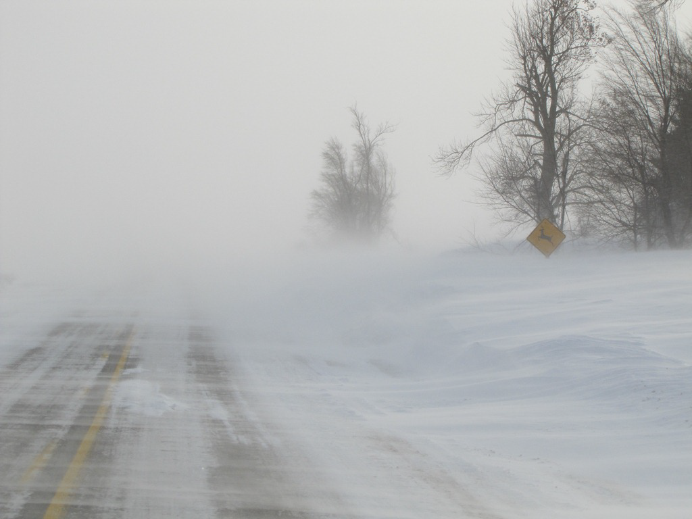
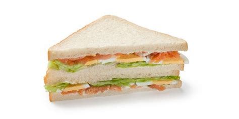

***************
English Notes 3
***************

**读未见书，如得良友；见已读书，如逢故人。**

| grain
| Definition: The longitudinal arrangement or pattern of fibres in wood, paper, etc.
| Usage: He scored along the grain of the table with the knife.
| Definition: the texture of wood, stone, etc., as determined by the arrangement and size of constituent  particles.
| Usage: The lighter, finer grain of the wood is attractive.
| Definition: give a rough surface or texture to.
| Usage: Her fingers were grained with chalk dust.
| Phrase: against the grain
| Definition: contrary to the natural inclination or feeling of someone or something.
| Usage: It goes against the grain to tell outright lies.
| Origin: From the fact that wood is easier to cut along the line of the grain.

| 
| quibble
| Definition: a slight objection or criticism. 
| Usage: the only quibble about this book is the price.
| Definition: argue or raise objections about a trivial matter. 
| Usage: they are always quibbling about the amount they are prepared to pay.
| 
| par
| Definition: the number of strokes a first-class player should normally require for a particular hole or course.
| Usage: The sixteen is a par five.
| Phrase: on a par with [等价于，相当于]
| Definition: equal in importance or quality to; on an equal level with. 
| Usage: this home cooking is on a par with the best in the world.
| Phrase: par for the course [合情合理]
| Definition: what is normal or expected in any given circumstances. 
| Usage: given the high standards of the food, the prices seem par for the course.
| Phrase: up to par [差不多？]
| Definition: at an expected or usual level or quality.
| Phrase: above (or below or under) par
| Definitin: better (or worse) than what is usual or expected.
| Usage: poor nutrition can leave you feeling below par.
| 
| empty-handed [一无所获]
| Definition: having failed to obtain or achieve what one wanted.
| Usage: the burglars fled empty-handed.
| Usage: They returned from the negotiations empty-handed and frustrated.
| Usage: She visited every Sunday and never arrived empty-handed.
| 
| passel
| Definition: a large group of people or things; a pack.
| Usage: a passel of journalists.
| 
| puffery [捧杀]
| Definition: exaggerated commendation especially for promotional purposes
| Usage: the newspaper's local stories are often thinly disguised puffery for area businesses.
| 
| rhapsody
| Definition: Music a free instrumental composition in one extended movement, typically one that is emotional or exuberant in character.
| Usage: Liszt's *Hungarian Rhapsodies*. [匈牙利狂想曲]
| Definition: an effusively enthusiastic or ecstatic expression of feeling.
| Usage: rhapsodies of praise.
| 
| effusive
| Definition: expressing feelings of gratitude, pleasure, or approval in an unrestrained or heartfelt manner.
| Usage: an effusive welcome.
| Definition: (Geology) (of igneous rock) poured out when molten and later solidified.
| 
| igneous
| Definition: (Geology) (of rock) having solidified from lava or magma.
| Definition: relating to or involving volcanic processes.
| Usage: igneous activity.
| 
| heartfelt 
| Definition: (of a feeling or its expression) sincere; deeply and strongly felt.
| Usage: our heartfelt thanks.
|
| lullaby [摇篮曲]
| Definition: A quiet, gentle song sung to send a child to sleep.
| 
| ballad
| Definition: a poem or song narrating a story in short stanzas. 
| Usage: A medieval ballad about a knight and a lady. [民谣，叙事诗]
| Definition: a small popular song about love. [情歌]
| Usage: Here latest single is a ballad.
| Origin: Traditional ballads are typically of unknown authorship, having been passed on orally from one generation to the next as part of folk culture.
|
| coalesce
| Definition: combine (elements) in a mass or whole.
| Synonyms:  amalgamate.
| Usage: the puddles had coalesced into shallow streams.
| Usage: his idea served to coalesce all that happened into one connected whole.
| 
| caveat
| Definition: a warning that particular things need to be considered before something can be done.
| 
| gotcha
| Definition: (non-standard) the written form of the way some people pronounce ‘I’ve got you’, which is not considered to be correct.
| Usage: ‘Gotcha!’ the child yelled as he grabbed his mother by the leg.
| Definition: (programming), a counter-intuitive, but documented, behavior in a computer system (as opposed to a bug)
| 
| severance
| Definition: the action of ending a connection or relationship. 
| Usage: a complete severance of links with the Republic.
| Definition: dismissal or discharge from employment. 
| Usage: employees were offered severance terms.
| 
| unassailable
| Definition: unable to be attacked, questioned, or defeated.
| Usage: an unassailable lead.
| Usage: Their ten-point lead puts the team in an almost unassailable position. 
| 
| compendious [简明扼要]
| Definition: containing or presenting the essential facts of something in a comprehensive but concise way.
| Usage: a compendious study.
| 
| unbending [固执，不屈]
| Definition: strict and austere in one's behavior or attitudes.
| Usage: they were unbending in their demands 
| Usage: his unbending iron will.
| Definition: (often disapproving) unwilling to changed one's opinions, decisions, etc.
| 
| austere
| Definition; severe or strict in manner, attitude, or appearance. [庄重严肃]
| Usage: an austere man, with a rigidly puritanical outlook.
| Usage: an austere expression.
| Definition: (of living conditions or a way of life) having no comforts or luxuries; harsh or ascetic.
| Usage: conditions in the prison could hardly be more austere. [简陋]
| Definition: having an extremely plain and simple style or appearance; unadorned.
| Usage: the cathedral is impressive in its austere simplicity. [朴实无华]
| Definition: (of an economic policy or measure) designed to reduce a budget deficit, especially by cutting public expenditure. [财政紧缩]
| 
| sabotage
| saboteur
| Definition: a person who engages in sabotage.
| Usage: Saboteurs blew up a small section of the track. 
| Definition: deliberately destroy, damage, or obstruct (something), especially for political or military advantage.
| 
| 
| hall of fame
| Definition: If you say that someone is a member of a particular hall of fame, you mean that they are one of the most famous people in that area of activity.
| Usage: Yao Ming enters Hall of Fame as global ambassador of basketball.
| 
| orchestrate
| Definition: arrange or score (music) for orchestral performance.
| Definition: arrange or direct the elements of (a situation) to produce a desired effect, especially surreptitiously.
| Usage: the developers were able to orchestrate a favorable media campaign.
| 
| surreptitious
| surreptitiously
| Definition: in a way that attempts to avoid notice or attention; secretively.
| Usage: Mary surreptitiously slipped from the room.
| Usage: surreptitiously recorded conversations.
| Usage: they carried on a surreptitious affair.
| 
| itinerary 
| Definition: An itinerary is a plan of journery, including the route an the places you will visit. 
| Usage: the next place on our itinerary was Silistra.
| 
| persona
| Definition: the aspect of someone's character that is presented to or perceived by others. In psychology, often contrasted with anima。
| Usage: His public persona is quite different from the family man described in the book. [持家男人]
| Definition: role or character adopted by an author or an actor.
| 
| anima
| Definition: (Psychology) Jung's term for the feminine part of a man's personality. Often contrasted with animus (sense 3).
| Definition: the part of the psyche that is directed inward, and is in touch with the subconscious. Often contrasted with persona.
| Origin: 1920s: from Latin, literally ‘mind, soul.’
| 
| animus
| Definition: hostility or ill feeling
| Definition: Psychology Jung's term for the masculine part of a woman's personality. Often contrasted with anima.
| Usage: the author's animus toward her.
| Definition: motivation to do something.
| Usage: the reformist animus came from within the Party.
| Origin: early 19th century: from Latin, ‘spirit, mind.’
|
| spawn
| Definition: when fish or animals such as frogs spawn, they lay eggs. [产卵]
| Usage: the fish spawn among fine-leaved plants.
| Usage: why had she married a man who could spawn a boy like that?
| Definition: the eggs of fish.
| Usage: The fish covers its spawn with gravel.
| Definition: produce or generate, especially in large numbers.
| Usage: the decade spawned a bewildering variety of books on the forces.
| Definition: (computing) generate (a dependent or subordinate computer process).
| 
| gravel
| Definition: a loose aggregation of small water-worn or pounded stones.
| Synonyms: pepple. [鹅卵石]
| Definition: a mixture of small stones with coarse sand, used for paths and roads and as an aggregate.
| Definition: make (someone) angry or annoyed.
| Usage: this was a bad strike, and it graveled him to involve himself in it.

| whiteout
| Definition: a blizzard, especially in polar regions, that reduces visibilities to near zero.
| Definition: white correction fluid for covering typing or writing mistakes. [涂改液]
| Definition: a loss of color vision due to rapid acceleration, often before a loss of consciousness. [眩晕]
| 
| blizzard
| Definition: a severe snowstorm with high winds and low visibility.
| Definition: an overabundance; a deluge. [臃肿庞杂]
| Usage: a blizzard of legal forms.

| when it rains it pours [祸不单行]
| Definition: proverb misfortunes or difficult situations tend to follow each other in rapid succession or to arrive all at the same time.
| 
| when it comes to
| Definition: used to identify the specific topic that is being talked about.
| Usage: When it comes to playing chess, he's the best I know.
|
| underdog
| Definition: a competitor thought to have little chance of winning a fight or contest.
| Definition: a person who has little status in society.
| Origin: late 19th century: with reference to the beaten dog in a dogfight.
| 
| leave-taking
| Definition: an act of saying goodbye.
| Synonyms: farewell.
| Usage: the leave-taking was restrained, with none of her earlier displays of emotion.
| 
| earsplitting
| Definition: extremely loud. [震耳欲聋]
| Usage: an ear-splitting crack of thunder.
| 
| insufferable
| Definition: too extreme to bear; intolerable.
| Usage: the heat would be insufferable by July.
| Definition: having or showing unbearable arrogance or conceit.
| Usage: an insufferable bully.
| Usage: insufferable French chauvinism.
| 
| interwine
| Definition: twist or twin together.
| Synonyms: entwine.
| Definition: connect or link (two or more things) closely.
| Usage: Dickens has been very clever to intertwine all these aspects and ideas.
| Usage: Our fates have been entwined, Elizabeth, but never joined.
| 
| parenthesis
| Definition: an interlude or interval.
| Usage: the three
| Usage: In parenthesis I should say that I am passing quickly over the significance of these matters.
| 
| Phrase: the new normal
| Definition: a previously unfamiliar or atypical situation that has become standard, usual, or expected.
| Usage: 32% of Americans say spending less is the new normal, according to a recent poll.
| 
| attypical [非典型的，反常的]
| Definition: not representative of a type, group, or class.
| Usage: a sample of people who are rather atypical of the target audience.
| 
| evocation
| Definition: the action of invoking a spirit or deity.
| Usage: the evocation of wandering spirits. [召唤]
| Definition: the act of bringing or recalling a feeling, memory, or image to the conscious mind. [共鸣]
| Usage: his 560-page epic is a detailed, moving evocation of childhood.
| 
| single out
| Definition: If you single out someone from a group, you choose them and give them special attention or treatment.
| Usage: The gunman had singled Debilly out and waited for him.
| 
| issue from
| Definition: come, go, or flow out from.
| Usage: exotic smells issued from a nearby building.
| Definition: result or be derived from.
| Usage: the struggles of history issue from the divided heart of humanity.
| 
| aura
| Definition: the distinctive atmosphere or quality that seems to surround and be generated by a person, thing, or place. [气质，气场]
| Usage: the ceremony retains an aura of mystery.
| Synonyms: atmosphere, air.
| Definition: (in spiritualism and some forms of alternative medicine) a supposed emanation surrounding the body of a living creature and regarded as an essential part of the individual.
| Usage: emotional, mental, and spiritual levels form an energy field around the body known as the aura. [小宇宙?]
| Definition: any invisible emanation, especially an odour.
| Usage: there was a faint aura of disinfectant.
| Definition: (medicine) a warning sensation experienced before an attack of epilepsy[癫痫] or migraine [偏头痛].
| 
| emanation
| Definition: an abstract but perceptible thing that issues or originates from a source.
| Usage: she saw the insults as emanations of his own tortured personality.
| Definition: a tenuous substance or form of radiation given off by something.
| Usage: vaporous emanations surround the mill's foundations.
| Definition: (in various mystical traditions) a being or force that is a manifestation of God. [替身]
| 
| tenuous
| Definition: very slender or fine.
| Usage: a tenuous cloud.
| Definition: very weak or slight.
| Usage: the tenuous link between interest rates and investment.
| 
| triangular
| Definition: shaped like a triangle; having three sides and three corners.
| Usage: dainty triangular sandwiches.
| Definition: involving three people or parties.
| Usage: a triangular relationship.

