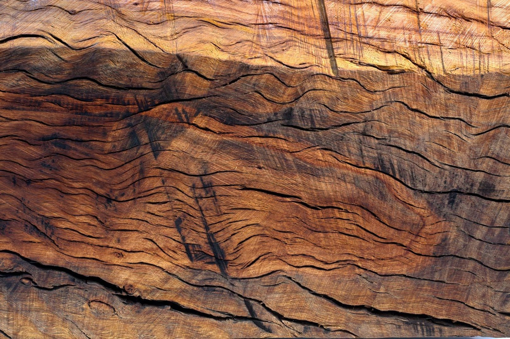
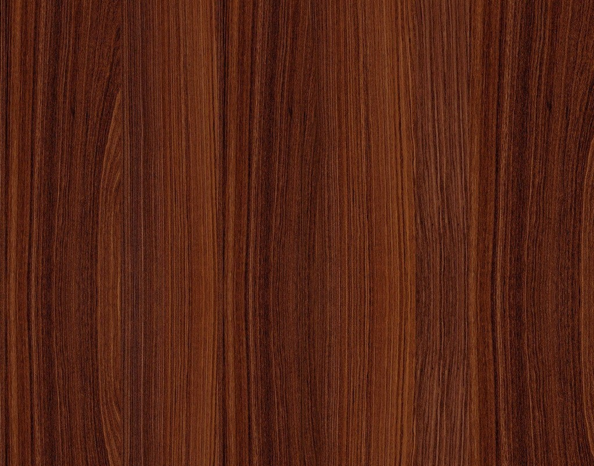

***************
English Notes 3
***************

| grain
| Definition: The longitudinal arrangement or pattern of fibres in wood, paper, etc.
| Usage: He scored along the grain of the table with the knife.
| Definition: the texture of wood, stone, etc., as determined by the arrangement and size of constituent  particles.
| Usage: The lighter, finer grain of the wood is attractive.
| Definition: give a rough surface or texture to.
| Usage: Her fingers were grained with chalk dust.
| Phrase: against the grain
| Definition: contrary to the natural inclination or feeling of someone or something.
| Usage: It goes against the grain to tell outright lies.
| Origin: From the fact that wood is easier to cut along the line of the grain.

