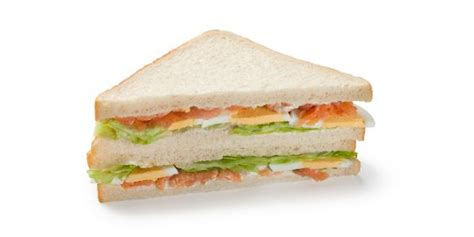

***************
English Notes 4
***************

**Open your mind**

| head/top the bill [领衔主演]
| Definition: be the main performer or act int the show, or play, etc.
| Usage: Topping the bill tonight will be Robbie Williams.
| 
| bill and coo [卿卿我我]
| Definition: behave or talk in a very loving or sentimental way.
| Usage: All my sister and her boyfriend do is bill and coo - It's nauseating.
| 
| nauseate
| nauseated
| nauseating
| Definition: make (someone) feel sick; affect with nausea.
| Usage: The thought of food nauseated her.
| Definiton: fill (someone) with revulsion; disgust. [令人作呕]
| Usage: I was nauseated by the vicious comment.
| 
| nausea
| Definiton: the felling that you have when you want to vomit, for example because you are ill or are disgusted by something.
| Usage: Nausea and vomitingare common symptoms.
| Definiton: loathing; revulsion; intented to induced a feeling of nostalgia.
| Usage: It only induces in me a feeling of nausea.
| 
| seasick
| seasickness [晕船]
| Definition: suffering from sickness or nausea caused by the motion of a ship at sea.
| 
| loathe
| loathing
| Definition: feel intense dislike or disgust for.
| Usage: She loathed him on sight.
| 
| revulsion
| Definiton:a sense of disgust and loathing.
| Usage: News of the attack will be met with sorrow and revulsion.
| Definiton: (Medicine) the drawing of disease blood congestion from one part of the body to another, e.g., by counterirrigation.
| 
| counterirritant
| counterirrigation
| Definiton: something such as heat or an ointment that is used to produce surface irritation of the skin, thereby counteracting underlying pain or | discomfort. 
| 
| ointment [膏药，美白霜，防嗮霜 -_-!]
| Definition: a smooth oily preparation that is rubbed on the skin for medicinal purposes or as a cosmetic.
| Synonyms: sun oil.
|
| delegate
| delegation
| Definition: a delegate is a person who is chosen to vote or make decisions on behalf of a group of other people, especially at a conference or meeting.
| Synonyms: representive.
| Definiton: If you delegate duties, responsibilities, or power to someone, you give them those duties, responsibilites, or that power so that they can act on | your behalf.
| Synonyms: appoint.
| Usage: How many of their activities can be safely and effectively delegated to less trained staff?
| Usage: Officials have now been delegated to start work on a draft settlement.
| 
| scenario
| Definition: The scenario of a film is a piece of writing that gives an outline of the story.
| Definition: if you talk about a likely or possible scenario, you are taking about the way in which a situation may develop.
| Usage: Try to imagine all the possible scenarios and what action you would take. 
| 
| squelch
| Definition: If you squelch something that is causing you trouble, for example rumors or oppositions, you firmly put a stop to it.
| Synonyms: squash; suppress.
| Usage: The President wants to squelch any perception that the meeting is an attempt to negotiate.
| Definition: To squelch means to make a wet, sucking sound, like the sound you make when you are walking on wet, muddy group.
| 
| apostle [使徒]
| Definition: each of the twelve chief disciples of Jesus Christ.
| Usage: The twelve Apostles. [耶稣十二门徒]
| 
| ill-fated
| Definiton: marked by or promising bad fortune.
| Usage: An ill-fated expedition.
| 
| caries [龋齿]
| Definiton: soft decayed area in a tooth, progressive decay can lead to the death of a tooth.
| 
| singsong
| Definition: (of a person's voice) having a repeated rising and falling rhythm.
| Usage: The singsong voices of children reciting tables.
| 
| meter
| Definition: a device that measures and records the quantity, degree, or rate of something.
| Usage: an electricity meter. [电流表/电压表]

.. image:: images/meter_2.png

| 
| mensurable
| mensurability
| Definition: capable of being measured; having fixed limited.
|
| suffice
| Definition: to be enough to achieve a purpose or to fulfil a need.
| Usage: Two examples should suffice to prove the contention.
| Usage: Simple mediocrity cannot suffice them.
| Phrase: suffice (it) to say
| Definition: used to indicate that one is saying enough to make one's meaning clear while withholding something for reasons of discretion or brevity.
| Usage: Suffice it to say that they were not considered suitable for this project.
| 
| supersede
| Definition: to replace something because it has become old-fashioned or unacceptable.
| Synonyms: supplant.
| Usage: Hand tools are relics of the past that have now been superseded by the machine.
|
| tweet
| Definition: the chirp of a small or young bird.
| Definition: a posing made on the social media website Twitter.
| Usage: He started posting tweets via his cell phone to let his parents know he was safe.

| 
| converse
| Definition: to make conversation with someone.
| Usage: They were conversing in German, their only common language.
| Definition: The converse of a statement is its opppsite or reverse.
| Usage: If spirituality is properly political, the converse is also true: the politics is properly spiritual.
| Definition: having characteristics which are the reverse of something else mentioned earlier.
| Usage: The only mode of change will be the slow process of growth, and the converse process of decay.
| 
| aforementioned
| Definition: the person or thing that has already been mentioned.
| Synonyms: aforedsaid.
| Usage: This is the draft of a declaration that will be issued at the end of the aforementioned UN conference.
| 
| arena
| Definition: a place with seats where sports, entertainments, and other public events take place.
| Synonyms: stadium.
| 
| hebdomadal
| Synonyms: weekly
| Usage: He was forced to eke out a meager living scribbing hebdomadal feuilletons.
| 
| feuilleton
| Definition: a part of newspaper or magazine devoted to fiction, criticism, or light literature.
|
| automaton
| Plural: automata
| Definition: An automaton is a small, mechanical figure that can move automatically; machine.
| Usage: Sophisticated automata continue to run factory assembly line.
| Definition: used to refer to a person who seems to act in a mechanical or unemotional way.
| Usage: Like an automaton, she walked to the door.
| 
| Tom, can you give me off the hook? for old time's sake. [求情]  
| Can't do it, Sally.
|
| avatar
| Definition: (in Hinduism and Buddhism) a god appearing in a physical form. [化身]
| Definition: a picture which represents a person on computer screen, especially in a game or chat room. [头像]
| 
| interlink
| interlinkage
| Definition: join or connect (two or more things) together.
| Usage: Agreement has been reached to interlink the airport's two baggage systems.
| Usage: The film, Puls Fiction, written and directed by Quentin Tarantino, consists of a series of short interlinking stories.
| 
| hoagie
| Definition: a long piece of bread filled with meat, cheese and salad.
| Synonyms: submarine sandwich.
| triangular
| Definition: shaped like a triangle; having three sides and three corners.
| Usage: dainty triangular sandwiches.
| Definition: involving three people or parties. [三角关系]
| Usage: a triangular relationship.

| powder
| powdery
| Definition: consisting of or resembling powder.
| Usage: powdery snow.
| Definition: covered with powder.
| Usage: her pale powdery cheeks.
| 
| commiserate
| commiserative
| Definition: express or feel sympathy or pity; sympathize.
| Usage: she went over to commiserate with Rose on her unfortunate circumstances.
| Definition: archaic feel, show, or express pity for (someone).
| Usage: she did not exult in her rival's fall, but, on the contrary, commiserated her.
| 
| refurbish
| Definition: renovate and redecorate (something, especially a building).
| Usage: the premises have been completely refurbished in our corporate style.
| 
| tavern [小卖部]
| Definition: an establishment for the sale of beer and other drinks to be consumed on the premises, sometimes also serving food.
| 
| premise
| Definition: an assertion or proposition which forms the basis for a work or theory.
| Usage: the fundamental premise of the report.
| Definition: base an argument, theory, or undertaking on. 
| Usage: the reforms were premised on our findings.
| Definition: a house or building, together with its land and outbuildings, occupied by a business or considered in an official context.
| Usage: business premises.
| Usage: supplying alcoholic liquor for consumption on the premises.

| hard-hitting
| Definition: not afraid to talk about or criticize sb / sth in an honest and very direct way.
| Usage: a hard-hitting speech [直言不讳；单刀直入；一针见血]
| Definition: (of an athlete or athletes) aggressive and physical.
| Usage: the game's grunting, hard-hitting defense.
| 
| pucker
| Definition: (especially with reference to a person's face) tightly gather or contract into wrinkles or small folds.
| Usage: her brows puckered in a frown.  
| Usage: the baby stirred, puckering up its tiny face.
| Usage: a pucker between his eyebrows.

| brow
| Definition: a person's forehead. [额头]
| Usage: he wiped his brow.
| Definition: (usually brows) an eyebrow.
| Usage: his brows lifted in surprise.
| 
| eyebrow [眉毛]
| Definition: the strip of hair growing on the ridge above a person's eye socket.
| Phrase: raise one's eyebrows (or an eyebrow)
| Definition: show surprise, disbelief, or mild disapproval.
| Phrase: be up to one's eyebrow in sth.
| Definition: to have a lot of thing to deal with.
| 
| hoister
| Definition: raise (something) by means of ropes and pulleys.
| Usage: high overhead great cranes hoisted girders.
| Definition: raise or haul up.
| Usage: she hoisted her backpack onto her shoulder.
| Phrase: hoist one's flag [接任]
| Definition: (of an admiral) take up command. 
| Phrase: hoist the flag [宣示主权]
| Definition: stake one's claim to discovered territory by displaying a flag. 
| Phrase: hoist with (or by) one's own petard [机关算尽太聪明，反误了卿卿性命]
| Definition: have one's plans to cause trouble for others backfire on one. [from Shakespeare's Hamlet]
| Usage: He has no one to blame but himself; he was hoisted by his own petard. [自食其果]
| 
| petard
| Definition: a small bomb made of a metal or wooden box filled with powder, used to blast down a door or to make a hole in a wall.
| Definition: a kind of firework that explodes with a sharp report.

| scythe
| Definition: a tool used for cutting crops such as wheat or grass, with a long cruved blade at the end of a long pole attached to which are one or two | short handles.

   
   Parts of a scythe:：

      1. Toe               2. Chine
      3. Beard             4. Heel
      5. Tang              6. Ring
      7. Snath or snaith   8. Grips

| gaff
| Definition: a stick with a hook, or a barbed spear, for landing large fish.

.. image:: images/skiff_from_above.jpg

   Parts of a canoe::

      gunwale [船舷] stern [船尾]

   在西洋航海史中，有一段时期是让海员站在船体右舷一块名为「Starboard」的板子上驾驶船舶，
   因此后人便延用「Starboard」一语称呼右舷；反之，位於船体左舷（Port）一块名为「Larboard」
   的板子则是专用於装卸货物，因此以「Larboard」称呼左舷，但在船舶货物装卸方式改变后，便将它
   舍弃不用，改以「Port」一语称呼左舷。 也正因为有前述的历史，后来才进一步形成「右舷为尊」的观念，
   更造成船体右舷结构有一段时期是由资深木工师傅（Shipwright）负责施工。

| treachery
| treacherous
| treacherousness
| Definition: betrayal of trust; deceptive action or nature.
| Usage: his resignation was perceived as an act of treachery.
| Usage: memory is particularly treacherous.
| Definition: (of ground, water, conditions, etc.) hazardous because of presenting hidden or unpredictable dangers.
| Usage: a vacationer was swept away by treacherous currents. [暗流]
| 
| coagulate
| Definition: (of a fluid, especially blood) change to a solid or semisolid state.
| Usage: blood had coagulated around the edges of the wound.
| 
| slant
| Definition: slope or lean in a particular direction; diverge or cause to diverge from the vertical or horizontal.
| Usage: slant your skis as you turn to send up a curtain of water.
| 
| teeter
| Definition: move or balance unsteadily; sway back and forth.
| Usage: she teetered after him in her high-heeled sandals.
| Phrase: teeter on the brink (or edge) [处于...边缘]
| Definition: be very close to a difficult or dangerous situation.
| Usage: the country teetered on the brink of civil war.
| 
| debauch 
| Definition: destroy or debase the moral purity of; corrupt.
| Definition: (dated) seduce (a woman).
| Usage: he debauched sixteen schoolgirls.
| 
| conscientious
| conscientiously [兢兢业业，一丝不苟]
| Definition: taking care to do things carefully and correctly.
| Usage: She performed all her duties conscientiously.
| 
| laden
| Definition: heavily loaded or weighed down.
| Usage: a tree laden with apples.
| Usage: a heavily / fully laden truck.

