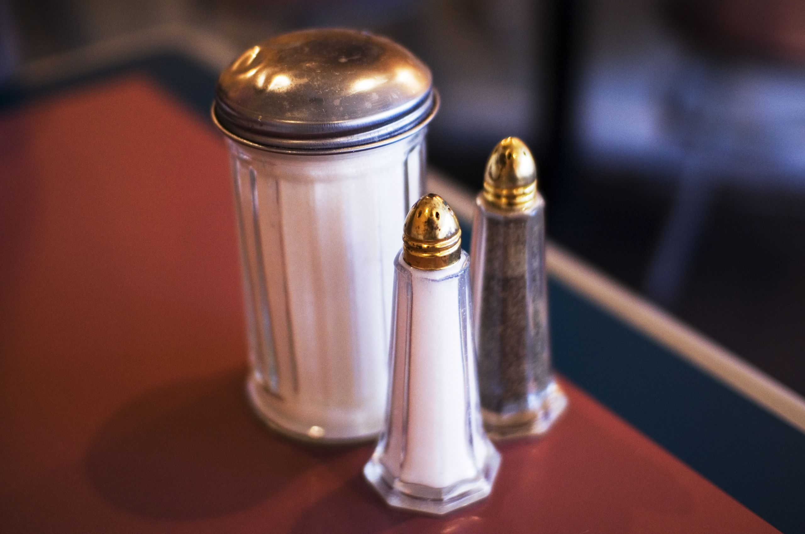
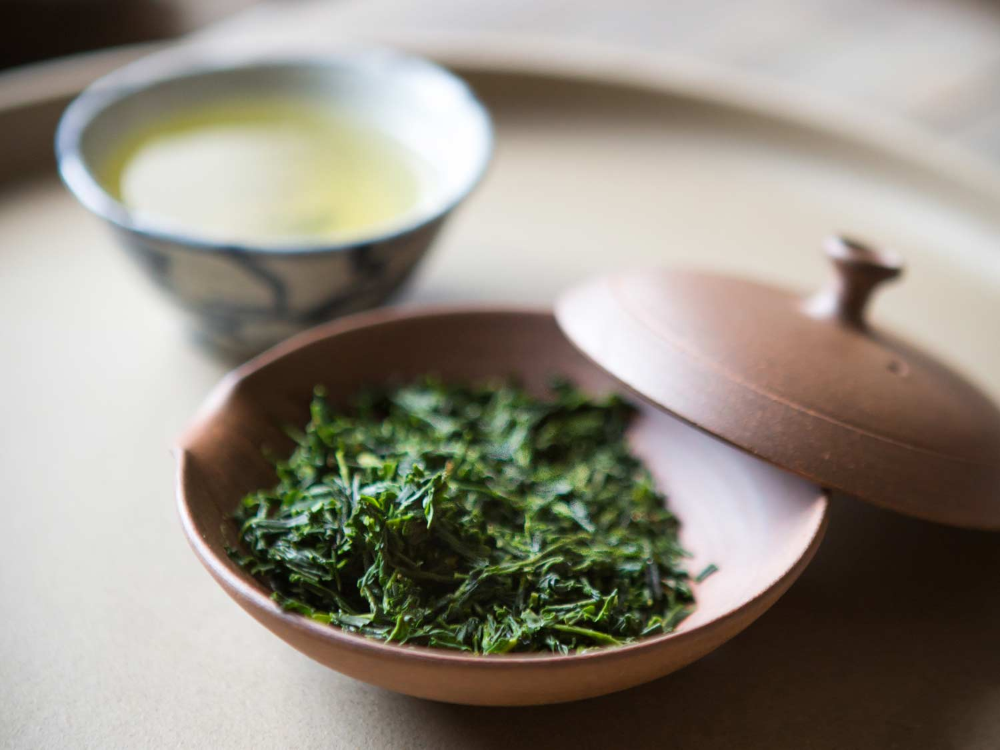
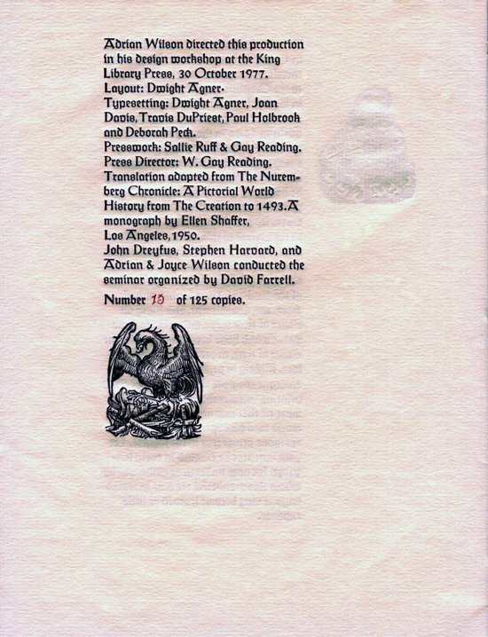
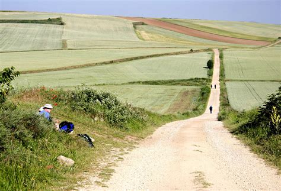
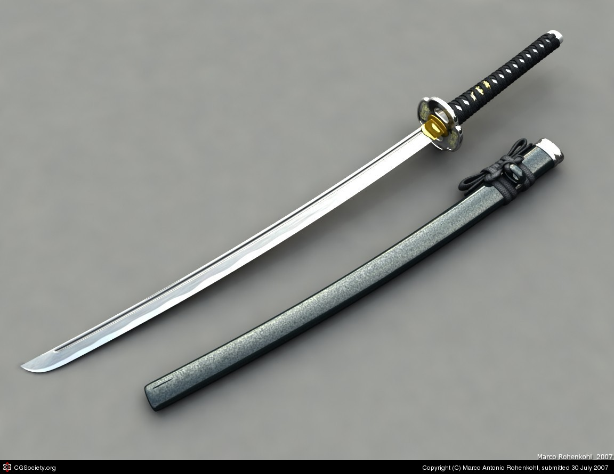

***************
English Notes 5
***************

**What's important is finding that one thing that will truly put your heart at rest.**

| 
| diet
| dietary
| Definition: relating to diets or dieting.
| Usage: dietary advice for healthy skin and hair.
| Usage: Animal research showed that breast tumours struggled without the dietary nutrient asparagine. [天冬氨酸]
| Definition: provided by one's diet.
| Usage: the average dietary calcium intake was 140 milligrams per day.
| 
| char
| Definiton: partially burn (an object) so as to blacken its surface.
| Usage: Their bodies were badly charred in the fire.
| 
| culinary [烹饪]
| Definition: culinary means concerned with cooking.
| Usage: She was keen to acquire more advanced culinary skills.
| 
| condiment [调料，酱汁]
| Definition: a substance such as salt or ketchup(番茄酱) that is used to add flavor to food.
| 
| churn
| Definition: a machine or container in which butter is made by agitating milk or cream.
| Phrase: churn something out
| Definition: produce something routinely or mechanically, especially in large quantities.
| Usge: many artists continued to churn out insipid, shallow works.

.. image:: images/butter_churn.png

   Salt, pepper, and sugar are commonly placed on Western restaurant tables.

| Profiterole 泡芙
| Definition: a small hollow pastry typically filled with cream and covered with chocolate sauce.
| choux  高麗萊
| Definition: very light pastry made with egg, typically used for eclairs and profiteroles.
| pastry [油酥麪团，油酥麪皮]
| Definition: a dough of flour, and water, used as a base and covering in baked dishes such as pies.

.. image:: images/Pastry_with_Azuki_beans.jpg

Sencha (煎茶) is a type of Japanese ryokucha (緑茶, green tea) which is prepared
by infusing the processed whole tea leaves in hot water.
It is the most popular tea in Japan.

   sancha green tea

   I'm too old for this carp. [老骨头不中用了]

| cramp
| Definition: a painful, involuntary contraction of a muscle or muscles, typically caused by fatigue or strain.
| Usage: he suffered severe cramps in his foot.
| Phrase: cramp someone's style
| Definition: prevent a person from acting freely or naturally.
| Usage: You two relax and celebrate on your own. You don't want us oldies cramping your style. [扫兴，不自在]
| 
| colophon [版权页, 版本记录]
| Definition: a publisher's emblem or imprint, especially one on the title page or spine of a book.
| Definition: a statement at the end of a book, typically with a printer's emblem, giving information about its authorship and printing.
| 
| emblem [国徽，徽章，象征]
| Definition: a heraldic device or symbolic object as a distinctive badge of a nation, organization, or family.
| Usage: America's national emblem, the bald eagle. 
| Usage: The dove is an emblem of peace.
| Definition: (emblem of) a thing serving as a symbolic representation of a particular quality or concept.
| Usage: Our child would be a dazzling emblem of our love. [结晶]
| 
| imprint
| Definition: the name of the publisher of a book, usually printed below the title on the first page. [出版社]
| Definition: a mark made by pressing something onto a softer substance so that its outline is reproduced.
| Usage: He made imprints of the keys in the bars of soap.
| Usage: Tire marks were imprinted in the snow. [车辙印]
| Usage: Clothes imprinted with the logos of sports teams.
| Definition: a lasting impression or effect.
| Usage: Years in the colonies had left their imprint.
| Usage: He would always have this ghastly image imprinted on his mind. [久久不能释怀]

| 
| sulfurous 
| Definition: (chiefly of vapor or smoke) containing or derived from sulfur. [硫磺味]
| Definition: Marked by bad temper, anger, or profanity.
| Usage: A sulfurous glance.
| 
| profane
| profaner
| profanity
| profaneness
| Definition: blasphemous or obscene language.
| Usage: An outburst of profanity.
| 
| blasphemy
| blasphemous
| Definition: Sacrilegious against God or sacred things; profane.
| usage: Blasphemous and heretical talk.
| 
| sacrilege
| sacrilegious
| Definition: Violation or misuse of what is regarded as sacred.
| Definition: Involving or committing sacrilege.
| Usage: It seems sacrilegious to say this, but it’s really not that great a movie.
| 
| pilgrim
| pilgrimage 
| Definition: a person who journeys to a sacred place for religious reasons.
| Definition: a journey to a place associated with someone or something well known or respected.
| Usage: making a pilgrimage to the famous racing circuit. [表演团]

| 
| piety 虔诚
| Definition: the state of having or showing a deep respect for somebody or something, especially for God and religion; the state of being pious.
| Usage: Act of piety and charity.
| 
| begrime
| Definition: make soiled, filthy or dirty.
| Usage: Paint flaking from begrimed walls.
| 
| flake [剥落]
| Definition: a small, flat, thin piece of something, typically one that has broken away or been peeled off a larger piece. 
| Usage: Paint peeling off the walls in unsightly flakes.
| 
| etch
| Definition: to cut lines into a piece of glass, metal etc. in order to make words or a picture.
| Usage: a glass tankard etched with his initials.
| Usage: Tiredness was etched on his face. 
| Usage: his name is etched in baseball history.
| Definition: be permanently fixed in someone's memory.
| Usage: the events remain etched in the minds of all who witnessed them.

+-----------------------------------------+-----------------------------------------+
| .. image:: images/etched_utensils_1.jpg | .. image:: images/etched_utensils_1.jpg |
+-----------------------------------------+-----------------------------------------+

| cumulous
| cumulus [积云]
| Plural: cumuli
| Definition: a type of thick white cloud.
| 
| cirrus
| Definition: a type of light cloud that forms high in the sky. [卷云]

+---------------------------------+---------------------------------+
| .. image:: images/cumulus_1.jpg | .. image:: images/cumulus_2.jpg |
+---------------------------------+---------------------------------+

| bet
| bettor / better [赌徒]
| Definition: a person who bets, typically regularly or habitually.
| 
| rig
| Definition: to provide a ship or boat with ropes, sails, etc.; to fit the sails, etc. in position [(给船只)装帆,提供索具]
| Definition: a large piece of equipment that is used for taking oil or gas from the ground or the bottom of the sea. [钻井设备；钻塔]
| 
| fillet
| Definition: a piece of meat or fish that has no bones in it.
| Usage: a fillet of cod. [鳕鱼片]

   Japanese Sword
