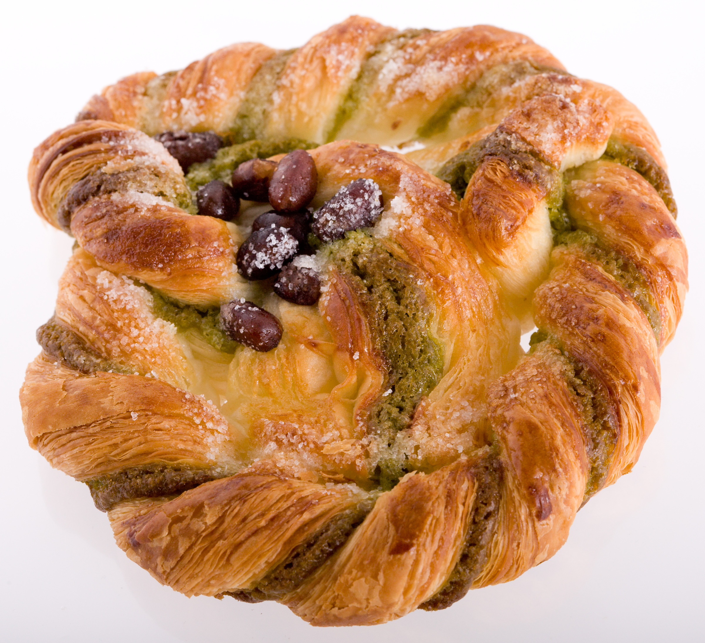

***************
English Notes 5
***************

**What's important is finding that one thing that will truly put your heart at rest.**

| cookbook
| Definition: a book of cooking directions and recipes. [食谱，菜谱]
| Definition: a book of detailed instructions. [工具书]
| Usage: Python cookbooks
| 
| diet
| dietary
| Definition: relating to diets or dieting.
| Usage: dietary advice for healthy skin and hair.
| Usage: Animal research showed that breast tumours struggled without the dietary nutrient asparagine. [天冬氨酸]
| Definition: provided by one's diet.
| Usage: the average dietary calcium intake was 140 milligrams per day.
| 
| char
| Definiton: partially burn (an object) so as to blacken its surface.
| Usage: Their bodies were badly charred in the fire.
| 
| cuisine
| culinary [烹饪]
| Definition: culinary means concerned with cooking.
| Usage: She was keen to acquire more advanced culinary skills.
| 
| concoct
| Definition: make (a dish or meal) by combining various ingredients. [杂烩？]
| Usage: they concoct relish from corn that is so naturally sweet no extra sugar is needed.
| Definition: create or devise (said especially of a story or plan). [杜撰，编造事实]
| Synonyms: make up.
| Usage: She concocted some elaborate story to explain her absence.
| 
| condiment [调料，酱汁]
| Definition: a substance such as salt or ketchup(番茄酱) that is used to add flavor to food.
| 
| pickle
| Definition: to keep vegetables or fruites in vinegar or salt water so that it doesn't go bad and it develops a strong, sharp taste.
| Usage: Herrings can be salted, smoked and pickled. [腌制]
| Phrase: in a pickle
| Definition: in a difficult and awkward situation.
| Usage: Caroline had sure as hell got herself into a pickle this time.
| 
| leaven [酵母, 催化剂]
| Definition: a substance, typically yeast, that is added to dough to make it ferment and rise.
| Definition: a pervasive influence that modifies something or transforms it for the better.
| Usage: A few jokes add leaven to a boring speech. 
| Usage: they acted as an intellectual leaven to the warriors who dominated the city.
| 
| churn
| Definition: a machine or container in which butter is made by agitating milk or cream.
| Phrase: churn something out
| Definition: produce something routinely or mechanically, especially in large quantities.
| Usge: many artists continued to churn out insipid, shallow works.

.. image:: images/culinary.jpg
.. image:: images/butter_churn.png
.. figure:: images/condiment.jpg

   Salt, pepper, and sugar are commonly placed on Western restaurant tables.

.. figure:: images/utensil.jpg

   Cooking / kitchen utensils. [炊具；厨房用具]

   Scoop
   

   
   Escargot [蜗牛]

   A snail, especially as an item on a menu.

   Profiterole 泡芙

   | Profiterole 泡芙
   | Definition: a small hollow pastry typically filled with cream and covered with chocolate sauce.
   | choux  高麗萊
   | Definition: very light pastry made with egg, typically used for eclairs and profiteroles.
   | pastry [油酥麪团，油酥麪皮]
   | Definition: a dough of flour, and water, used as a base and covering in baked dishes such as pies.

.. figure:: images/donut.jpg
  
   Doughnut / donut 甜甜圈

.. figure:: images/sencha_green_tea.jpg

   Sancha green tea

   Sencha (煎茶) is a type of Japanese ryokucha (緑茶, green tea) 
   which is prepared by infusing the processed whole tea leaves 
   in hot water. It is the most popular tea in Japan.
   

   Omelette 煎蛋卷,摊鸡蛋(常加入奶酪、肉和蔬菜)

   In cuisine, an omelette or omelet is a dish made from beaten eggs 
   fried with butter or oil in a frying pan. It is quite common for 
   the omelette to be folded around a filling such as cheese, chives, 
   vegetables, mushrooms, meat, or some combination of the above.

   
   stew [炖汤]

   A dish of meat and vegetables cooked 
   slowly in liquid in a closed dish or pan. 

| cramp
| Definition: a painful, involuntary contraction of a muscle or muscles, typically caused by fatigue or strain.
| Usage: he suffered severe cramps in his foot. [痉挛]
| Phrase: cramp someone's style
| Definition: prevent a person from acting freely or naturally.
| Usage: You two relax and celebrate on your own. You don't want us oldies cramping your style. [扫兴，不自在]
|
| flex
| Definition: bend (a limb or joint).
| Usage: she saw him flex his ankle and wince.
| Definition: cause (a muscle) to stand out by contracting or tensing it.
| Usage: bodybuilders flexing their muscles.
| 
| wince
| Definition: (at sth) to suddenly make an expression with your face that shows that you are feeling pain or embarrassment.
| Usage: He winced as a sharp pain shot through his left leg. [龇牙咧嘴,皱眉蹙额]
| Usage: I still wince when I think about that stupid thing I said. [懊悔不已]
| 
| wrench
| Definition: a sudden violent twist or pull.
| Definition: a feeling of sadness or distress caused by one's own or another's departure. [心如刀绞]
| Usage: it will be a real wrench to leave after eight years.
| Definition: a tool used for gripping and turning nuts, bolts, pipes, etc. [扳手]

.. image:: images/wrenches.png

| rigid
| rigidify
| rigidness
| rigidity
| Definition: (of a person or part of the body) stiff and unmoving, especially as a result of shock or fear.
| Usage: his face grew rigid with fear.
| Definition: inability to be to bent or be forced out of shape.
| Definition: inability to be changed or adapted.
| Usage: the rigidity of the school system.
| Definition: unwillingness to be adaptable in outlook, belief, or response.
| Usage: there was a regrettable rigidity in this decision.
| 
| colophon [版权页, 版本记录]
| Definition: a publisher's emblem or imprint, especially one on the title page or spine of a book.
| Definition: a statement at the end of a book, typically with a printer's emblem, giving information about its authorship and printing.
| 
| emblem [国徽，徽章，象征]
| Definition: a heraldic device or symbolic object as a distinctive badge of a nation, organization, or family.
| Usage: America's national emblem, the bald eagle. 
| Usage: The dove is an emblem of peace.
| Definition: (emblem of) a thing serving as a symbolic representation of a particular quality or concept.
| Usage: Our child would be a dazzling emblem of our love. [结晶]
| 
| imprint
| Definition: the name of the publisher of a book, usually printed below the title on the first page. [出版社]
| Definition: a mark made by pressing something onto a softer substance so that its outline is reproduced.
| Usage: He made imprints of the keys in the bars of soap.
| Usage: Tire marks were imprinted in the snow. [车辙印]
| Usage: Clothes imprinted with the logos of sports teams.
| Definition: a lasting impression or effect.
| Usage: Years in the colonies had left their imprint.
| Usage: He would always have this ghastly image imprinted on his mind. [久久不能释怀]

.. image:: images/colophon.jpg
.. image:: images/barcelona_football_emblem.jpeg

| 
| sulfurous 
| Definition: (chiefly of vapor or smoke) containing or derived from sulfur. [硫磺味]
| Definition: Marked by bad temper, anger, or profanity.
| Usage: A sulfurous glance.
| 
| profane
| profaner
| profanity
| profaneness
| Definition: blasphemous or obscene language.
| Usage: An outburst of profanity.
| 
| atheist [无神论者]
| Definition: a person who believes that God does not exist.
| 
| blasphemy
| blasphemous
| Definition: Sacrilegious against God or sacred things; profane.
| usage: Blasphemous and heretical talk.
| 
| sacrilege
| sacrilegious
| Definition: Violation or misuse of what is regarded as sacred.
| Definition: Involving or committing sacrilege.
| Usage: It seems sacrilegious to say this, but it’s really not that great a movie.
| 
| pilgrim
| pilgrimage 
| Definition: a person who journeys to a sacred place for religious reasons.
| Definition: a journey to a place associated with someone or something well known or respected.
| Usage: making a pilgrimage to the famous racing circuit. [表演团]

| 
| piety 虔诚
| Definition: the state of having or showing a deep respect for somebody or something, especially for God and religion; the state of being pious.
| Usage: Act of piety and charity.
| 
| begrime
| Definition: make soiled, filthy or dirty.
| Usage: Paint flaking from begrimed walls.
| 
| flake [剥落]
| Definition: a small, flat, thin piece of something, typically one that has broken away or been peeled off a larger piece. 
| Usage: Paint peeling off the walls in unsightly flakes.
| 
| etch
| Definition: to cut lines into a piece of glass, metal etc. in order to make words or a picture.
| Usage: a glass tankard etched with his initials.
| Usage: Tiredness was etched on his face. 
| Usage: his name is etched in baseball history.
| Definition: be permanently fixed in someone's memory.
| Usage: the events remain etched in the minds of all who witnessed them.

+-----------------------------------------+-----------------------------------------+
| .. image:: images/etched_utensils_1.jpg | .. image:: images/etched_utensils_2.jpg |
+-----------------------------------------+-----------------------------------------+

| cumulous
| cumulus [积云]
| Plural: cumuli
| Definition: a type of thick white cloud.
| 
| cirrus
| Definition: a type of light cloud that forms high in the sky. [卷云]

+---------------------------------+---------------------------------+
| .. image:: images/cumulus_1.jpg | .. image:: images/cumulus_2.jpg |
+---------------------------------+---------------------------------+

.. image:: images/cirrus_clouds.jpg

| bet
| bettor / better [赌徒]
| Definition: a person who bets, typically regularly or habitually.
| 
| rig
| Definition: to provide a ship or boat with ropes, sails, etc.; to fit the sails, etc. in position [(给船只)装帆,提供索具]
| Definition: a large piece of equipment that is used for taking oil or gas from the ground or the bottom of the sea. [钻井设备；钻塔]
| 
| fillet
| Definition: a piece of meat or fish that has no bones in it.
| Usage: a fillet of cod. [鳕鱼片]
| 
| commiserate
| commiserative
| commiseration
| Definition: an expression of sympathy for sb who has had sth unpleasant happen to them, especially not winning a competition.
| Usage: Commiserations to the losing team! 
| Usage: she went over to commiserate with Rose on her unfortunate circumstances.
| 
| futile
| Definition: incapable of producing any useful result; pointless. [徒劳，徒然]
| Usage: a futile attempt to keep fans from mounting the stage.
| 
| protrude
| Definition: to stick out from a place or a surface.
| Usage: Protruding teeth. [龅牙]
| Usage: He hung his coat on a nail protruding from the wall.
| 
| convent
| Definition: a Christian community under monastic vows, especially one of nuns. [修道院]
| Definition: (also convent school) a school, especially one for girls, attached to and run by convent. [教会学校]
|
| pectoral
| Definition: relating to the breast or chest.
| Usage: a pectoral shield. [护胸]
| buckler
| Definition: a small, round shield held by a handle or worn on the forearm.
|
| stoop
| Definition: to bend your body forwards and downwards.
| Usage: She stooped down to pick up the child. 
| Usage: He tends to stoop because he's so tall. [弓背]
| Phrase: stoop so low (as to do sth) 
| Definition: (formal) to drop your moral standards far enough to do sth bad or unpleasant [卑鄙(或堕落)到…地步]
| Usage: She was unwilling to believe anyone would stoop so low as to steal a ring from a dead woman's finger. 
| 
| swain [情郎]
| Definition: a young man who is in love.
| 
| coil
| Definition: a length of something wound or arranged in a spiral or sequence of rings.
| Usage: a coil of rope.
| Usage: the snake wrapped its coils around her.
| Usage: he coiled a lock of her hair around his finger.
| 
| plank
| Definition: a long narrow flat piece of wood that is used for making floors, etc.
| Definition: a fundamental point of a political or other program.
| Usage: the central plank of the bill is the curb on industrial polluters.
| Definition: walk the plank
| Definition: (formerly) be forced by pirates to walk blindfold along a plank over the side of a ship to one's death in the sea.
| Definition: (informal) lose one's job or position.
| Usage: the manager should be made to walk the plank for not insisting Bream be re-signed.
| 
| spray
| Definition: very small drops of a liquid that are sent through the air, for example by the wind. [浪花；水花；飞沫]
| Usage: A cloud of fine spray came up from the waterfall. 
| Usage: a spray of machine-gun bullets. [机枪雨点般地扫射]
| 
| shoal
| Definition: an area of shallow water, especially as a navigational hazard. [浅滩]
| Definition: a large number of fish swimming together. [鱼群]
| Definition: (informal) a large number of people
| Usage: a rock star's entrance, first proceeding with his shoal of attendants.
| 
| shaft
| Definition: a long, narrow part or section forming the handle of a tool or club, the body of a spear or arrow.
| Usage: the shaft of a golf club.
| Usage: the shaft of a feather.
| 
| lash
| Definition: strike (someone) with a whip or stick. [敲打，鞭打]
| Usage: they lashed him repeatedly about the head.
| Usage: waves lashed the coast.
| Definition: (lash someone into) drive someone into (a particular state or condition).
| Usage: fear lashed him into a frenzy.
| 
| hide
| Definition:  an animal's skin, especially when it is bought or sold or used for leather. [兽皮]
| Usgae: boots made from buffalo hide.
| Phrase: hide one's head
| Definition: cover up one's face or keep out of sight, especially from shame.
| Phrase: hide one's light under a bushel
| Definition: keep quiet about one's talents or accomplishments.
|
| ballpark
| Definition: (of prices or costs) approximate; rough.
| Usage: The ballpark figure is $400-500.
|
| demographic
| Definition: relating to the structure of populations.
| Usage: the demographic trend is toward an older population.
| Usage: the drink is popular with a young demographic.

   trough 水槽，饲料槽

   Glade : an open space in a forest

   Claymore [西洋剑]

