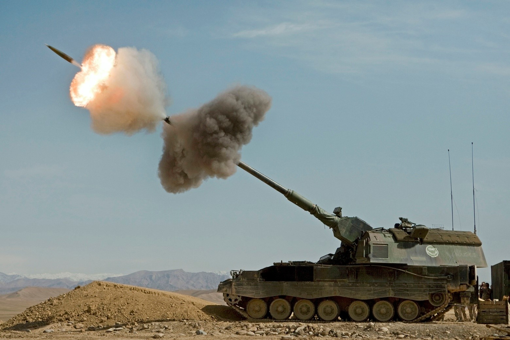
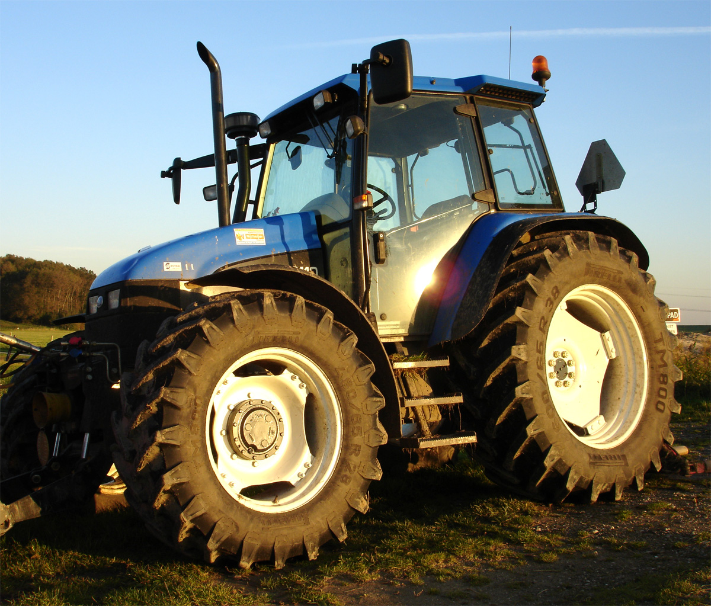
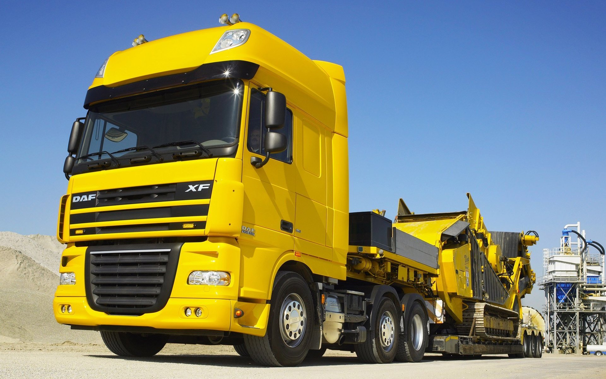

**************
English Note 6
**************

**同情自己是懦夫的勾当**

| butt 
| Definition: (of a person or animal) hit (someone or something) with the head or horns.
| Usage: she butted him in the chest with her head.
| Usage: he butts his head against a wall.
| Definition: the part of a cigarette or cigar that is left after it has been smoked. [烟蒂]
| Usage: Get off your butt and do some work. [屁股]
| Phrase: butt in/out
| Definition: to become involved in a situation that does not concern you.
| Usage: Butt out! Neil, that's none of your business.
| Usage: I didn't ask you to butt in my private business.
| Phrase: butt heads
| Definition: (North American informal) engage in conflict or be in strong disagreement.
| Usage: the residents continue to butt heads with the mall developers.
| 
| bulge
| Definition: a rounded swelling or protuberance that distorts a flat surface.
| Definition: (especially in a military context) a piece of land that projects outward from an otherwise regular line.
| Usage: the advance created an eastward-facing bulge in the line. [突出部]
| Usage: the veins in his neck bulged. [青筋暴露]
| Usage: he stared with bulging eyes. [眼睛充血]
| 
| cartridge
| Definition: a tube or case containing explosive and a bullet or shot , for shooting from a gun. [弹药筒；弹夹]
| Definition: a case containing sth that is used in a machine, for example film for a camera, ink for a printer, etc. Cartridges are put into the machine | and can be removed and replaced when they are finished or empty. [胶片盒；暗盒；墨盒]
| Definition: a thin tube containing ink which you put inside a pen [(钢笔的)笔芯,墨水囊]

   Artillery 炮击，炮兵

   Tractor 拖拉机

   Camion 大卡车，军用卡车

