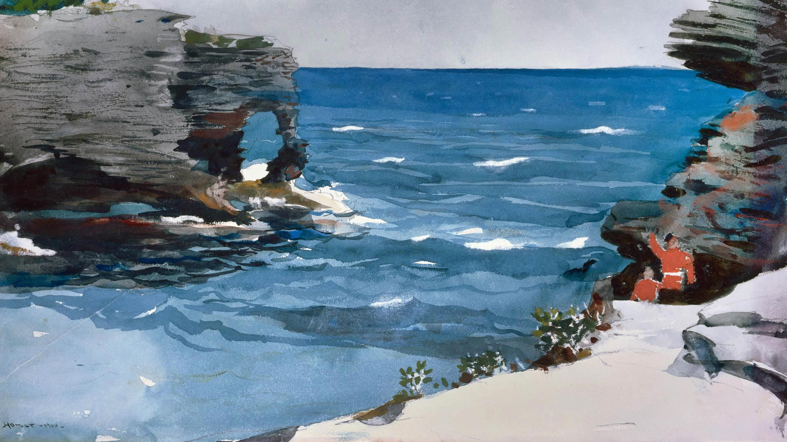
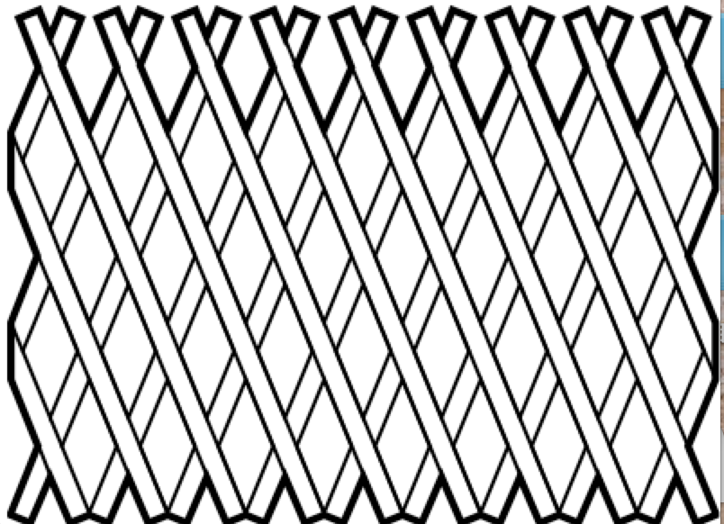
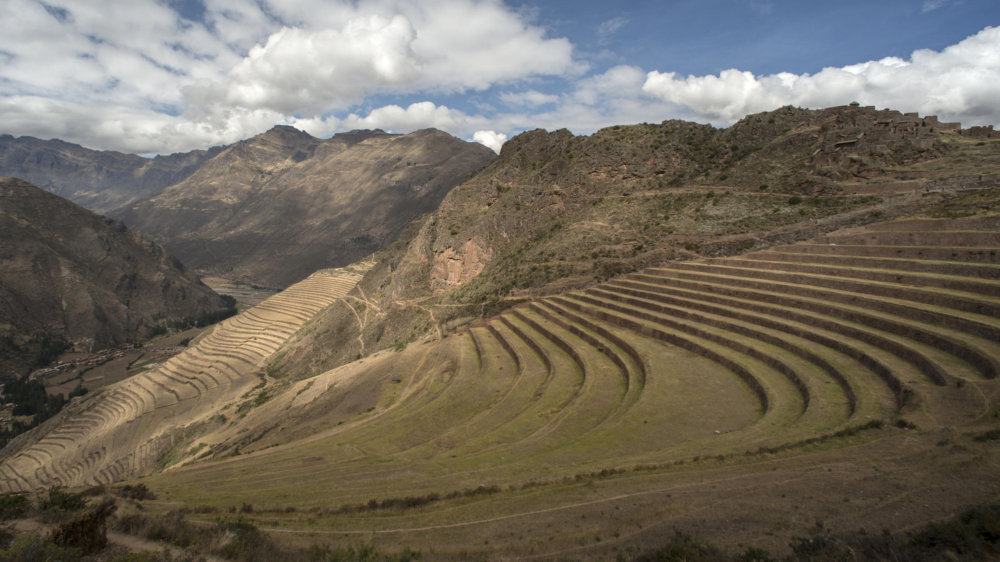
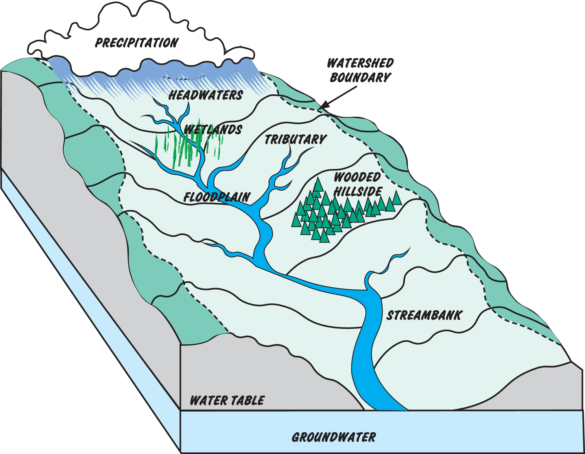
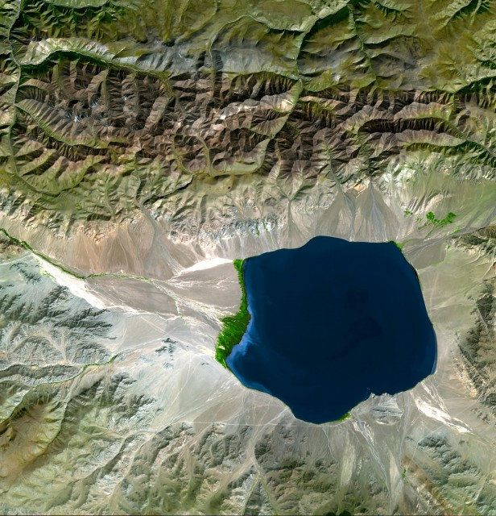

**************
English Note 6
**************

同情自己是懦夫的勾当。

-- 村上春树《挪威的森林》

| butt 
| Definition: (of a person or animal) hit (someone or something) with the head or horns.
| Usage: she butted him in the chest with her head.
| Usage: he butts his head against a wall.
| Definition: the part of a cigarette or cigar that is left after it has been smoked. [烟蒂]
| Usage: Get off your butt and do some work. [屁股]
| Phrase: butt in/out
| Definition: to become involved in a situation that does not concern you.
| Usage: Butt out! Neil, that's none of your business.
| Usage: I didn't ask you to butt in my private business.
| Phrase: butt heads
| Definition: (North American informal) engage in conflict or be in strong disagreement.
| Usage: the residents continue to butt heads with the mall developers.
| 
| bulge
| Definition: a rounded swelling or protuberance that distorts a flat surface.
| Definition: (especially in a military context) a piece of land that projects outward from an otherwise regular line.
| Usage: the advance created an eastward-facing bulge in the line. [突出部]
| Usage: the veins in his neck bulged. [青筋暴露]
| Usage: he stared with bulging eyes. [眼睛充血]
| 
| cartridge
| Definition: a tube or case containing explosive and a bullet or shot , for shooting from a gun. [弹药筒；弹夹]
| Definition: a case containing sth that is used in a machine, for example film for a camera, ink for a printer, etc. Cartridges are put into the machine | and can be removed and replaced when they are finished or empty. [胶片盒；暗盒；墨盒]
| Definition: a thin tube containing ink which you put inside a pen [(钢笔的)笔芯,墨水囊]
|
| conceal
| Definition: keep from sight; hide.
| Usage: a line of sand dunes concealed the distant sea.
| Definition: keep (something) secret; prevent from being known or noticed. [秘而不宣]
| Usage: love that they had to conceal from others.
| 
| succumb
| Definition: fail to resist (pressure, temptation, disease, injure or some other negative force).
| Usage: he has become the latest to succumb to the strain.
| Usage: He finally succumbed to Lucy's charms and agreed to her request. 
| Usage: His career was cut short when he succumbed to lung cancer.
| 
| myopic
| myopically
| Synonyms: short-sighted; nearsighted.
| Definition: lacking imagination, foresight, or intellectual insight.
| Usage: the government still has a myopic attitude to public spending.
| 
| stifle
| Definition: restrain (a reaction) or stop oneself acting on (an emotion). [克制]
| Synonyms: forbear.
| Usage: she stifled a giggle.
| Usage: she stifled a desire to turn and flee.
| Definition: prevent or constrain (an activity or idea).
| Synonyms: supress; hamper
| Usage: high taxes were stifling private enterprise.
| 
| forbear
| Definition: politely or patiently restrain an impulse to do something.
| Synonyms: self-restrain; self-control.
| Usage: The boy forbore from touching anything.
| Definition: refrain from doing or using something.
| Usage: Rebecca could not forbear a smile. [忍俊不禁]
|
| cut
| Phrase: cut both ways
| Definition: (of a point or statement) serve both sides of an argument.
| Definition: (of an action or process) have both good and bad effects
| Usage: the triumphs of civilization cut both ways.
| Phrase: cut the corner
| Definition: take the shortest course by going across and not around a corner.
| Phrase: cut corners [破例]
| Definition: undertake something in what appears to be the easiest, quickest, or cheapest way, especially by omitting to do something important or ignoring rules.
|
| state-of-art
| Definition: State-of-art (sometimes cutting edge) refers to the highest level of general development, as of a device, technique, or scientific field achieved at a particular time.
|
| grubby
| Definition: rather dirty, usually because it has not been washed or cleaned. [邋遢]
| Usage: grubby hands / clothes 
| Definition:  unpleasant because it involves activities that are dishonest or immoral. [卑鄙]
| Usage: a grubby scandle.
| 
| bawdy house
| Synonyms: brothel. [妓院]
| Definition: a house where men can visit prostitutes. [妓女]
| 
| prostitute
| Definition: a person who has sex for money, especially a woman. [卖淫]
| Synonyms: whore.
| Definition: a person who misuses their talents or who sacrifices their self-respect for the sake of personal or financial gain.
| Usage: Many felt he was prostituting himself by writing Hollywood scripts. [糟蹋自己，浪费才华]
| 
| latrine [(营地等的)厕所；(尤指)茅坑,便坑]
| Definition: a toilet in a camp, etc., especially one made by digging a hole in the ground. 
| 
| strand
| Definition: drive or leave (a boat, sailor, or sea creature) aground on a shore. [搁浅]
| Usage: the ships were stranded in shallow water. 
| Definition: a single thin length of something such as thread, fiber, or wire, especially as twisted together with others.
| Usage: a strand of cotton.
| 
| slush
| Definition: partially melted snow or ice.
| Definition: watery mud. [泥浆，泥泞的街道]
| 
| bellow
| Definition: (of a person or animal) emit a deep loud roar, typically in pain or anger. [怒吼，咆哮]
| Usage: he bellowed in agony.
| Usage: the bellowing of a bull.
| 
| picturesque
| Definition: visually attractive, especially in a quaint or pretty style. [如画般的]
| Usage: the picturesque covered bridges of New England.
| Definition: (of language) unusual and vivid. [生动活泼]
| Usage: his picturesque speech contrasted with his rough appearance.
| 
| shamble [拖着脚走；蹒跚] [类似僵尸片里的僵尸的走法]
| Definition: to walk in an awkward or lazy way, as if dragging your feet along the ground. 
| Usage: he shambled off down the corridor.
| 
| clean slate
| Definition: an absence of existing restraints or commitments.
| Usage: no government starts with a clean slate.
| 
| inevitable
| Synonyms: unavoidable.
| Usage: War was inevitable.
| 
| out of hand
| Definition: not under control
| Definition: without taking time to think.
| Usage: She's so stubborn that she just rejected my suggestion out of hand.
| 
| falter [窝囊]
| Definition: start to lose strength or momentum.
| Usage: her smile faltered and then faded.
| Definition: speak in a hesitant or unsteady voice.
| Usage: “I c-c-can't,” he faltered. [结巴]
| Definition: move unsteadily or in a way that shows lack of confidence.
| Usage: the baby's first faltering steps. [蹒跚学步]
| 
| stammer [结巴，打颤]
| Definition: speak with sudden involuntary pauses and a tendency to repeat the initial letters of words.
| Usage: “I … I can’t,” Isabel stammered.
| 
| corporate
| corporation
| Definition: relating to a corporation.
| Usage: airlines are very keen on their corporate identity. [公司形象]
| 
| tangiblei
| tangiblity
| Antonyms: intangible
| Definition: perceptible by touch.
| Usage: the atmosphere of neglect and abandonment was almost tangible.
| 
| curare
| Definition: 箭毒 (马鞍子的毒素，南美洲印地安人用以浸制毒箭).
| 
| comeuppance
| Definition: a punishment or fate that someone deserves. [报应]
| Usage: I was glad to see that the bad guy got his comeuppance at the end.
|
| hard-pressed
| Definition: closely pursued.
| Usage: the hard-pressed French infantry. [紧追不舍]
| Definition: burdened with urgent business.
| Usage: training centers are hard-pressed and insufficient in numbers.
| Definition: in difficulties.
| Usage: many families will be hard pressed to support their elderly relations.
| 
| dissent
| Defintion: the fact of having or expressing opinions that are different from those that are officially accepted.
| Usage: political/ religious dissent. [异议]
| Usage: Only two ministers dissented from the official view. 
|
| implicit
| implicitation
| Antonyms: explicit.
| Definition: implied though not plainly expressed.
| Usage: comments seen as implicit criticism of the policies. [暗讽]
| Usage: the implication is that no one person at the bank is responsible.
|
| morgue
| Definition: a place where bodies are kept, especially to be identified or claimed.
| Synonyms: mortuary 霊安室  太平间，停尸间
| Usage: the cadavers were bagged and removed to the city morgue.
| Definition: used metaphorically to refer to a place that is quiet, gloomy, or cold.
| Usage: she put us in that drafty morgue of a sitting room.
| 
| cadaver
| Synonyms: corpse
| 
| devoid
| Definition: entirely lacking or free from.
| Usage: Lisa kept her voice devoid of emotion.
| 
| taxonomy [分类]
| Definition: the branch of science concerned with classification, especially of organisms; systematics.
| 
| nomenclature [命名法]
| Definition: The nomenclature of a particular set of things is the system of naming those things.
| Usage: Mistakes arising from ignorance of the nomenclature of the  woody plants.
|
| meteorology [气象学]
| meteorological
| Definition: relating to the branch of science concerned with the processes and phenomena of the atmosphere, especially as a means of forecasting the weather.
| Usage: the effect of global warming on meteorological conditions.
| 
| introspection
| introspective
| Definition: the examination or observation of one's own mental and emotional processes.
| Usage: quiet introspection can be extremely valuable. [冥想，内省]
| Usage: he grew withdrawn and introspective.
| 
| dictrum
| Definition: a formal pronouncement from an authoritative source.
| Usage: the First Amendment dictum that “Congress shall make no law ... abridging the freedom of speech."
| 
| abridge
| Definition: shorten (a piece of writing) without losing the sense.
| Usage: the introduction is abridged from the author's afterword to the novel.
| Definition: curtail (a right or privilege).
| Usage: even the right to free speech can be abridged.
| 
| ad-hoc
| Definition: when necessary or needed.
| Synonyms: make-shift.
| Usage: the group was constituted ad hoc
| Usage: ad hoc committees to examine specific problems. [临时委员]
|
| preclude
| Definition: to prevent something from happening.
| Usage: At 84, Jone feels his age precludes too much travel.
| Usage: In some cases poor English precludes them from ever finding a job.
|
| grandeur
| grandiose
| Definition: impressive and imposing in appearance or style, especially pretentiously so.
| Usage: the court's grandiose facade. [冠冕堂皇]
| Definition: excessively grand or ambitious.
| Usage: grandiose plans to reform the world. [华而不实]
| 
| catch short
| Definition: Found to be lacking something one needs, especially money.
| Usage: I'm caught a little short. Can I borrow a few bucks? [手头紧]
| Definition: Pregnant when one is not married. [未婚先育] 
| Usage: I think that Heather has missed so much school because she's caught short.
| Definition: Having an urgent need to use the toilet. [内急] 
| Usage: I always go to the bathroom before a long drive, to avoid being caught short.
| 
| android
| Definition: (in science fiction) a robot with a human appearance.
| Usage: a space station inhabited only by androids.
| Definition: an OS developed by Google running on mobile phones.

.. figure:: images/ripple-effect.jpg

   Ripple effect

   A ripple effect is a situation in which, like ripples expanding across the water 
   when an object is dropped into it, an effect from an initial state can be followed 
   outwards incrementally.
   
   Ripple effect is often used colloquially to mean a multiplier (economics).
   
   In sociology, it can be observed how social interactions can affect situations 
   not directly related to the initial interaction, and in charitable activities 
   where information can be disseminated and passed from community to community 
   to broaden its impact.
   
   The concept has been applied in computer science within the field of software 
   metrics as a complexity measure.

   Watercolor painting 水彩画

   Lattice [百叶窗]

| 
| cartography [制图]
| Definition: The activity of making map.
| 
| Terrain 地形
| Definition: a stretch of land, especially with regard to its physical features.
| Usage: they were delayed by rough terrain.
|
| watershed
| Definition: an area or ridge of land that separates waters flowing to different rivers, basins, or seas.
| Definition: an area or region drained by a river, river system, or other body of water.
| Definition: an event or period marking a turning point in a situation. [分水岭]
| Usage: The election of Mary Robinson in 1990 was a watershed in Irish politics.
| Definition: The time after which programmes that are regarded as unsuitable for children are broadcast on television.
| Usage: The 9 p.m. watershed.

   Watershed diagram

   Basin Geology
