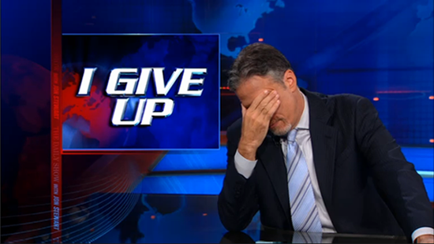
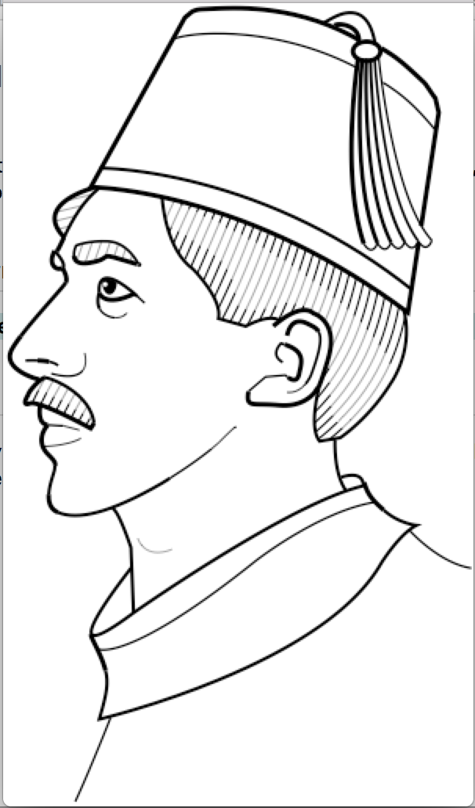
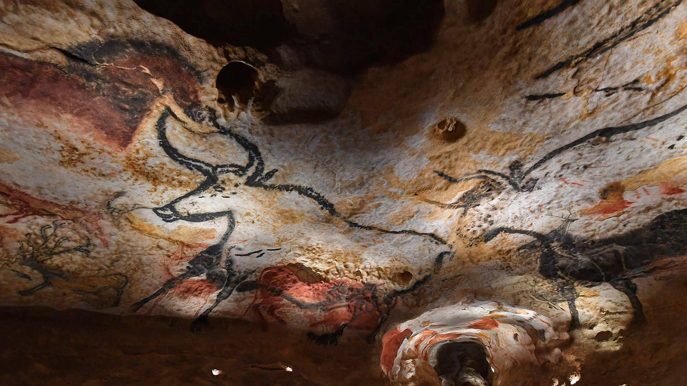
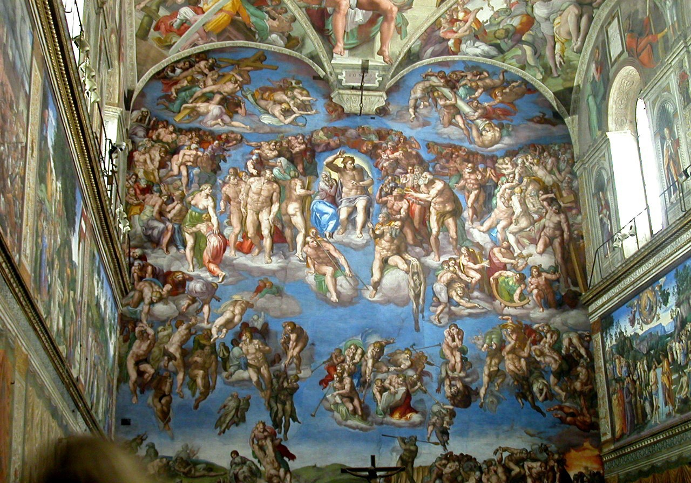
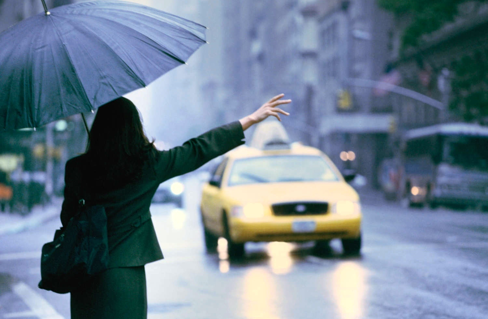
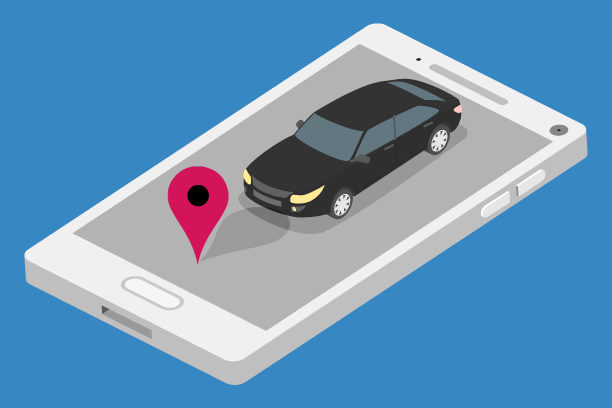
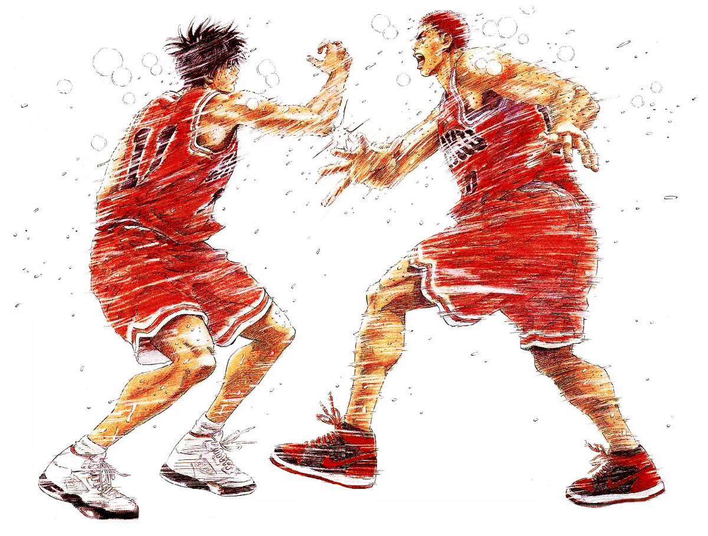
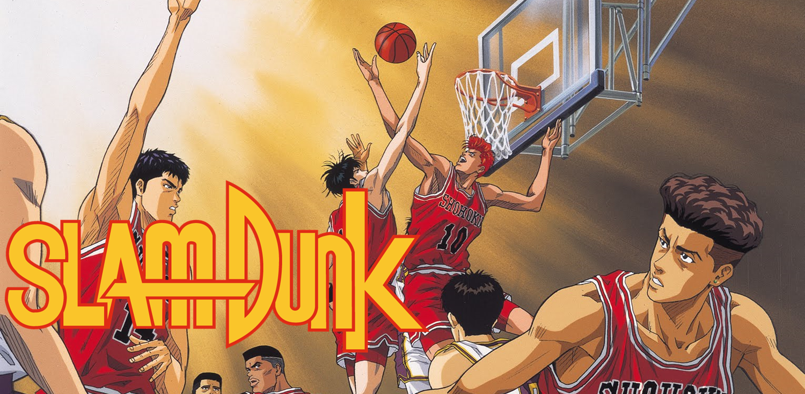
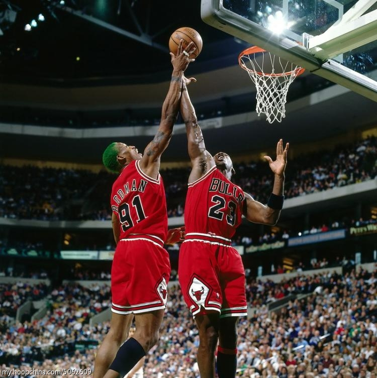
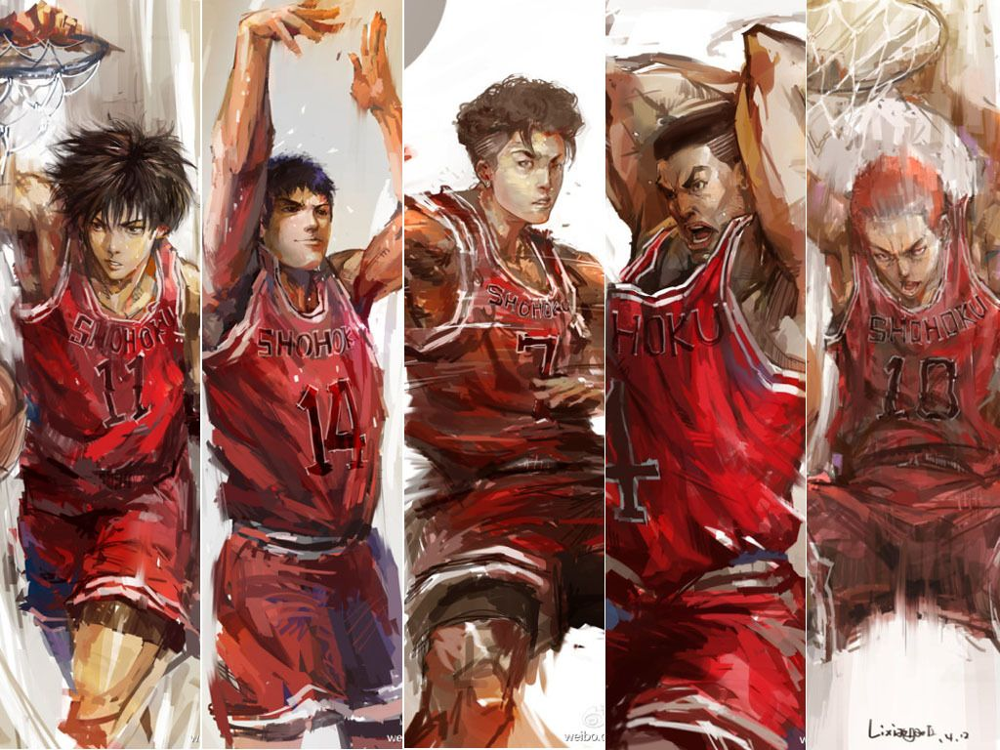

**************
English Note 8
**************

what is called a reason for living also the excellent one for dying.

-- Alber Camus

| maltreat [虐待]
| Definition: treat (a person or animal) cruelly or violently.
| Usage: if you maltreat the puppy, we will take it away immediately.
| 
| etiquette
| Definition: The customary of polite behavior in society or among members of a particular profession or group.
| Usage: Advice on etiquette. [礼仪]
| Usage: Medical / legal / professional etiquette. [职业操守]
| 
| deportment
| Definition: a person's behavior or manners.
| Usage: lessons for young ladies in deportment and etiquette. [礼仪，举止]
| 
| disposition
| Definition: the natural qualities of a person's character. [性格，性情]
| Synonyms: temperament.
| Usage: people of a nervous disposition. [歇斯底里，神经质的人]
| Definition: the way someone tends to behave or feel.
| Usage: The rides are unsuitable for people of a nervous disposition.
| Definition: (formal) the way something is placed or arranged. [处置，安排]
| Synonyms: arrangement.
| 
| unnerve
| Definition: to make sb feel nervous or frightened or lose confidence
| Usage: His silence unnerved us. [他的沉默令我们心里发慌]
| Usage: She appeared strained and a little unnerved. 
| 
| sane
| Definition: (of a person) of sound mind; not mad or mentally ill.
| Usage: hard work kept me sane.
| 
| embitter
| Definition: cause (someone) to feel bitter or resentful.
| Usage: he died an embittered man.
| Definition: literary give a sharp or pungent taste or smell to.
| Usage: the smell of orange zest and smoke embittered the air.
| 
| zest
| Definition: the outer skin of an orange, a lemon, etc., when it is used to give flavour in cooking.
| Definition: great enthusiasm and energy.
| Usage: the slight risk added zest to the experience.
| Usage: He had a great zest for life.
| 
| idolize
| Definition: admire, revere, or love greatly or excessively.
| Usage: he idolized his mother. [母控]
| Usage: a pop star idolized by millions of fans. [Michael Jackon]
| Usage: The parent idolize the kids. [宠爱，溺爱]

.. image:: images/Michael-Jackson.jpg

| penultimate
| Definition: last but one in a series of things; second last.
| Usage: the penultimate chapter of the book.
| 
| colloquially
| Definition: in the language of ordinary or familiar conversation; informally.
| Usage: the storms hit several states along a corridor colloquially referred to as “tornado alley”
| 
| ludicrous
| Definition: so foolish, unreasonable, or out of place as to be amusing; ridiculous.
| Usage: it's ludicrous that I have been fined.
|
| top up
| Definition: to raise the level of (a liquid, powder, etc) in (a container), usually bringing it to the brim of the container.
| Usage: top up the sugar in those bowls.
| Usage: Let me top up your glass. [加酒]
| Definition: an amount added to something in order to raise it to or maintain it at a desired level.
| Usage: a top-up loan.
| Usage: Top Up Mobile Phone International. [手机充值]
|
| perplex
| perplexed
| Definition: (of something complicated or unaccountable) cause (someone) to feel completely baffled.
| Usage: she was perplexed by her husband's moodiness. [抓狂]
| 
| baffle
| Definition: totally bewilder or perplex.
| Usage: an unexplained occurrence that baffled everyone.
| Definition: restrain or regulate (a fluid, sound, etc.). [隔音]
| Usage: to baffle the noise further, I pad the gunwales. [船舷]
| 
| cognizant
| Definition: having knowledge or being aware of.
| Usage: statesmen must be cognizant of the political boundaries within which they work.
| 
| rationale
| Definition: a set of reasons or logical basis for a course of action or a particualr belief.
| Usage: He explained the rationale behind the change.
| 
| stupefy
| Definition: to surprise or shock sb; to make sb unable to think clearly。
| Usage: He was stupefied by the amount they had spent. 
| Usage: She was stupefied with cold. [神志不清, 冻迷糊了]
| 
| southpaw [左撇子]
| 
| half-baked
| Definition: not well planned or considered.
| Usage: a half-baked idea.
| 
| dilatory [拖延]
| Definition: not acting quickly enough; causing delay.
| Usage: they resorted to dilatory procedural tactics, forcing a postponement of peace talks.
| 
| more bang for the buck [物超所值]
| Definition: Having greater value for the amount of money one is spending.
| Usage: It’s not one of the most popular brands, but this :abbr:`HD (high-definition)` TV will give you away more bang for your buck.
| Usage: While desktop computers still give you more bang for your buck, today's notebooks are capable of more than just basic office work. 
|
| DINK = Double Income and No Kid [丁克人群]
| 
| throttle
| Definition: a device controlling the flow of fuel or power to an engine.
| Usage: the engines were at full throttle.
| Definition: attack or kill (someone) by choking or strangling them.
| Usage: she was sorely tempted to throttle him.
|
| bust
| Defintion: raid or search (premises where illegal activity is suspected)
| Usage: their house got busted.
| Usage: he was busted for drugs. [被捕]
| Definition: (be/get busted) be caught in the act of doing something wrong.
| Usage: I sneaked up on them and told them they were busted.
| Definition: [chiefly US] reduce (a soldier) to a lower rank; demote.
| Usage: he was busted to private. [降为普通士兵]
| 
| private
| Definition: a soldier of the lowest rank, in particular an enlisted person in the US Army or Marine Corps ranking below private first class.
| Phrase: in private.
| Definition: with no one else present.
| Usage: I've got to talk to you in private.
|
| caliber [Britain calibre]
| Definition: the internal diameter or bore of a gun barrel.
| Usage: a .22 caliber repeater rifle. [口径]
| 
| straggle
| straggler
| Definition: to move slowly behind a group of people that you are with so that you become separated from them. [落伍，掉队]
| Usage: On the way the kids straggled behind us. 
| Definition: grow, spread, or be laid out in an irregular, untidy way.
| Usage: her hair was straggling over her eyes.
| Usage: the town straggled to an end and the fields began.
| Usage: a straggle of cottages. [散落的村落]
| 
| rupture
| Definition: (especially of a pipe, a vessel, or a bodily part such as an organ or membrane) break or burst suddenly.
| Usage: if the main artery ruptures he could die. [大动脉]
| Usage: it was her first match since rupturing an Achilles tendon. [肌腱]
| Phrase: be ruptured or rupture oneself
| Definition: suffer an abdominal hernia.
| Usage: one of the boys was ruptured and needed to be fitted with a truss[夹板固定]. [和肠道有关]
| Definition: breach or disturb (a harmonious feeling or situation).
| Usage: once trust has been ruptured it can be difficult to regain.
| 
| foul
| Definition: offensive to the senses, especially through having a disgusting smell or taste or being unpleasantly soiled.
| Definition: (of language) obscene or profane. [污言秽语]
| 
| stew
| Definition: a dish of meat and vegetables cooked slowly in liquid in a closed dish or pan. [炖汤]
| Definition: a state of great anxiety or agitation.
| Usage: I suppose he's all in a stew. [焦头烂额]
| 
| dugout
| Definition: a shelter that is dug in the ground and roofed over, especially one used by troops in warfare. [战壕]
| Definition: a low shelter with seating from which a team's coaches and players not taking part can watch the game. [教练席]
| Definition: a canoe made from a hollowed tree trunk. [独木舟]
| 
| oven
| Definition: an enclosed compartment, as in a kitchen range, for cooking and heating food. [炉灶]
| Usage: the house was like an oven when I came in.
| 
| sheen
| Definition: a soft luster on a surface.
| Usage: black crushed velvet with a slight sheen.
| Usage: he seemed to shine with that unmistakable showbiz sheen.
| Usage: men entered with rain sheening their steel helms.
| Usage: her black hair sheened in the sun.
| 
| worrywart [爱操心的人]
| Definition: a person who tends to dwell unduly on difficulty or troubles.
| 
| meddlesome
| Definition: enjoying getting involved in situations that do not concern them
| Usage: a gaggle of meddlesome politicians.
| 
| errand
| Definition: a short journey undertaken in order to deliver or collect something, often on someone else's behalf.
| Usage: she asked Tim to run an errand for her. [跑腿，差事]
| Usage: he often run errands for his grandma.
| Phrase: errand of mercy
| Definition: a mission carried out to help someone in difficulty.
| 
| protagonist [主人公，主角]
| Definition: the leading character or one of the major characters in a drama, movie, novel, or other fictional text.
| 
| plastered
| Definition: very drunk.
| Usage: I went out and got totally plastered.
| 
| steep
| Definition: soak (food or tea) in water or other liquid so as to extract its flavor or to soften it.
| Usage: the noodles should be left to steep for 3–4 minutes. [浸泡]
| Definition: (usually be steeped in) surround or fill with a quality or influence.
| Usage: a city steeped in history. [沧桑古城]
| Usage: they spent a month steeping themselves in Chinese culture. 
| 
| nether
| Defintion:  (literary or humorous)  lower
| Usage: a person's nether regions (= their genitals ) [下半身]
| 
| crotch
| Definition: the part of the human body between the legs where they join the torso.
| Definition: the part of a garment that passes between the legs. [裆部]
| Definition: a fork in a tree, road, or river.
| 
| piss
| Definition: an act of urinating.
| Usage: take a piss.
| Phrase: not have a pot to piss in
| Definition: be very poor.
| Phrase: piss in the wind
| Definition: do something that is ineffective or a waste of time.
| Phrase: piss something away
| Definition: waste something, especially money or time.
| Phrase: piss someone off
| Definition: annoy someone.
| Phrase: piss on
| Definition: show complete contempt for. 
| 
| proprietress [老板娘]
| dunno = (I) do not know
| 
| gargle
| Definition: wash one's mouth and throat with a liquid kept in motion by exhaling through it.
| Usage: instruct patients to gargle with warm water. [漱口]
| 
| grudge
| Definition: a persistent feeling of ill will or resentment resulting from a past insult or injury.
| Usage: she held a grudge against her former boss.
| Phrase: bear someone a grudge (also bear a grudge)
| Definition: maintain a feeling of ill will or resentment toward someone.
| Usage: I hope you will not bear me a grudge. [记仇]
| 
| retard
| Definition: delay or hold back in terms of progress, development, or accomplishment
| Usage: his progress was retarded by his limp.
| Definition: a mentally handicapped person (often used as a general term of abuse). [智障]
| 
| handicap
| Definition: act as an impediment to.
| Usage: lack of funding has handicapped the development of research.
| Usage: without a good set of notes you will handicap yourself when it comes to exams.
| Usage: a criminal conviction is a handicap and a label that may stick forever. [一日为贼,终生为贼]
| 
| jackass
| Definition: a stupid person.
| Synonyms: moron.
| Definition: a male ass or donkey.
| 
| nonchalant
| Definition: (of a person or manner) feeling or appearing casually calm and relaxed; not displaying anxiety, interest, or enthusiasm.
| Usage: she gave a nonchalant shrug.
| 
| asphyxiation
| Definition: the state or process of being deprived of oxygen, which can result in unconsciousness or death; suffocation.
| Usage: the cause of death was asphyxiation.
| 
| hyperventilate
| hyperventilation
| Definition: breathe or cause to breathe at an abnormally rapid rate, so increasing the rate of loss of carbon dioxide.
| Definition: be or become overexcited.
| Usage: it was one less thing to hyperventilate about.
| 
| lewd
| Definition: crude and offensive in a sexual way.
| Usage: she began to gyrate to the music and sing a lewd song.
| 
| budge
| Definition: make or cause to make the slightest movement.
| Usage: the line in the bank hasn't budged.
| Usage: budge over, boys, make room for your uncle.
| Definition: change or make (someone) change an opinion.
| Usage: I tried to persuade him, but he wouldn't budge.
| Usage: neither bribe nor threat will budge him.
| 
| nefarious
| Definition: (typically of an action or activity) wicked or criminal.
| Usage: the nefarious activities of the organized-crime syndicates.
| 
| freak
| Definition: a very unusual and unexpected event or situation. [反常]
| Usage: the teacher says the accident was a total freak. 
| Definition: (also freak of nature) a person, animal, or plant with an unusual physical abnormality. [怪胎]
| Definition: behave or cause to behave in a wild and irrational way, typically because of the effects of extreme emotion, mental illness, or drugs.
| Definition: My parents really freaked when they saw my hair. 
| Usage: Snakes really freak me out. 
| 
| armageddon
| Definition: (in the New Testament) the last battle between good and evil before the Day of Judgment.
| Definition: a dramatic and catastrophic conflict, typically seen as likely to destroy the world or the human race.
| Usage: nuclear Armageddon.
| 
| Jerusalem 耶路撒冷
| 
| monkey
| Definition: behave in a silly or playful way.
| Phrase: make a monkey of (or out of) someone [捉弄]
| Definition: humiliate someone by making them appear ridiculous.
| Phrase: a monkey on one's back
| Definition: a burdensome problem.
| Definition: a dependence on drugs.
| 
| parody 
| Definition: an imitation of the style of a particular writer, artist, or genre with deliberate exaggeration for comic effect.
| Usage: the movie is a parody of the horror genre. [恶搞]
| Usage: his specialty was parodying schoolgirl fiction.
| Definition: an imitation or a version of something that falls far short of the real thing; a travesty.
| Usage: he seems like a parody of an educated Englishman.
| 
| travesty
| Definition: a false, absurd, or distorted representation of something.
| Usage: the absurdly lenient sentence is a travesty of justice.
| Usage: Michael has betrayed the family by travestying them in his plays.
| 
| lenity
| lenient
| Definition: (of punishment or a person in authority) permissive, merciful, or tolerant.
| Usage: Judges were far too lenient with petty criminals.
| 
| petty
| Definition: of little importance; trivial.
| Usage: The petty divisions of party politics.
| 
| trivial
| Definition: If you describe something as trivial, you think that it is unimportant and not serious.
| Synonyms: insignificant.
| Usage: I don't like to visit the doctor just for something trivial.
| 
| fall in / into line
| Definition: conform with others or with accepted behavior.
| 
| exploit
| exploitation
| Definition: to treat a person or situation as an opportunity to gain an advantage for yourself.
| Usage: She realized that her youth and inexperience were being exploited.
| Usage: What is being done to stop employers from exploiting young people?
| Usage: She fully exploits the humor of her role in the play.
| Usgae: No minerals have yet been exploited in Antarctia.
| 
| enunciate
| enunciative
| enunciation
| Definition: say or pronounce clearly.
| Usage: she enunciated each word slowly.
| Definition: express (a proposition or theory) in clear or definite terms.
| Usage: a written document enunciating this policy.
| Usage: He enunciated his vision of the future. 
| 
| hunker [蹲坐，踞]
| Definition: to sit on your heels with your knees bent up in front of you.
| Usage: He hunkered down beside her. 
| Definition: (hunker down) apply oneself seriously to a task.
| Usage: students hunkered down to prepare for the examinations.
|
| facepalm
| Definition: a gesture in which the palm of one's hand is brought to one's face, as an expression of disbelief, shame, or exasperation.
| Usage: I'm pretty sure said friend now thinks Anne and I are dating—facepalm!" 
| 

   Candelabrum (pl. candelabra) [灯座，烛台] 
   
   A large branched candlestick or holder for several candles or lamps.

   Fez

   A flat-topped conical red hat with a black tassel on top, 
   worn by men in some Muslim countries.

.. figure:: images/Vatican-ChapelleSixtine-Plafond.jpg

   Fresco [壁画]

   A painting done rapidly in watercolor on wet plaster on a wall or ceiling, 
   so that the colors penetrate the plaster and become fixed as it dries.

   Windsurfing 帆板運動

   Car-hailing [打车] 

   E-hailing is a process of ordering a car, taxi, limousine [豪华轿车], 
   or any other form of transportation pick up via a computer or mobile device.

   Slam dunk 灌篮高手
