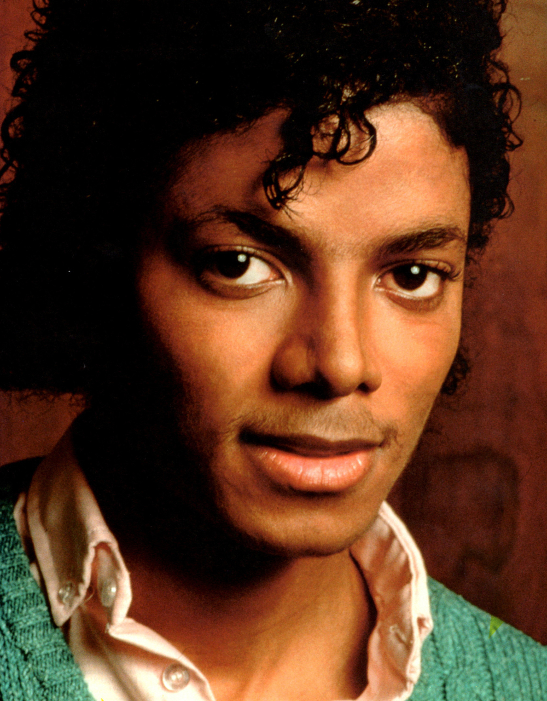

**************
English Note 8
**************

what is called a reason for living also the excellent one for dying.

-- Alber Camus

| maltreat
| Definition: treat (a person or animal) cruelly or violently.
| Usage: if you maltreat the puppy, we will take it away immediately.
| 
| deportment
| Definition: a person's behavior or manners.
| Usage: there are team rules governing deportment on and off the field.
| Usage: lessons for young ladies in deportment and etiquette. [礼仪，举止]
| 
| disposition
| Definition: the natural qualities of a person's character. [性格，性情]
| Synonyms: temperament.
| Usage: people of a nervous disposition. [神经质的人]
| Definition: the way someone tends to behave or feel.
| Usage: The rides are unsuitable for people of a nervous disposition.
| Definition: (formal) the way something is placed or arranged. [处置，安排]
| Synonyms: arrangement.
| 
| embitter
| Definition: cause (someone) to feel bitter or resentful.
| Usage: he died an embittered man.
| Definition: literary give a sharp or pungent taste or smell to.
| Usage: the smell of orange zest and smoke embittered the air.
| 
| zest
| Definition: the outer skin of an orange, a lemon, etc., when it is used to give flavour in cooking.
| Definition: great enthusiasm and energy.
| Usage: the slight risk added zest to the experience.
| Usage: He had a great zest for life.
| 
| idolize
| Definition: admire, revere, or love greatly or excessively.
| Usage: he idolized his mother. [母控]
| Usage: a pop star idolized by millions of fans. [Michael Jackon]
| Usage: The parent idolize the kids. [宠爱，溺爱]

| penultimate
| Definition: last but one in a series of things; second last.
| Usage: the penultimate chapter of the book.
| 
| colloquially
| Definition: in the language of ordinary or familiar conversation; informally.
| Usage: the storms hit several states along a corridor colloquially referred to as “tornado alley”
| 
| ludicrous
| Definition: so foolish, unreasonable, or out of place as to be amusing; ridiculous.
| Usage: it's ludicrous that I have been fined.
|
| facepalm
| Definition: a gesture in which the palm of one's hand is brought to one's face, as an expression of disbelief, shame, or exasperation.
| Usage: I'm pretty sure said friend now thinks Anne and I are dating—facepalm!" 
| 

.. image:: images/facepalm.png

| top up
| Definition: to raise the level of (a liquid, powder, etc) in (a container), usually bringing it to the brim of the container.
| Usage: top up the sugar in those bowls.
| Usage: Let me top up your glass. [加酒]
| Definition: an amount added to something in order to raise it to or maintain it at a desired level.
| Usage: a top-up loan.
| Usage: Top Up Mobile Phone International. [手机充值]
|
