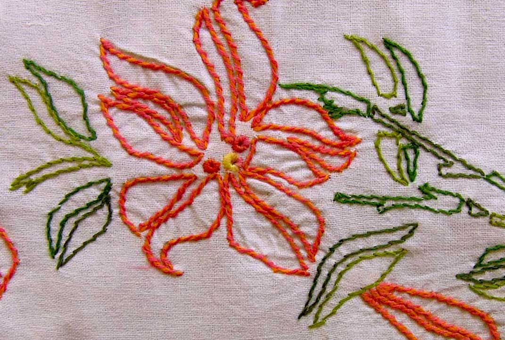

**************
English Note 9
**************

纸上得来终觉浅，绝知此事要躬行。

-- 陆游《冬夜读书示子聿》

| ancillary
| Definition: providing necessary support to the primary activities or operation of an organization, institution, industry, or system.
| Synonyms: auxillary.
| Usage: the development of ancillary services to support its products.
| Definition: additional; subsidiary.
| Usage: paragraph 19 was merely ancillary to paragraph 16.
| 
| bumpkin
| bumpkinish
| Definition: an unsophisticated or socially awkward person from the countryside.
| Usage: she thought Tom a bit of a country bumpkin. [多贬义]
| 
| unsophisticated
| Definition: not complicated or highly developed; basic: unsophisticated computer software.
| Definition: not artificial.
| Usage: the village has remained unspoiled and unsophisticated.
| Definition: lacking refined worldly knowledge or tastes. [单纯的；阅历浅的；涉世不深的；不谙世故的]
| 
| quaint
| Definition: attractively unusual or old-fashioned.
| Usage: quaint country cottages.
|
| wail
| wailful
| Definition: a prolonged high-pitched cry of pain, grief, or anger.
| Usage: Christopher let out a wail.
| Usgae: the wail of an air-raid siren. [咆哮]
| Usage: the wind wailed and buffeted the timber structure. [呼啸]
| 
| whittle
| Definition: carve (wood) into an object by repeatedly cutting small slices from it.
| Usage: He whittled a simple toy from the piece of wood. 
| Defnition: (whittle something away/down) reduce something in size, amount, or extent by a gradual series of steps.
| Usage: the short list of fifteen was whittled down to five.
| 
| caboodle
| Definition: (the whole caboodle or the whole kit and caboodle) whole.
| Usage: I had new clothes, a new hairstyle—the whole caboodle. [焕然一新]
|
| pest
| Definition: an insect or animal that destroys plants, food, etc.
| Definition: an annoying person or thing.
| Usage: That child is being a real pest. 
| 
| antagonistic
| Definition: showing or feeling active opposition or hostility toward someone or something.
| Usage: he was antagonistic to the government's reforms.
| 
| the silver screen [银幕]
| Definition: the movie industry
| Usage: Stars of the silver screen. 
| 
| limelight
| Definition: intense white light obtained by heating a cylinder of lime [石灰], formerly used in theaters.
| Definiton: (the limelight) the focuse of public attention. [荧光灯，大众焦点]
| Usage: The work that brought the artists into the limelight.
| Phrase: steal / hog the limelight
| Definition: take attention away from other people.
| 
| hog
| Definition: keep or use all of (something) for oneself in an unfair or selfish way.
| Usage: He never hogged the limelight.
| Idiom: go (the) whole hog
| Definition: do something completely or thoroughly.
| Idiom: live high on (or off) the hog
| Definition: have a luxurious lifestyle.
| 
| the lion’s share
| Definition: the idiomatic expression of the major share of something.
| Synonyms: the main hog
| 
| all-embracing
| Definition: including or covering everything or everyone; comprehensive. [包罗万象]
| usage: the goal is not one all-embracing religion.
| 
| obstruct
| obstruction
| Definition: block (an opening, path, road, etc.); be or get in the way of.
| Usage: she was obstructing the entrance.
| Definition: prevent or hinder (movement or someone or something in motion).
| Usage: they had to alter the course of the stream and obstruct the natural flow of the water.
| Definition: deliberately make (something) difficult.
| Usage: fears that the regime would obstruct the distribution of food.
| Definition: commit the offense of intentionally hindering (a legal process).
| Definition: (in various sports) impede (a player in the opposing team) in a manner which constitutes an offense.
| 
| folklore
| Definition: the traditional beliefs, customs, and stories of a community, passed through the generations by word of mouth.
| Usage: Indian folklore. [民俗风情]
| Usage: The story rapidly became part of family folklore. [家族传说]
| Definition: a body of popular myth and beliefs relating to a particular place, activity, or group of people.
| Usage: programming folklore.
|
| tractable
| Definition: (of a person or animal) easy to control or influence. [驯服，温顺]
| Usage: tractable dogs that have had some obedience training. 
| Definition: (of a situation or problem) easy to deal with. [容易驾驭]
| Usage: trying to make the mathematics tractable.
| Antonyms: intractable.
| 
| advertise
| Definition: draw attention to (a product, service, or event) in a public medium in order to promote sales or attendance.
| Definition: make (a quality or fact) known.
| Usage: Meryl coughed briefly to advertise her presence.
| Usage: some prisoners advertised the French of this terrible danger.
| Usage: I wouldn't advertise the fact that you don't have a work permit. [声张]
| 
| thrash
| Definition: beat (a person or animal) repeatedly and violently with a stick or whip.
| Usage: she thrashed him across the head and shoulders.
| Usage: what he needs is a good thrashing.
| Definition: move in a violent and convulsive way.
| Usage: he lay on the ground thrashing around in pain.
| Phrase: thrash around 
| Definition: struggle in a wild or desperate way to do something.
| Usage: two months of thrashing around on my own have produced nothing.
| 
| convulsion
| convulsive
| Definition: a sudden, violent, irregular movement of a limb or of the body, caused by involuntary contraction of muscles. [抽搐，痉挛]
| Definition: a violent social or political upheaval.
| Usage: the convulsions of 1939–45.
| 
| wily
| wilily
| wiliness
| Definition: skilled at gaining an advantage, especially deceitfully.
| Synonyms: cunning.
| Usage: The boss is a wily old fox. 
| 
| hoop
| Definition: a circular band of metal, wood, or similar material, especially one used for binding the staves of barrels or forming part of a framework. [箍]
| Definition: the round metal rim from which a basketball net is suspended. [球筐]
| Usage: hula hoop. [呼啦圈]
| 
| demarcate
| Definition: set the boundaries or limits of.
| Usage: plots of land demarcated by barbed wire.
| Definition: separate or distinguish from.
| Usage: art was being demarcated from the more objective science.
| 
| culprit
| Definition: a person who is responsible for a crime or other misdeed. [元凶]
| Definition: the cause of a problem or defect.
| Usage: viruses could turn out to be the culprit.
|
| ornament
| unornamented
| Definition: lacking embellishment or ornamentation.
| 
| embellish
| embellishment
| Definition: make (something) more attractive by the addition of decorative details or features.
| Usage: blue silk embellished with golden embroidery.
| Definition: make (a statement or story) more interesting or entertaining by adding extra details, especially ones that are not true.
| Usage: she had real difficulty telling the truth because she liked to embellish things.
| 
| guise
| Definition: an external form, appearance, or manner of presentation, typically concealing the true nature of something.
| Usage: he visited in the guise of an inspector.
| Usage: telemarketing and selling under the guise of market research.

   Embroidery [刺绣]