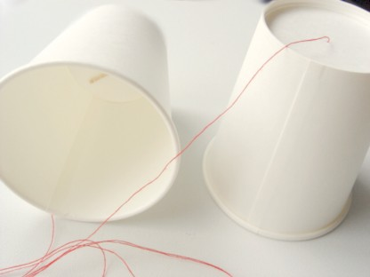
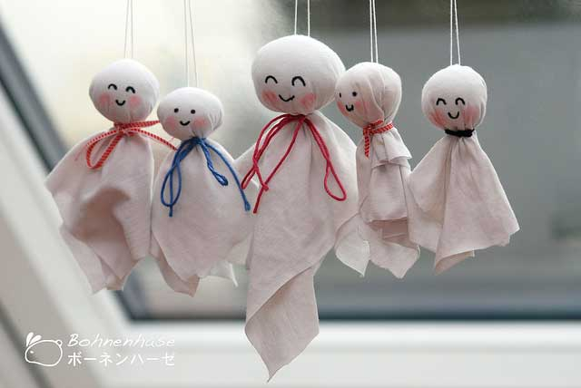
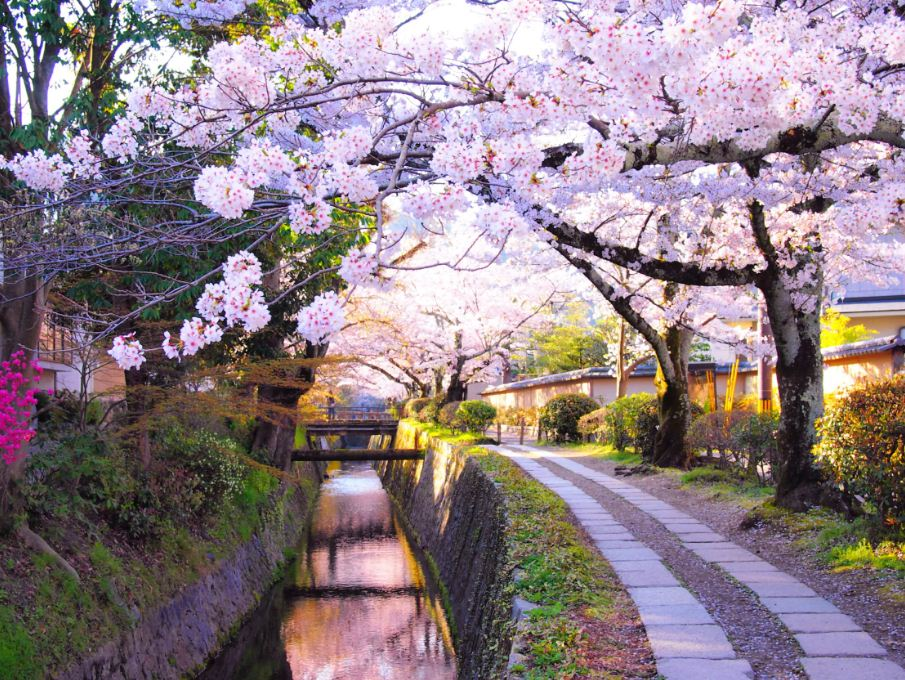
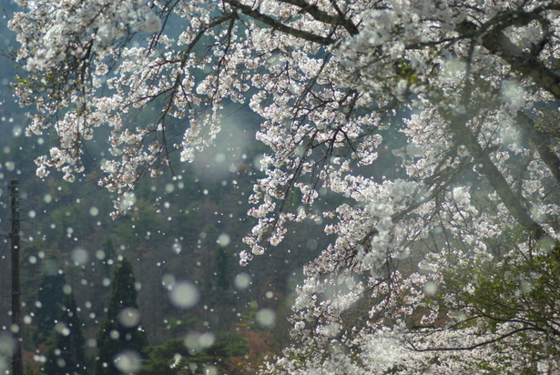

*****************
Janpanese Note 01
*****************

#. AA制用日语怎么说

   割り勘 （わりかん）：【名】分担费用;大家均摊 
   不好意思让你请，AA制吧：おごってもらっちゃ悪いわ，割り勘にしましょう。 
   AA制夫妇：财布が别々の割り勘夫妇。 
   我和老公实行AA制：うちはダンナと家计が别々なの。

#. 申し訳ありません 申し訳ございません 这两句有什么不同

   「ありません」是「ある」的ます形的否定，「ございません」是「ござる」ます形的否定。
   「申し訳」是“辩解”的意思，在后面加上否定，表示“不辩解”、“不找借口”，于是就成了“对不起”，这是一种很正式的说法。
   「ござる」是「ある」、「いる」的敬体形式。「ござる」是ラ行变格活用动词，变为ます形时将词尾「る」变为「い」再接上「ます」，
   而不是像五段动词那样将词尾由う段变为い段再接ます。所以，「申し訳ございません」是「申し訳ありません」的敬体说法。前者更加郑重。

#. 比古清十郎／るろうに剣心「春は夜桜 夏には星 秋に満月 冬には雪 それで十分酒は美味い」

   .. code-block:: none

      春は夜桜
      夏には星
      秋に満月
      冬には雪
      それで十分酒は美味い
      
      それでも不味いんなら
      それは自分自身の何かが
      病んでいる証しだ

   和月伸宏『るろうに剣心』の追憶編より，主人公ではなくその師匠・比古清十郎の名言（ただし回想シーン）．

   さすが師匠，理想の酒飲みですNE！

   この言葉から普遍的な人生論が学べるかは分かりませんが，酒飲みとして学ぶところは多いので引用してみました．
   年末年始お酒を飲む機会にかみしめて，あまりつまみを食べずに酒を味わいましょう（そして二日酔い）．

#. ツンデレ

   ツンデレは、特定の人間関係において敵対的な態度（ツンツン）と過度に好意的な態度（デレデレ）の二つの性質を持つ

#. how to type romanji letters in little-case
   
   First type "l" then romaji as usual. for example, "lyu", "lyo" would be ゅ、ょ.

#. 膝枕
   
   子供は母親の膝を枕に寝ている。

   .. image:: images/hizamakura_1.jpg
   .. image:: images/hizamakura_2.jpg
   .. image:: images/hizamakura_3.jpg

#. 空耳
   
   空耳来源于日语词语“そらみみ”，在日语中是“幻听”的意思，但后来渐渐转义为将歌词中的一句话（或一个字）的读音，
   造出发音相似的另一句话，常用在歌词和鬼畜中，是一种在文字领域进行恶搞娱乐的方式。

#. 取引先　「とりひきさき」
#. 後輩　vs 先輩

#. Seasons

   +--------+--------+--------+--------+
   | Spring | Summer | Autumn | Winter |
   +--------+--------+--------+--------+
   | 春     | 夏     | 秋     | 冬     |
   +--------+--------+--------+--------+
   | haru   | natsu  | aki    | fuyu   |
   +--------+--------+--------+--------+

#. Weeks
   
   +------------+------------+----------+------------+------------+------------+----------+
   | Sunday     | Monday     | Tuesday  | Wednesday  | Thursday   | Friday     | Saturday |
   +------------+------------+----------+------------+------------+------------+----------+
   | 日曜日     | 月曜日     | 火曜日   | 水曜日     | 木曜日     | 金曜日     | 土曜日   |
   +------------+------------+----------+------------+------------+------------+----------+
   | にちようび | げつようび | かようび | すいようび | もくようび | きんようび | どようび |
   +------------+------------+----------+------------+------------+------------+----------+
   | Sun        | Moon       | Mars     | Mercury    | Jupitor    | Venus      | Saturn   |
   +------------+------------+----------+------------+------------+------------+----------+

#. Months

   .. code-block:: none

      +--------------+----------------------+------------------------------------------------------------------------+
      | January      | 一月 (ichigatsu)     | Mutsuki (睦月, "Month of Love alternatively Affection").               |
      +--------------+----------------------+------------------------------------------------------------------------+
      | February     | 二月 (nigatsu)       | Kisaragi (如月) or Kinusaragi (衣更着, "Changing Clothes").            |
      +--------------+----------------------+------------------------------------------------------------------------+
      | March        | 三月 (sangatsu)      | Yayoi (弥生, "New Life").                                              |
      +--------------+----------------------+------------------------------------------------------------------------+
      | April        | 四月 (shigatsu)      | Uzuki (卯月, "u-no-hana month"). The u-no-hana (卯の花)                |
      |              |                      | is a flower, of the genus Deutzia.                                     |
      +--------------+----------------------+------------------------------------------------------------------------+
      | May          | 五月 (gogatsu)       | Satsuki (皐月) or Sanaetsuki (早苗月, "Early-rice-planting Month").    |
      +--------------+----------------------+------------------------------------------------------------------------+
      | June         | 六月 (rokugatsu)     | Minazuki (水無月, "Month of Water"). The 無 character,which normally   |
      |              |                      | means "absent" or "there is no", is here ateji, that is, used only for |
      |              |                      | the sound "na". In this name the na is actually a possessive particle, |
      |              |                      | so 'minazuki' means "month of water", not "month without water" , and  |
      |              |                      | this is in reference to the flooding of the rice fields,               |
      |              |                      | which require large quantities of water.                               |
      +--------------+----------------------+------------------------------------------------------------------------+
      | July         | 七月 (shichigatsu)   | Fumizuki (文月, "Month of Erudition").                                 |
      +--------------+----------------------+------------------------------------------------------------------------+
      | August       | 八月 (hachigatsu)    | Hazuki (葉月, "Month of Leaves"). In old Japanese, the month           |
      |              |                      | was called 葉落ち月 (Haochizuki, or "Month of Falling Leaves").        |
      +--------------+----------------------+------------------------------------------------------------------------+
      | September    | 九月 (kugatsu)       | Nagatsuki (長月, "The Long Month").                                    |
      +--------------+----------------------+------------------------------------------------------------------------+
      | October      | 十月 (jūgatsu)       | Kannazuki or Kaminazuki (神無月, Month of the Gods), which means       |
      |              |                      | "Month of the Gods", not "Month without Gods" (Kaminakizuki),          |
      |              |                      | similarly to Minatsuki, the "Month of Water". However,                 |
      |              |                      | by false etymology this became commonly interpreted to                 |
      |              |                      | mean that because in that month all the Shinto kami gather             |
      |              |                      | at Izumo shrine in Izumo Province (modern-day Shimane Prefecture),     |
      |              |                      | there are no gods in the rest of the country. Thus in Izumo            |
      |              |                      | Province, the month is called Kamiarizuki (神有月 or 神在月,           |
      |              |                      | "Month with Gods"). This interpretation is the one commonly            |
      |              |                      | cited in western works. Various other etymologies have also            |
      |              |                      | been suggested from time to time.                                      |
      +--------------+----------------------+------------------------------------------------------------------------+
      | November     | 十一月 (jūichigatsu) | Shimotsuki (霜月, "Month of Frost").                                   |
      +--------------+----------------------+------------------------------------------------------------------------+
      | December     | 十二月 (jūnigatsu)   | Shiwasu (師走, "Priests Running"). This is in reference to priests     |
      |              |                      | being busy at the end of the year for New Year's preparations          |
      |              |                      | and blessings.                                                         |
      +--------------+----------------------+------------------------------------------------------------------------+

#. 桜日和　[风和日丽，樱花绽放]

   糸電話

   照る照る坊主　[晴天娃娃]

   桜吹雪
