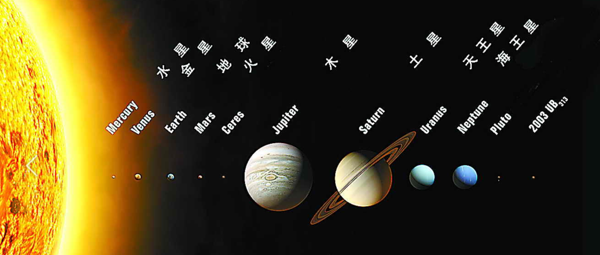
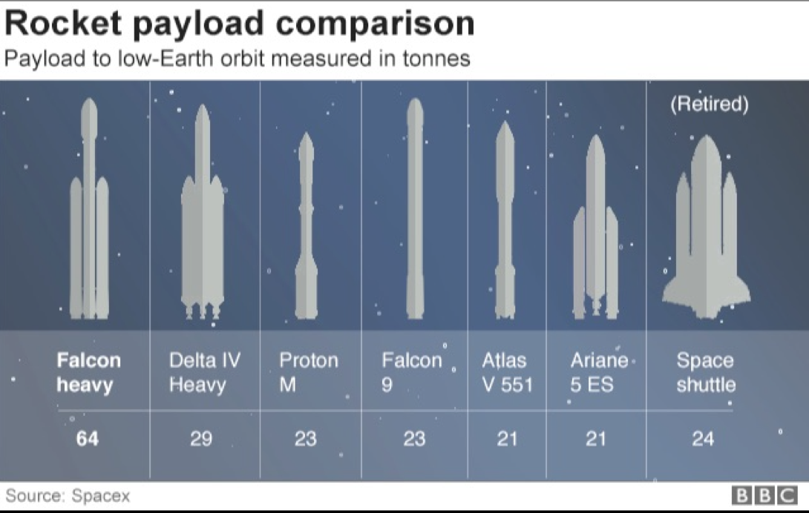
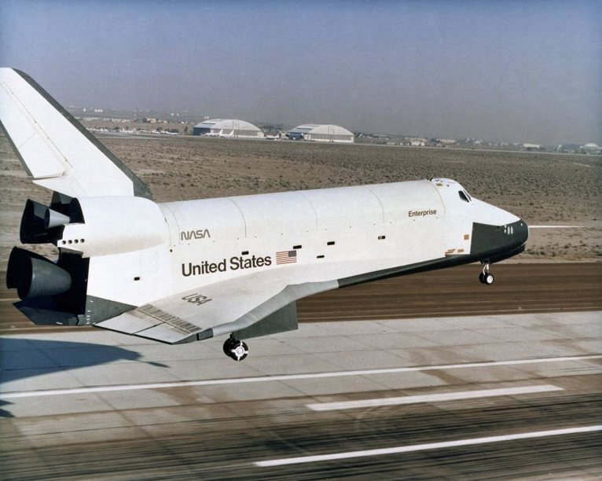
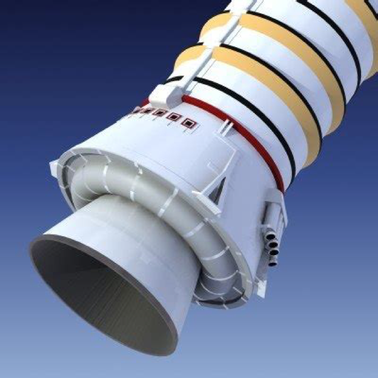
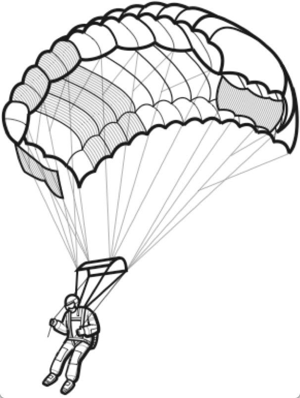
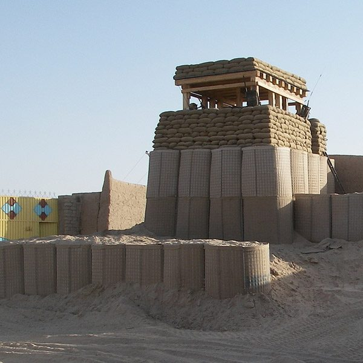
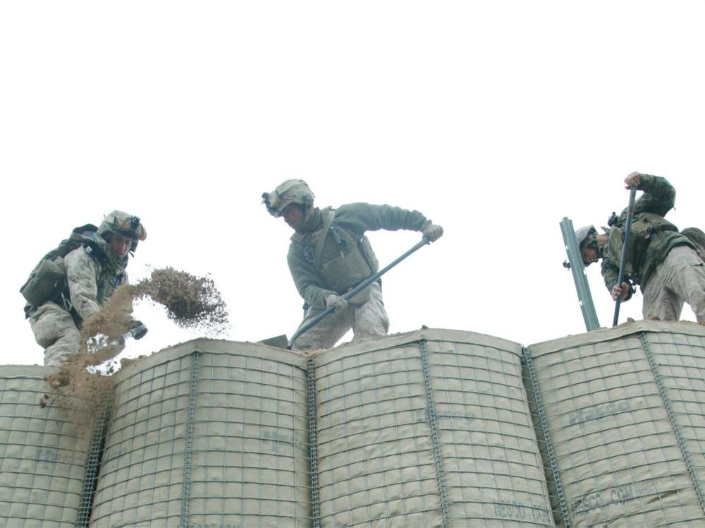

Military Terms
==============

| MIA -- missing-in-action [失踪]
| KIA -- killed-in-action [阵亡]
| Allied Powers [盟军]
| Axis Powers [轴心国]
| United Nations [联合国]
| appeasement policy [绥靖政策]
| Nazi-Soviet non-aggression pact [苏德互不侵犯条约]
| Nazi German
| Soviet Union
| government-in-exile [流亡政府]
| war machine
| unification of China
| the Northern Expedition [北伐战争]
| puppet state [附庸国]
| 
| anti-Semitism
| Definition: hostility to or prejudice against Jews.
|
| ultimatum [最后通牒]
| Definition: A final demand or statement of terms, the rejection of which will result a breakdown in relations.
| Usage: Their employers issued an ultimatum demanding an immediate return to work.
| 
| embargo  [禁运]
| Definition: an official ban on trade or other commercial activity with a particular country.
| Usage: The United States sought to bring the Japenest war effort to a complete halt by imposing a full embargo on all trade between the United States to it.
| 
| ouster  [罢黜，流放]
| Definition: Dismissal or expulsion from a position.
| Usage: A showdown that may lead to his ouster as leader of the party.
| Definition: Ejection from a freehold or other possession; deprivation of inheritance.
| 
| Confederate
| Definition: joined by an agreement or treaty.
| 
| inter [埋葬]
| Definition: place (a corpse) in a grave or tomb, typically with funeral rites.
| Usage: He was interred with the military honors due to him. 
| 
| loot
| Definition: goods, especially private property, take from an enemy in war. [战利品]
| Definition: stolen money or valuables. [赃款]
| Usage: The theif made off  with $5 million in loot.
| 
| militia  [民兵，预备役]
| Definition: a military force that is raised from the civil population to supplement a regular army in an emergency.
| 
| mercenary [雇佣兵]
| Definition: a professional soldier hired to serve in a foreign country.
| Definition: a person primarily concerned with material reward at the expense of ethics.
| Usage: Sanchez was accused of being the biggest mercenary for leaving Arsenal for Manchester United by Arsenal’s legend Martin Keown.
| 
| insurrection [起义]
| Definition: a violent uprising against the current authority or government.
| Usage: Opposition to the new regime lead to armed insurrection.
| 
| regime
| Definition: a government, especially an authoritarian one.
| 
| mass grave [万人坑]
| Definition: a pit dug in the ground to receive a large number of corpses.
| 
| guild
| Definition: a medival association of craftmen or merchants, often having considerable power.
| Definition: an association of people for mutual aid or the pursuit of a common goal.
| Usage: The Screen Actors Guild. [电影演员协会]
| 
| medieval [中世纪]
| Definition: relating to the Middle Ages (about AD 1000 to AD 1450).
| Usage: A medieval castle.
| Definition: very old-fashioned or primitive.
| Usage: The guerrillas’ medieval behavior has become an embarassment to their supporters.
| 
| Fiorentina [佛罗伦萨]
| The Renaissance [文艺复兴]
| Definition: The Renaissance was the period in Europe, especially Italy, in the 14th, 15th, and 16th centuries, when there was a new interest in art, literature, science, and learning.
| Usage: Science took a new and different turn in the Renaissance.
|
| Mediterranean Sea - 地中海
| The straits of Gibraltar are the gate of the Mediterranean. [直布羅陀海峡]
| The Suez Canal joins the Mediterranean and the Red Sea. [蘇伊士運河]
|
| strait
| Definition: A very difficult situation especially because of lack of money.
| Usage: The factory is in dire straits.
| Definition: A narrow passage of water that connect two seas or large areas of water, especially in the names of places.
| Usage: the Straits of Gibraltar (直布罗陀海峡)
| 
| canyon 
| Definition: a deep gorge, typically one with a river flowing through it.
| ravine
| Definition: a deep, narrow gorge with narrow sides.
| sierra
| Definition: a long jagged mountain chain.
|
| workhorse
| Definition: a workhorse is a horse is used to do a job, for example to pull a plough.
| Definition: If you describe a person or machine as a workhorse, you mean that they can be relied upon to do a large amount of work, especiall work that is dull or routine.
| Usage: My husband nerver even looked at me. I was just a workhorse bring up three children.
| Usage: Falcon 9, the workhorse of SpaceX.
| 
| constellation
| Definition: a constellation is a group of stars which form a pattern and have a name. [星系]
| Definition: a constellation of similar things is a group of them.
| Usage: Most patients have a constellation of diseases, with few clear-up distinctions between them. 
| 
| Solar system
|

| Falcon heavy
| Delta IV Heavy
| Proton M
| Falcon 9
| Atlas V 551
| Ariane 5 ES
|

| Space shuttle
|

| booster
|

| parachute
|

|
| rendezvous
| Definition: (noun) A rendevous is a meeting, often a secret one, that you have arranged with someone for a particular time and place.
| Definition: (verb) If you rendezvous with someone or if the two of you rendezvous, you meet them at a time and place that you have arraged.
| Usage: I had almost decided to keep my rendezvous with Tony.
| Usage: Their rendezvous would be the Penta Hotel at Heathrow Airport.
| Usage: The plan was to rendezvous with him on Sunday afternoon.
|
| deplore [谴责]
| Definition: Feel or express strong disapproval of something.
| Usage: We deplored this act of violence.
| 
| condolence
| Usage: President Vladimir Putin has expressed his condolences to the victims’s families.
| Usage: a letter of condolence. [吊唁信]
| 
| archenemy
| arch-enemy [世仇]
| Definition: a person who is extremely hostile or opposed to someone or something.
| Usage: The twins were archenemies. [天生不和]
| 
| cockpit
| Definition: a compartment for the pilot and sometimes also the crew in an aircraft or spacecraft.
| Usage:  The company was banned from operating international flights when surprise inspectors found someone other than the flight crew in a cockpit. [驾驶舱]
| 
| confiscate
| Definition: take or seize (someone’s property) with authority. [没收]
| Usage: The guards confiscated his camera.
|  
| secession
| Definition: the action of withdraw formally from membership of a federation or body, especially a political state.
| Usage: The referendum on independence [独立公投] in September showed that more than 90% of the 3.3 million people who voted had supported secession.
| 
| mandate
| mandatory
| Definition: an offical order or commission to do something.
| Usage: A mandate to seek the release of political prisoners.
| Usage: He didn’t want the guide to be mandatory.
| 
| annul
| Definition: declare invalid (an offical aggreement, decision, or result).
| Usage: The elections were annulled by the general amid renewed protests.
|
| enclave [少数民族聚居地]
| Definition: a portion of territory within or surrounded by a larger territory whose inhabitants are culturally or ethnically distinct. 
| Definition: a place or group that is different in character from those surrounding it.
| Usage: The engineer department is traditionally a male encalve.
|
| rove [流离失所]
| Definition: Travel constantly without a fixed destination; wander.
| Usage: A quarter of a million refugees roves around the country.
|  
| coalition [联合政府]
| Definition: an alliance for combined action, especially a temporary alliance of political parties forming a government or of states. 
| Definition: The party was only able to govern in coalition with three or even four other parties.
| 
| doctrine
| Definition: a belief or set of beliefs held and taught by a church, political party, or other group.
| Usage: The Monroe Doctrine.
| 
| pragmatic 經驗主義的   
| dogmatic  教條主義的
| dogma [教条]
| Definition: a principle or set of principles laid down by an authority as incontrovertibly true.
| Usage: political dogma
| Usage: The alphaGo has upset the established chess dogma. 
| Usage: A pragmatic approach to politics.
| Usage: He tries to give his opinions without to be dogmatic.
| 
| retalitory
| retaliation
| Definition: the action of returning a military attack; counterattack.
| Usage: The bombings are believed to be in retaliation for the trial of 15 | suspects.
| Synonyms: revenge
| Usage: Protectionism invites retaliation.
| Usage: Fears of a retalitory attack by the victim’s friends.
| 
| dual nationality. [双重国籍]
| criminal record [前科]
| prior
| Definition: a previous criminal conviction.
| Usage: He had no juvenile record, no priors.
|
| burglary [入室行窃]
| Definition: the crime of entering a building illegally and stealing things from it.
| Usage: The youth was charged with three counts of burglary.
| 
| felon [重犯]
| Definition: A person who has been convicted of a felony.
| Definition: cruel; wicked.
| Usage: The felon undermining hand of dark corruption.
| 
| complicity [共谋，共犯]
| Definition: the state of being involved with others in an illegal activity or wrongdoing.
| Usage: They were accused of complicity in the attempt to overthrow the government.
| Definition: the action of taking part with another person in a crime. 
| Usage: He was charged with being guilty of complicity in the murder.
| 
| liaision [联络人]
| Definition: a person who acts as a link to assist communication or cooperation between groups of people.
| Usage: He is our liaison with a number of interested parties. 
|
| vandalize
| vandalism
| Definition: action involving deliberate destruction of damage to public or private property.
| Usage: Stations have been wrecked and vandalized beyond recognition.
| 
| sentinel
| Synonyms: sentry
| 
| extortion [勒索，恐吓]
| Definition: Extortion is the crime of obtaining something from someone, especially money, by using force or threats.
| Usage: He has been charged with extortion and abusing his power.
| 
| coercion [政治高压]
| Definition: Coercion is the act or process of persuading someone forcefully to do something that they did not want to do.
| Usage: It was vital that the elections should be free of coercion or intimidation.
| 
| espionage [谍报活动]
| Definition: The practice of spying or of using spies, typically by governments to obtain political and military information.
| Antonym: counter-espionage
| Usage: Some of the commercial activities were a cover for espionage.
| 
| scaffold  [断头台， 绞刑架]
| Definition: A scaffold is a raised platform where criminals were hanged or had their head cut off.
| Usage: Ascending the shaky ladder to the scaffold, More addressed the executioner.
| Definition: A scaffold is a temporary raised platform on which workers stand to paint, repair, or build high parts of a building.
| 
| defame
| Definition: damage the good reputation of (someone); slander or libel.
| Usage: He claimed that the article defamed his family.
| 
| slander [诽谤]
| Definition: The action or crime of making a false spoken statement damaging to a person’s reputation.
| Usage: He is suing the TV network for slander.
| Usage: I ‘ve had just about all I can stomach of your slanders.
|  
| libel [恶意中伤]
| Definition: A pulished false statement that is damaging to a person’s reputation; a written defamation.
| Usage: The councilor who sued two national newspaper for libel.
| 
| precinct
| Definition: a commercial area in a town  where cars cannot go. [步行街]
| Definition: one of the parts into which a town or city is divided in order to organize elections. [选区]
| Definition: a part of a city that has its own police station. [派出所]
| Usage: The murder occurred just a block from the precinct.
| Usage: With 35% of the precincts declaring, he had 51% of the vote.
| 
| cadet [军官候补生]
| Definition: a young person who is training to become an officer in the police or armed force. 
| 
| arbiter 仲裁
| Definition: a person who settles a dispute or has ultimate authority in a matter.
| Usage: The military act as arbiter of the conflicts between political groups
| 
| asylum 政治庇护
| Definition: (also political asylum) the protection granted by a nation to someone who has left their native country as political refugee.
| Usage: She applied for asylum and was granted refugee status.
| 
| manifesto
| Definition: a public declaration of policy and aim, especially one is issued before an election by a political party or candidate.
| Usage: An election manifesto.
| Usage: Manifesto of the communist party. [共产党宣言]
| 
| UN Security Council 联合国安理会
| Syria War: UN Security Council approves 30-day ceasefire. [停火]
| 
| unanimous
| unanimously
| Definition: When a group of people are unanimous, they all agree about something or all vote for the same | thing.
| Usage: The UN Security Council has unanimously approved a resolution demanding a 30-day ceasefire in Syria to | allow aid deliveries and medical evacuations.
| 
| truce [休战，停战]
| Definition: a truce is an agreement between two people or groups of people to stop fighting or quarrelling for | a short time.
| Usage: Let's call a truce.
| 
| impact
| Definition: If one object impacts on another, it hits it with great force.
| Definition: To impact on a situation, process, or person means to affect them.
| Usage: However, some of the biggeds jihadist rebel groups, and their associates, are not covered by the truce, | raising questions about its real impact.
| 
| autonomy
| autonomous
| Definition: (of a country or region) having self-government, at least to a significant degree.
| Usage: The federation included sixteen autonomous republics.
| Definition: action independently or having the freedom to do so.
| Usage: autonomous underwater vehicles.
| 
| crown prince [储君，太子]
| Definition: a crown prince is a prince of a country who will become the king of his country when the present king or queen dies.
| 
| shake-up
| Definition: a shake-up is a major set of changes in an oragnization or system.
| Usage: Crown Prince Mohammed bin Salman is believed to be behind various recent shake-ups in the country.
| 
| abuse of power 滥用职权
| Usage: The prince led a drive against corruption and abuse of power.
| 
| decree [敕令，手令]
| Definition: A decree is an official order or decision, especially made by the ruler of a country.
| Usage: Presidential decrees.
| Usage: Saudi Arabia had sacked its top military commanders, including the chief of staff, in a series of late-night royal decrees.
| 
| austerity
| Definition: difficult economic conditions created by government measures to reduce budget deficit, especially by reducing public expenditure. [财政紧缩政策]
| Definition: sternness or severity of manner or attitude.
| Usage: He was note for his austerity and his authoritarianism.
| 
| stern
| sternness
| Definition: (of a person or their manner) serious and unrelenting, especially in the assertion of authority and exercise of discipline.
| Usage: A smile transformed his stern face.
| Definition: the rearmost part of a ship or boat.
| Usage: He stood at the stern of the yacht. [游艇]
| Idiom: be made of sterner stuff
| Definition: have a stronger character and be more able to overcome problems than others.
| Usage: Whereas James was deeply wounded by the failure, George was made of sterner stuff.
| 
| servere
| serverity
| Definition: (of something bad or undesirable) very great; intense.
| Usage: A severe shortage of technicians.
| Definition: demanding great ability, skill or resilience.
| Usage: a severe test of stamina.
| Definition: strict or harsh.
| Usage: He is usually severe on what he regards as tendentious pseudo-learning.
| Definiton: very plain in style or appearance. [朴素]
| Usage: She wore another severe suit, gray this time.
| 
| resilient
| resilience
| Definiton: the ability of a substance or object to spring back into shape; elasticity. [韧性]
| Definition: the capacity to recover quickly from difficulties; toughness.
| Usage: Babies are generally far more resilient than new parents realize.
| 
| sever
| severable
| Definition: divide by cutting or slicing, especially suddenly and forcibly.
| Synonyms: behead [斩首]
| Usage: The head was severed from the body.
| Definition: put an end to (a connection or relationship); break off.
| Usage: He severed his relationship with Lawrence.
| 
| maneuver
| manoeuver [演习]
| Definition: a large-scale exercise of troops, warships, and other forces.
| Synonyms: trainning exercises, operations
| Usage: The Russian vessel was on maneuver.
| Definition: carefully guide or manipulate (someone or something) in order to achieve an end.
| Synonyms: plot, conspire
| Usage: They were maneuvering him into a betrayal of his countryman.
| 
| invincible
| Definition: If you describe an army or sports team as invincible, you believe that they are too powerful to be defeated.
| Synonyms: unbeatable
| Usage: President Putin has uneviled Russia's stockpile of "invincible" nuclear weapons, with a video graphic appearing to show missiles raining on Floriada.
| Definition: If someone has an invincible belief or attitude, it cannot be changed.
| Synonyms: unshakable
| Usage: He had an invicible faith in the medicinal virtues of garlic.
| 
| arsenal
| Definition: An arsenal is a large collection of weapons and military equipment held by a country, group, or person.
| Usage: Russia and the other republics are committed to destroying most of their nuclear arsenals.
| 
| bunker 掩体
| Definition: A bunker is a place, usually undergroup, that has been built with strong walls to protect it against heavy gunfire and bombing.
| 
| raucous
| Definition: A raucous sound is loud, harsh, and rather unpleasant.
| Usage: A raucous crowd of 25,000 delirious fans.
| 
| bar
| Definition: If you say someone is behind bars, you mean that they are in prison.
| Usage: Nearly 5,000 people a year are put behind bars over motoring penalties.
| 
| life expectancy
| Definition: The life expectancy of a person, animal, or plant is the length of tiem that they are normally likely to live.
| Synonyms: lifespan
| Usage: The average life expectancy in ancient times was less than 40.
| 
| nuclear attack
| nuclear arsenal 核武库
| nuclear bunker 核掩体
| nuclear warhead 核弹头
| bomb shelter
| intercontinental ballistic missile 洲际弹道导弹
| cruise missile 巡航导弹
| torpedo 鱼雷
| 
| the Cold War 冷战
| the White house 白宫
| The Kremlin 克里姆林宫
| The US State Department 美国国会

.. figure:: images/the_pentagon.jpg

   the Pentagon [五角大楼，美国国防部]

The Pentagon is the headquarters of the United States Department of Defense, located in Arlington County, Virginia, across the Potomac River from Washington, D.C. As a symbol of the U.S. military, The Pentagon is often used metonymically to refer to the U.S. Department of Defense.

The Pentagon was designed by American architect George Bergstrom (1876–1955), and built by general contractor John McShain of Philadelphia. Ground was broken for construction on September 11, 1941, and the building was dedicated on January 15, 1943. General Brehon Somervell provided the major motive power behind the project; Colonel Leslie Groves was responsible for overseeing the project for the U.S. Army.

The Pentagon is one of the world's largest office buildings。 It has five sides, five floors above ground, two basement levels, and five ring corridors per floor with a total of 17.5 mi (28.2 km) of corridors. The Pentagon includes a five-acre central plaza, which is shaped like a pentagon and informally known as "ground zero," a nickname originating during the Cold War on the presumption that it would be targeted by the Soviet Union at the outbreak of nuclear war.

US Central Command

US Central Command, also known as Centcom, is the headquater at MacDill Air Base in Tampa.
It is responsible for the operational theatre spanning parts of the Middle Ease, Central Asia, and North Africa.

This isn't a warfighting strategy, to have a video of attacking Florida. Ths a message. The symbolism is in the video itself. It's a rhetorical flourish.

utopia

乌托邦（英语：utopia，国际音标：/juˈtoʊpiə/）也稱理想國（和製漢語，曾為魯迅《華蓋集》中使用），無何有之鄉（源于《庄子》），是一个理想的群体和社会的构想，名字由托马斯·摩尔的《乌托邦》一书中所写的完全理想的共和国“乌托邦”而来。意指理想完美的境界，特別是用於表示法律、政府及社會情況。托马斯·摩尔在书中虚构了一个大西洋上的小岛，小岛上的国家拥有完美的社会、政治和法制体系。这个词用来描述一种被称为“意向社群”的理想社会和文学虚构的社会。这个概念也引出了其他的概念，最突出的概念就是反乌托邦。

Dystopia

反乌托邦（英语：Dystopia、Cacotopia、kakotopia或anti-utopia，中文又稱反面乌托邦、敌托邦、惡托邦、絕望鄉或废托邦）是烏托邦（utopia）的反義語，希臘語字面意思是「不好的地方」（not-good place），它是一種不得人心、令人恐懼的假想社群或社會，是与理想社会相反的，一种极端恶劣的社会最终形态。反烏托邦常常表徵爲反人类、極權政府、生態災難或其他社會性的灾難性衰敗。這種社會出現在許多藝術作品中，特別是設定在未來的故事。反烏托邦出現在許多虛構作品的亞流派中，常被用於提醒人們注意現實世界中的有關環境、政治、經濟、宗教、心理學、道德倫理、科學技術方面的問題，這些問題如果被人們忽略，有可能導致出現反烏托邦的狀况。

cyberpunk

赛博朋克（英语：cyberpunk，是cybernetics与punk的结合词），又称数位庞克、赛博庞克、电脑叛客、网路叛客、电驭叛客，是科幻小说的一个分支，以计算机或信息技术为主题，小说中通常有社会秩序高度控管下存在弱点受破坏的情节。现在赛博朋克的情节通常围绕骇客、人工智能及大型企业之间的矛盾而展开，背景设在不远的将来的一个反乌托邦地球，而不像早期科幻（如太空歌剧）时空背景多在遥远未来的外太空殖民地。它的出现是对科幻小说一贯忽略信息技术高速发展的一种自我修正。

.. image:: images/Tokyo_Shibuya_Night.jpg

Tudor

Relating to the English royal dynasty which held the throne from 
the accession of Henry VII in 1485 until the death of Elizabeth I in 1603.

The cannonballs crack and corrode when exposed to air.

chlorine - Cl - the chemical element of atomic number 17.

| 
| corrode
| corrosion
| Definition: destroy or damage (metal, stone, or ohter materials) slowly by chemical action.
| Usage: Acid rain poisons fish and corrodes buildings.
| Usage: Over years copper pipework corrodes. [氧化，生锈]
| 
| curator
| Definition: A keeper or custodian of a museum or other collection.
| Usage: The curator of drawings at the National Gallery.
| 
| annex
| annexation
| Definition: If a country annexes another country or an area of land, it seizes it and take control of it.
| Usage: Indonesia's annexation of East Timor has never won the acceptance of the UN.
|

Chinese President Xi Jinping has told the :abbr:`NPC (National People's Congress)` that China must
not become complacent about its development.

| 
| complacent
| complacency
| Definition: showing smug or uncritical satisfication with oneself or one's achievements.
| Synonyms: self-satisfied
| Usage: You can't afford to be complacent about security.
| 
| vigilante [义警]
| Definition: a member of a self-appointed group of citizens who undertake law enforcement in their community without legal authority, typically because the legal agencies are thought to be inadequate.
| 
| memorandum
| Plural: memoranda
| Definition: a written message, especially in business or diplomacy.
| Definition: a note or record made for future use.
| Usage: The two countries signed a memorandum of understanding on economic cooperation. [备忘录]
| 
| veteran
| Definition: someone who has served in the millitary, especially during a war.
| Definition: a person who has had long experience in a particular field.
| Usage: An attempt of computer graphics veterans to trace the history of the problem and some tricks for its solution can be found in an issue of the *Ray Tracing News*
| 
| chauvinism
| Definition: exaggerated or aggressive patriotism. [沙文主义]
| Usage: public opinion was easily moved to chauvinism and nationalism.
| Definition: excessive or prejudiced loyalty or support for one's own cause, group, or gender. [左翼?]
| Usage: a bastion of male chauvinism.
| 
| bastion [掩体，堡垒，碉堡]
| Definition: a projecting part of a fortification built at an angle to the line of a wall, so as to allow defensive fire in several directions.
| Definition: an institution, place, or person strongly defending or upholding particular principles, attitudes, or activities.
| Usage: the last bastion of male privilege.

