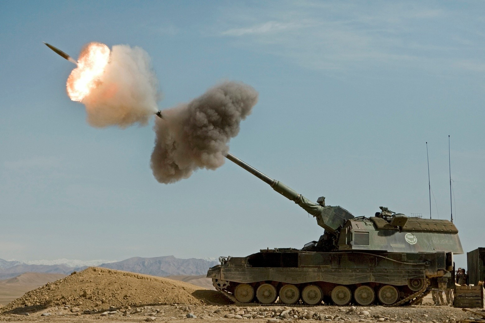
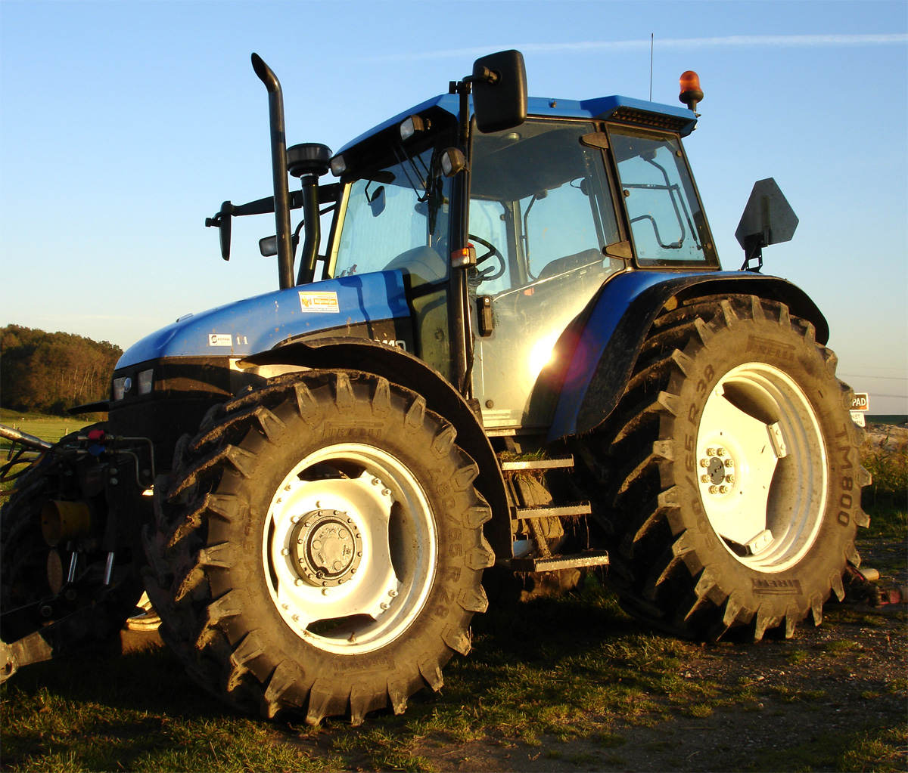
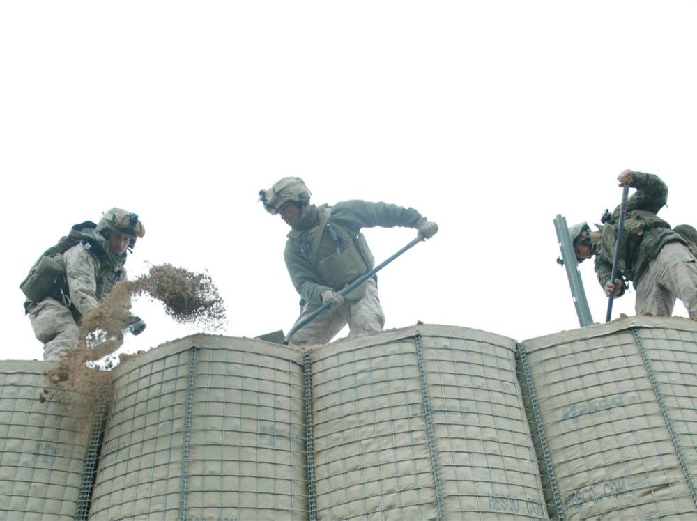
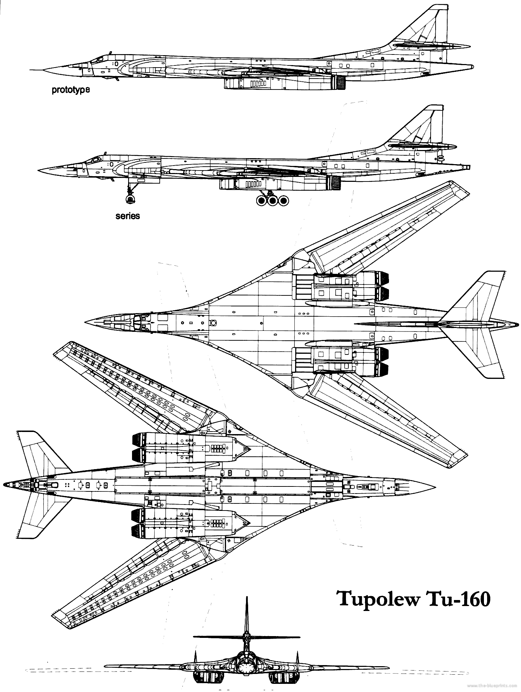

*****************
Military Terms 02
*****************

#. Dead Reckoning

    In navigation, dead reckoning or dead-reckoning (also ded for deduced reckoning or DR) 
    is the process of calculating one's current position by using a previously determined position, 
    or fix, and advancing that position based upon known or estimated speeds over elapsed time and course.
   
#. Utopia

    乌托邦也稱理想國（曾為魯迅先生的《華蓋集》中使用），無何有之鄉（源于《庄子》），
    是一个理想的群体和社会的构想，名字由托马斯·摩尔的《乌托邦》一书中所写的
    完全理想的共和国“乌托邦”而来。意指理想完美的境界，特別是用於表示法律、政府及社會情況。
    托马斯·摩尔在书中虚构了一个大西洋上的小岛，小岛上的国家拥有完美的社会、政治和法制体系。
    这个词用来描述一种被称为“意向社群”的理想社会和文学虚构的社会。这个概念也引出了其他的概念，
    最突出的概念就是反乌托邦。

#. Dystopia

    反乌托邦是烏托邦（utopia）的反義語，希臘語字面意思是「不好的地方」（not-good place），
    它是一種不得人心、令人恐懼的假想社群或社會，是与理想社会相反的，一种极端恶劣的社会最终形态。
    反烏托邦常常表徵爲反人类、極權政府、生態災難或其他社會性的灾難性衰敗。這種社會出現在許多藝術作品中，
    特別是設定在未來的故事。反烏托邦出現在許多虛構作品的亞流派中，常被用於提醒人們注意現實世界中的有關
    環境、政治、經濟、宗教、心理學、道德倫理、科學技術方面的問題，這些問題如果被人們忽略，
    有可能導致出現反烏托邦的狀况。

#. Cyberpunk [赛博朋克]
   
    .. image:: images/Tokyo_Shibuya_Night.jpg

    Cyberpunk，是cybernetics与punk的结合词，又称数位庞克、赛博庞克、电脑叛客、网路叛客、电驭叛客，
    是科幻小说的一个分支，以计算机或信息技术为主题，小说中通常有社会秩序高度控管下存在弱点受破坏的情节。
    现在赛博朋克的情节通常围绕骇客、人工智能及大型企业之间的矛盾而展开，背景设在不远的将来的一个反乌托邦地球，
    而不像早期科幻（如太空歌剧）时空背景多在遥远未来的外太空殖民地。
    它的出现是对科幻小说一贯忽略信息技术高速发展的一种自我修正。

#. the Pentagon [五角大楼，美国国防部]

    .. image:: images/the_pentagon.jpg
   
    The Pentagon is the headquarters of the United States Department of Defense, 
    located in Arlington County, Virginia, across the Potomac River from Washington, D.C. 
    As a symbol of the U.S. military, The Pentagon is often used metonymically to refer 
    to the U.S. Department of Defense.
    
    The Pentagon was designed by American architect George Bergstrom (1876–1955), 
    and built by general contractor John McShain of Philadelphia. Ground was broken 
    for construction on September 11, 1941, and the building was dedicated on January 15, 1943. 
    General Brehon Somervell provided the major motive power behind the project; 
    Colonel Leslie Groves was responsible for overseeing the project for the U.S. Army.
    
    The Pentagon is one of the world's largest office buildings. It has five sides, 
    five floors above ground, two basement levels, and five ring corridors per floor 
    with a total of 17.5 mi (28.2 km) of corridors. The Pentagon includes a five-acre 
    central plaza, which is shaped like a pentagon and informally known as "ground zero," 
    a nickname originating during the Cold War on the presumption that it would be targeted 
    by the Soviet Union at the outbreak of nuclear war.

#. US Central Command

    US Central Command, also known as Centcom, is the headquater at MacDill Air Base in Tampa.
    It is responsible for the operational theatre spanning parts of the Middle East, Central Asia, 
    and North Africa.
    
    This isn't a warfighting strategy, to have a video of attacking Florida. Ths a message. 
    The symbolism is in the video itself. It's a rhetorical flourish.

    Artillery 炮击，炮兵

    Infrantry division 步兵师

    Tractor 拖拉机

.. figure:: images/camion.jpg

    Camion 大卡车，军用卡车

    nonviolence: the use of peaceful means, not force, to bring about political or social change.

    Dugout 战壕
   
.. image:: images/bastion_1.jpg

    Bastion [掩体，堡垒，碉堡]

    An institution, place, or person strongly defending 
    or upholding particular principles, attitudes, or activities.
    

    Tupolev Tu-160

.. figure:: images/heavy_rockets.png

    Heavy rockets [重型火箭]

    | Falcon heavy
    | Delta IV Heavy
    | Proton M
    | Falcon 9
    | Atlas V 551
    | Ariane 5 ES

.. figure:: images/jetfire-transformer.jpeg

    I'm too old for this carp. [老骨头不中用了]

.. figure:: images/spaceshuttle.png

    Space shuttle

.. figure:: images/booster.png

    Booster

.. figure:: images/parachute.png

    Parachute