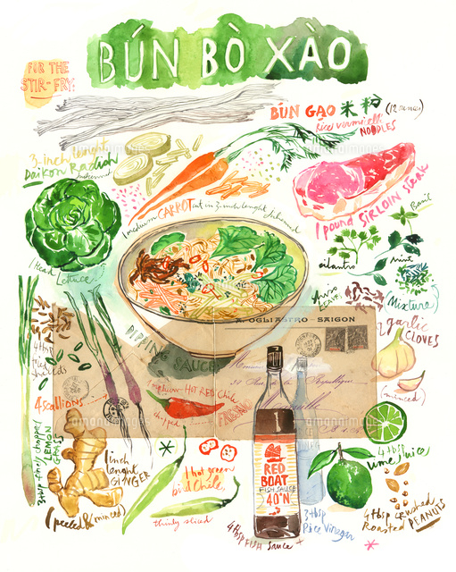
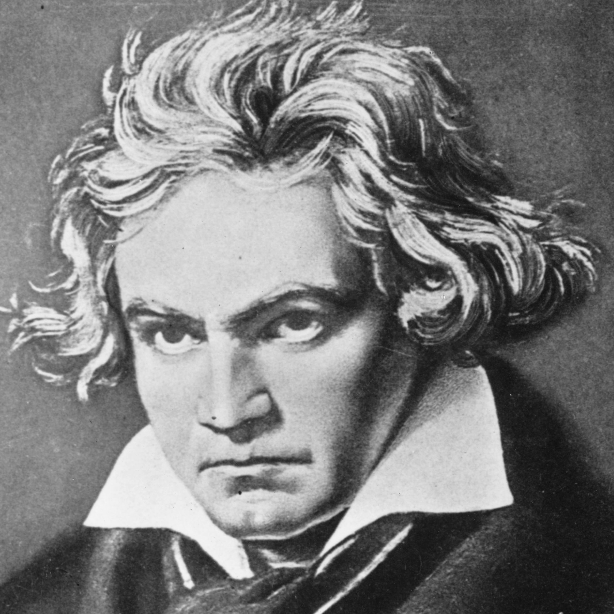
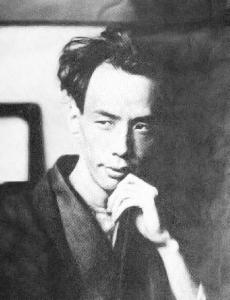

*******
Mottoes
*******

我的作品一经完成，就没有再加修改的习惯。因为我深信部分的变换足以改易作品的性格。

-- 路德维希·凡·贝多芬

删除我一生中的任何一个瞬间,我都不能成为今天的自己。

-- 芥川龙之介

愈使我受苦的我愈喜欢。

我的欢乐是悲哀。

千万的欢乐不值一单独的烦恼。

-- 米开朗琪罗

.. image:: images/Michelangelo-Buonarroti.jpg