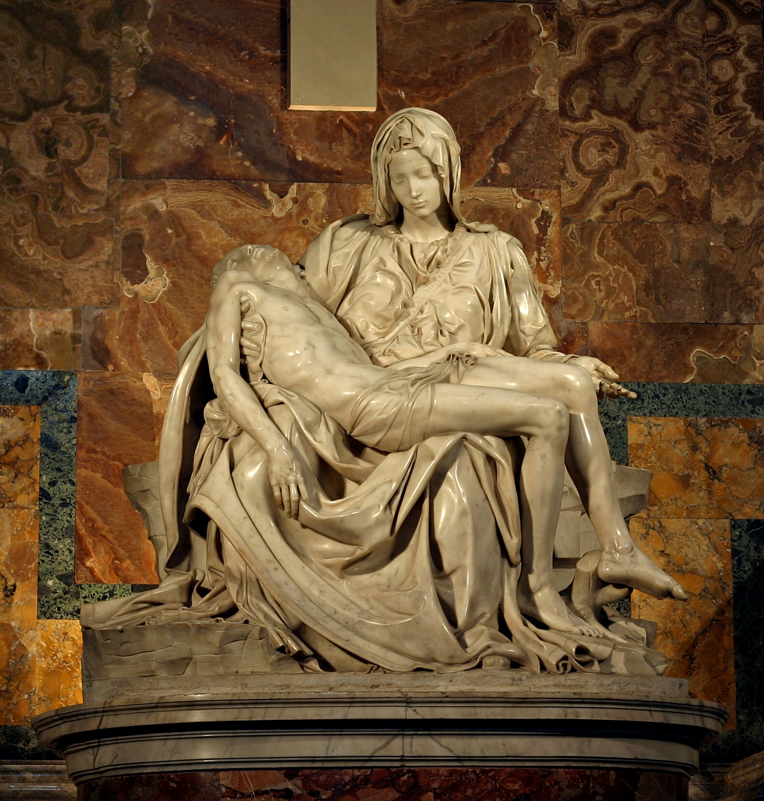

*******
Mottoes
*******

我的作品一经完成，就没有再加修改的习惯。因为我深信部分的变换足以改易作品的性格。

-- 路德维希·凡·贝多芬

删除我一生中的任何一个瞬间,我都不能成为今天的自己。

-- 芥川龙之介

.. image:: images/Akutagawa.jpg

愈使我受苦的我愈喜欢。

我的欢乐是悲哀。

千万的欢乐不值一单独的烦恼。

多么想望而来得多么迟的死，因为，对于不幸的人，死是懒惰的。

-- 米开朗琪罗

.. figure:: images/Michelangelo-Buonarroti.jpg

   Michelangelo Buonarroti

   米开朗琪罗 - 哀悼基督

我自己想，像我这样一个鼻子那么宽，口唇那么大，眼睛那么小的人，世界上是没有他的快乐的。

骄傲是我的大缺点，一种夸大的自尊心，毫无理智的我的野心，那么强烈。
如果我必得在光荣与德性（我爱好的）中选择其一，我确信我将选择前者。

-- 列夫·尼古拉耶维奇·托尔斯泰 

   Лев Николаевич Толстой

生而为人，我很抱歉。

-- 太宰治 《人间失格》

.. figure:: images/Osamu_Dazai.jpg

   太宰治
