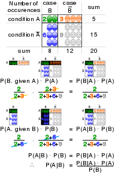
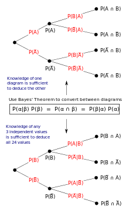

*************
Bayes Theorem
*************

.. figure:: images/Bayes'_Theorem.jpg

   Statement of theorem

   .. math::

     {P(A\mid B)={\frac {P(B\mid A)\,P(A)}{P(B)}},}
     \text{where A and B are events and } { P(B)\neq 0}.
      
   
.. note::

   :math:`P(A\mid B)` is a conditional probability: 
   the likelihood of event A occurring given that B is true.

