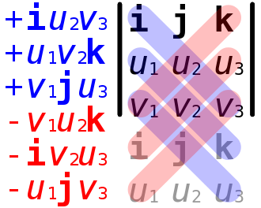
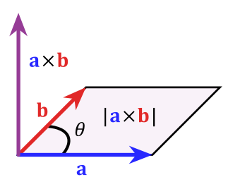
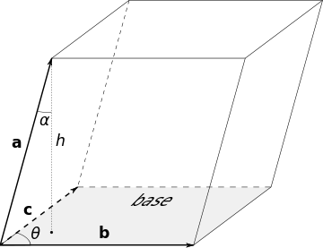

*************
Cross Product
*************

Introduction
============

.. sidebar:: Cross Product

   .. image:: images/Cross_product_vector.svg

In mathematics and vector algebra, the cross product or vector product 
(occasionally directed area product to emphasize the geometric significance) 
is a binary operation on two vectors in three-dimensional space 
:math:`{\left(\mathbb{R}^{3}\right)}` and is denoted by the symbol 
:math:`\times`. Given two linearly independent vectors 
:math:`\mathbf{a}` and :math:`\mathbf{b}` the cross product, 
:math:`{ \mathbf{a} \times \mathbf{b} }`, is a vector that is perpendicular 
to both :math:`\mathbf{a}` and :math:`\mathbf{b}` and thus normal to the plane 
containing them. It has many applications in mathematics, physics, engineering, 
and computer programming. It should not be confused with dot product (projection product).

If two vectors have the same direction (or have the exact opposite direction from one another, 
i.e. are not linearly independent) or if either one has zero length, then their cross product 
is zero. More generally, the magnitude of the product equals the area of a parallelogram with 
the vectors for sides; in particular, the magnitude of the product of two perpendicular vectors 
is the product of their lengths. The cross product is anticommutative (i.e., 
:math:`{\mathbf{a} \times \mathbf{b} = -\mathbf{b} \times \mathbf{a} }`) and is distributive over addition (i.e., 
:math:`{\mathbf{a} \times (\mathbf{b}+\mathbf{c} )=\mathbf{a} \times \mathbf{b} +\mathbf{a} \times \mathbf{c} }`). 
The space :math:`\mathbb{R} ^{3}` together with the cross product is an algebra over the real numbers, 
which is neither commutative nor associative, but is a Lie algebra with the cross product being the Lie bracket.

Definition
==========

.. figure:: images/Right_hand_rule_cross_product.svg

   Finding the direction of the cross product by the right-hand rule.

.. sidebar:: Cross Product Notation

   .. image:: images/Cross_product.gif

   The cross product :math:`{\mathbf{a} \times \mathbf{b}}` (vertical, in purple) 
   changes as the angle between the vectors a (blue) and b (red) changes. The cross 
   product is always orthogonal to both vectors, and has magnitude zero when the 
   vectors are parallel and maximum magnitude :math:`\| \mathbf{a} \| \| \mathbf{b} \|` 
   when they are orthogonal.

The cross product of two vectors a and b is defined only in three-dimensional space 
and is denoted by :math:`{\mathbf{a} \times \mathbf{b}}`. In physics, sometimes the 
notation :math:`a \wedge b` is used, though this is avoided in mathematics to avoid 
confusion with the exterior product.

The cross product :math:`{\mathbf{a} \times \mathbf{b}}` is defined as a vector *c* 
that is perpendicular (orthogonal) to both *a* and *b*, with a direction given by the 
right-hand rule and a magnitude equal to the area of the parallelogram that the vectors span.

The cross product is defined by the formula:

.. math::

   {\mathbf{a} \times \mathbf{b} = \| \mathbf{a} \| \| \mathbf{b} \|\sin(\theta )\ \mathbf{n} } 

where :math:`\theta` is the angle between *a* and *b* in the plane containing them 
(hence, it is between :math:`0^\circ` and :math:`180^\circ`), :math:`\| \mathbf{a} \|` 
and :math:`\| \mathbf{b} \|` are the magnitudes of vectors *a* and *b*, and *n* is 
a unit vector perpendicular to the plane containing *a* and *b* in the direction 
given by the right-hand rule. If the vectors *a* and *b* are parallel (i.e., 
the angle :math:`\theta` between them is either :math:`0^\circ` or :math:`180^\circ`), 
by the above formula, the cross product of *a* and *b* is the zero vector 0.

Names
=====

n 1881, Josiah Willard Gibbs, and independently Oliver Heaviside, introduced both 
the dot product and the cross product using a period (:math:`a \cdot b`) and a 
cross (:math:`a \times b`), respectively, to denote them.

In 1877, to emphasize the fact that the result of a dot product is a scalar while 
the result of a cross product is a vector, William Kingdon Clifford coined the 
alternative names **scalar product** and **vector product** for the two operations. 
These alternative names are still widely used in the literature.

Both the cross notation (:math:`a \times b`) and the name cross product were possibly 
inspired by the fact that each scalar component of :math:`a \times b` is computed by 
multiplying non-corresponding components of a and b. Conversely, a dot product 
:math:`a \cdot b` involves multiplications between corresponding components of a and b. 
the cross product can be expressed in the form of a determinant of a special 3 × 3 matrix. 
According to **Sarrus's rule**, this involves multiplications between matrix elements 
identified by crossed diagonals.

Computing the cross product
===========================

Coordinate notation
-------------------

the cross product of any two vectors u and v. Each vector can be defined as the sum of 
three orthogonal components parallel to the standard basis vectors:

.. math::

   \mathbf{u} &= u_{1}\mathbf{i} + u_{2}\mathbf{j} + u_{3}\mathbf {k} \\
   \mathbf{v} &= v_{1}\mathbf{i} + v_{2}\mathbf{j} + v_{3}\mathbf {k} 

Their cross product :math:`u \times v` can be expanded using distributivity:

.. math::

   \mathbf{u} \times \mathbf{v} =& (u_{1}\mathbf{i} + u_{2}\mathbf{j} + u_{3}\mathbf{k}) 
                                 \times (v_{1}\mathbf{i} + v_{2}\mathbf{j} + v_{3}\mathbf{k} ) \\ 
                                 =& u_{1}v_{1}(\mathbf{i} \times \mathbf{i}) + u_{1}v_{2}(\mathbf{i} \times \mathbf{j})
                                 + u_{1}v_{3}(\mathbf{i} \times \mathbf{k}) \\
                                 +& u_{2}v_{1}(\mathbf{j} \times \mathbf{i}) + u_{2}v_{2}(\mathbf{j} \times \mathbf{j})
                                 + u_{2}v_{3}(\mathbf{j} \times \mathbf{k}) \\
                                 +& u_{3}v_{1}(\mathbf{k} \times \mathbf{i})+u_{3}v_{2}(\mathbf{k} \times \mathbf{j}) 
                                 + u_{3}v_{3}(\mathbf{k} \times \mathbf{k} ) \\
                                 =& (u_{2}v_{3} - u_{3}v_{2})\mathbf{i} + (u_{3}v_{1} - u_{1}v_{3})\mathbf{j} 
                                 + (u_{1}v_{2} - u_{2}v_{1})\mathbf{k}

Matrix notation
---------------

   Use of Sarrus's rule to find the cross product of u and v

The cross product can also be expressed as the formal determinant:

.. math::

   {\begin{aligned}
      \mathbf{u \times v} 
         =& {\begin{vmatrix} \mathbf{i} & \mathbf{j} & \mathbf{k} \\ u_{1}&u_{2}&u_{3} \\ v_{1}&v_{2}&v_{3} \end{vmatrix}} \\
         =& {\begin{vmatrix} u_{2}&u_{3} \\ v_{2}&v_{3} \end{vmatrix}} \mathbf{i}
         -  {\begin{vmatrix} u_{1}&u_{3} \\ v_{1}&v_{3} \end{vmatrix}} \mathbf{j}
         +  {\begin{vmatrix} u_{1}&u_{2} \\ v_{1}&v_{2} \end{vmatrix}} \mathbf{k} \\
         =& (u_{2}v_{3} - u_{3}v_{2}) \mathbf{i} + (u_{3}v_{1} - u_{1}v_{3}) \mathbf{j} 
         + (u_{1}v_{2} - u_{2}v_{1}) \mathbf{k}  
   \end{aligned}} 

Specially for plane vector, :math:`u_{3} = v_{3} = 0`, the cross product turns into this:

.. math:: 

   \mathbf{u \times v} = (u_{1}v_{2} - u_{2}v_{1}) \mathbf{k}

Properties
==========

Geometric meaning
-----------------

The magnitude of the cross product can be interpreted as the positive area 
of the parallelogram having a and b as sides:

.. math::

   {\|\mathbf{a} \times \mathbf{b}\| = \|\mathbf{a}\| \|\mathbf{b}\| \sin\theta} 

   The area of a parallelogram as the magnitude of a cross product

Indeed, one can also compute the volume V of a parallelepiped having a, b and c as edges 
by using a combination of a cross product and a dot product, 
called **scalar triple product**:

.. math::

   { 
      \mathbf{a} \cdot (\mathbf{b} \times \mathbf{c}) 
         = \mathbf{b} \cdot (\mathbf{c} \times \mathbf{a}) 
         = \mathbf{c} \cdot (\mathbf{a} \times \mathbf{b})
   } 

Since the result of the scalar triple product may be negative, the volume of the parallelepiped 
is given by its absolute value. For instance,

.. math::

   { V = |\mathbf{a} \cdot (\mathbf{b} \times \mathbf{c})|} 

   Three vectors defining a parallelepiped

Because the magnitude of the cross product goes by the sine of the angle between its arguments, 
the cross product can be thought of as a measure of perpendicularity in the same way that the 
dot product is a measure of parallelism. Given two unit vectors, their cross product has a 
magnitude of 1 if the two are perpendicular and a magnitude of zero if the two are parallel. 
The dot product of two unit vectors behaves just oppositely: it is zero when the unit vectors 
are perpendicular and 1 if the unit vectors are parallel.

Unit vectors enable two convenient identities: the dot product of two unit vectors yields the cosine 
(which may be positive or negative) of the angle between the two unit vectors. The magnitude of the 
cross product of the two unit vectors yields the sine (which will always be positive).
