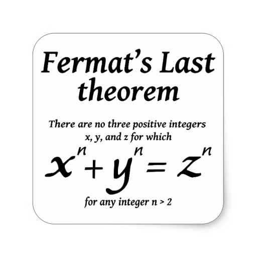

**********************
History of Mathematics
**********************

   Fermat's Last Theorem

   In number theory Fermat's Last Theorem (sometimes called Fermat's conjecture, 
   especially in older texts) states that no three positive integers a, b, and c 
   satisfy the equation :math:`a^n + b^n = c^n` for any integer value of **n > 2.** 
