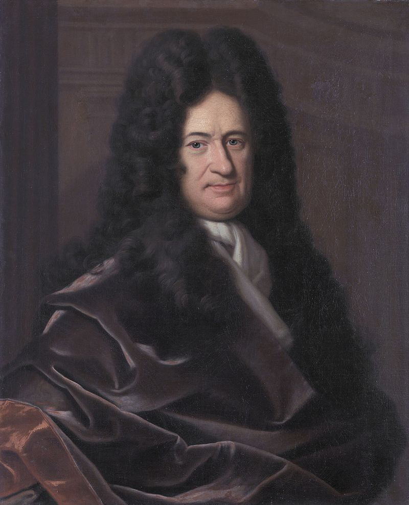

**********************
History of Mathematics
**********************

.. sidebar:: The School of Athens, by Raphael

   .. image:: images/the_school_of_anthens_by_raphael.jpg

   Euclid (holding calipers), Greek mathematician, 3rd century BC, 
   as imagined by Raphael in this detail from The School of Athens

Mathematics (from Greek μάθημα máthēma, "knowledge, study, learning") 
includes the study of such topics as quantity, structure, space, and change.

Mathematicians seek and use patterns to formulate new conjectures; 
they resolve the truth or falsity of conjectures by mathematical proof. 
When mathematical structures are good models of real phenomena, 
then mathematical reasoning can provide insight or predictions about nature. 
Through the use of abstraction and logic, mathematics developed from counting, 
calculation, measurement, and the systematic study of the shapes and motions of 
physical objects. Practical mathematics has been a human activity from as far back 
as written records exist. The research required to solve mathematical problems can 
take years or even centuries of sustained inquiry.

   Fermat's Last Theorem

   In number theory Fermat's Last Theorem (sometimes called Fermat's conjecture, 
   especially in older texts) states that no three positive integers a, b, and c 
   satisfy the equation :math:`a^n + b^n = c^n` for any integer value of **n > 2.** 

   Pythagorean Theorem [勾股定理]

   :math:`a^2 + b^2 = c^2`

.. figure:: images/Integral_as_region_under_curve.svg

   Caculus [微积分]

   The branch of mathematics that deals with the finding and properties of derivatives 
   and integrals of functions, by methods originally based on the summation of infinitesimal 
   differences. The two main types are differential calculus and integral calculus.

   Gottfried Wilhelm Leibniz was the first to state clearly the rules of calculus.

.. figure:: images/IsaacNewton.jpg

   Isaac Newton developed the use of calculus in his laws of motion and gravitation.
