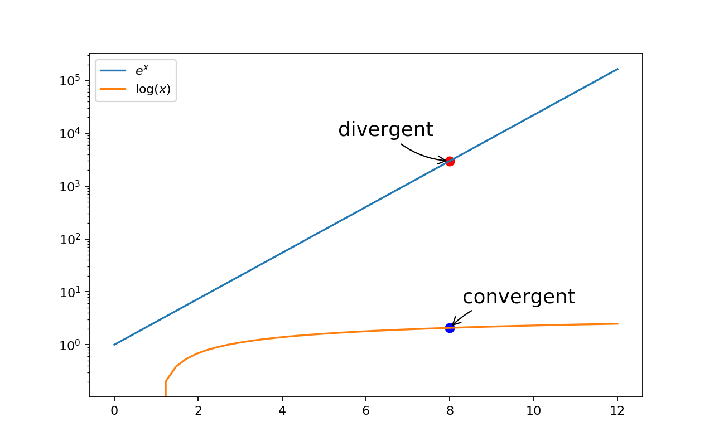

Mathematical Terminology
========================

I think, therefore I am

-- *Descartes*

| algebra
| algebraic
| Definition: the part of mathematics in which letters and other general symbols are used to represent numbers and quantities in formulae and equations.
| 
| congruent 
| Definition: (geometry) having the same size and shape.
| Usage: congruent triangles. [全等三角形]
| 
| tangential
| Definition: hardly touching a matter; peripheral
| Usage: The reforms were tangential to efforts to maintain a basic standard of life.
| Definition: (geometry) of  or along a tangent
| Usage: a tangential line. [切线]
|
| power
| Definition: in mathematics, power is used in expressions such as 2 to the power of 4 or 2 to the 4th power to indicate ``2^4``.
| Usage: Any number to the power of nought is equal to one.
|
| similar triangle [相似三角形]
| corresponding side [对应边] 
| exponential distribution
| uniform distribution
| normal distribution
| standard deviation   :math:`/sigma`
| mean  :math:`/mu`
| permutation 排列
| combination 组合
| combinatorics 组合数学
| probability theory 概率论
| algebraic dexterity 代数手算？--> 精通代数
| determinant 行列式
| parallelepiped 平行六面体
| parallelogram 平行四边形
| quadrilateral 四边形
| colinear 共线
| polyheron 多面体
| convex polygon 凸多边形
| diagonal 对角线
| ellipse 椭圆
| perimeter 周长
| significant digits 有效数字
| scientific notation 科学计数法
| trigonometic function 三角函数
| factorial 阶乘
| polynomial 多项式的
| 
| vertex [顶点]
| Definition: Each angular point of a polygon, polyhedron, or other figure.
| Plural: vertices
| Synonyms: apex, peak, pinnacle
| 
| decimal
| Definition: (decimal fraction) a fraction whose denominator is a power of ten and whose numerator is expressed by figures placed to the right of a decimal point.
| Usage: The decimal 0.61 stands for 61 hundredths.
| 
| denominator [分母]
| Definition: (mathematics) the number below the line in a fraction showing how many parts the whole is divided into.
| Antonyms: numerator [分子]
| Usage: common denominator. [公分母]
| Least common multiple [最小公倍数]
| 
| mantissa
| Definition: (mathematics) the part of a logarithm after the decimal point.
| Definition: (computing) the part of a floating-point number which represents the significant digits of that number.
| 
| cardinal, ordinal, nominal number
| A cardinal number says how many of something there are, such as one, two, three; [基数词]
| An ordinal number tells us the position of something in a list; [序数词]
| A nominal number is a number used only as a name, or to identify something (not as an actual value or position). 
|
| orthognal
| Definition: of or involving right angles; at right angles. [正交]
| Definition: (statistics) of variates statistically independent. [相互独立]
| Definition: (of an experiment) having variates which can be treated as statistically independent.
| 
| Cartesian
| Cartesianism
| Definition: relating to Descartes and his ideas.
| Definition: a follower of Descartes.
| Origin: from modern Latin Cartesianus, from Cartesius, Latinized form of the name of Descartes.
| 
| normal
| Definition: [technical] a line at right angles to a given line or surface.
| Usage: unit normal. [单位法向量]
|
| extrapolate
| Definition: extend the application of (a method or conclusion, especially one based on statistics) 
| to an unknown situation by assuming that existing trends will continue or similar methods 
| will be applicable.
| Usage: the results cannot be extrapolated to other patient groups.
| Usage: it is always dangerous to extrapolate from a sample.
| Usage: attempts to extrapolate likely human cancers from laboratory studies.
| Definition: (mathematics) extend (a graph, curve, or range of values) by inferring unknown values 
| from trends in the known data.
| 
| interpolate
| Definition: insert (something of a different nature) into something else.
| Usage: illustrations were interpolated in the text.
| Definition: interject (a remark) in a conversation.
| Usage: “I dare say,” interpolated her employer.
| Definition: (mathematics) insert (an intermediate value or term) into a series 
| by estimating or calculating it from surrounding known values.
| 
| symmetric
| Definition: made up of exactly similar parts facing each other or around an axis; symmetrical.
| Usage: The structure is completely sysmetric.

   Crossover point [交点]

.. figure:: images/abacus.jpg

   abacus 算盘

.. image:: images/right_triangle.png

   
   Trigonometric

.. figure:: images/tan_x.png

   :math:`f(x) = tan x`

   Superlinear

   (Mathematics) Describing a function 
   that eventually grows faster than any linear one

   Exponent Arithmetic notation

.. figure:: images/asymptotic_example.svg.png

   Asymptote [渐近线]

   Divergent 发散 convergent 收敛
