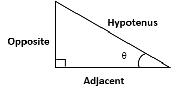
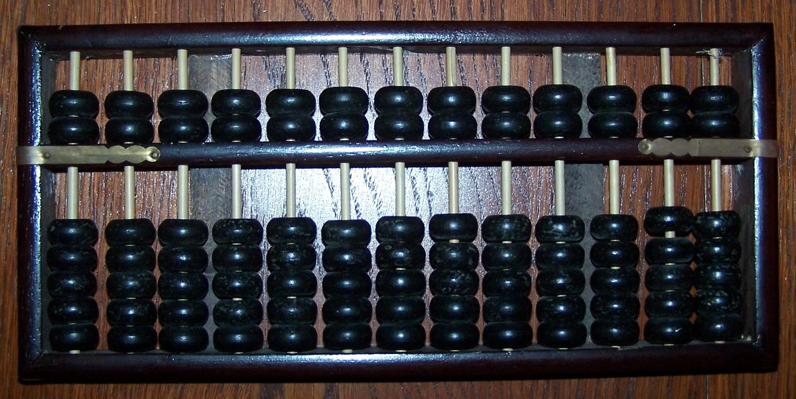

Mathematical Terminology
========================

| algebra
| algebraic
| Definition: the part of mathematics in which letters and other general symbols are used to represent numbers and quantities in formulae and equations.
| 
| quadratic
| Definition: (mathmatics) involving an unknown quantity that is multiplied by itself once only
| usage: a quadratic equation. [二次方程]
| 
| congruent
| Definition: (geometry) having the same size and shape.
| Usage: congruent triangles. [全等三角形]
| 
| tangnential
| Definition: hardly touching a matter; peripheral
| Usage: The reforms were tangnential to efforts to maintain a basic standard of life.
| Definition: (geometry) of  or along a tangent
| Usage: a tangential line.
|
| Pythagorean theorem: :math:`a^2 + b^2 = c^2` [勾股定理]
|

.. figure:: images/trigonometrics.png
   
   Trigonometric

   :math:`f(x) = tan x`

| convex polygon [凸多边形]
| similar triangle [相似三角形]
| corresponding side [对应边] 
| exponential distribution
| uniform distribution
| normal distribution
| standard deviation   σ
| mean  μ
| 
| divergent  发散
| convergent 收敛
| permutation 排列
| combination 组合
| 
| asymptote
| Definition: a line that continually approaches a given curve but doesn’t meet it at any finite length.
| 
| prime number
| Definition: (mathematics) a number that can be divided exactly only by itself and 1, for example 7, 17 and 41.
| Antonyms: composite number [质数]
| 
| polynomial
| Definition: (mathematics) 多项式的
|
| modulus
| Definition: another term for absolute value.
| Definition: a constant factor or ratio.
| Definition: a number used as a divisor for considering numbers in sets, numbers being considered congruent when giving the same remainder when divided by | a particular modulus.| 
| 

modulo [取余]

(in mathematics) with respect to or using a modulus of a specified number.
Two numbers are congruent modulo a given number if they give the same remainder
when divided by that number: 19 and 64 are congruent modulo 5.

multiplicative inverser

In mathematics, a **multiplicative inverse** or **reciprocal** for a number *x*,
denoted by :math:`\frac{1}{x}` or :math:`x^{−1}`, is a number which when multiplied
by x yields the multiplicative identity, 1. The multiplicative inverse of a fraction
:math:`\frac{a}{b}` is :math:`\frac{b}{a}`. For the multiplicative inverse of a real
number, divide 1 by the number. For example, the reciprocal of 5 is one fifth (1/5 or 0.2),
and the reciprocal of 0.25 is 4. The reciprocal function, the function *f(x)* that maps *x* 
to :math:`\frac{1}{x}`, is one of the simplest examples of a function which is its own inverse
(an involution).

.. figure:: images/one_over_x.png

   The reciprocal function: :math:`y = \frac{1}{x}`. For every x except 0, y represents its multiplicative inverse.

|
| vertex [顶点]
| Definition: Each angular point of a polygon, polyhedron, or other figure.
| Plural: vertices
| Synonyms: apex, peak, pinnacle
| 
| decimal
| Definition: (decimal fraction) a fraction whose denominator is a power of ten | and whose numerator is expressed by figures placed to the right of a decimal | point.
| Usage: The decimal 0.61 stands for 61 hundredths.
| 
| denominator
| Definition: (mathematics) the number below the line in a fraction showing how | many parts the whole is divided into, for example in :math:`\frac{3}{4}`.
| Synonyms: numerator
| Usage: common denominator. [公分母]
| 
| 
| mantissa
| Definition: (MATHEMATICS) the part of a logarithm after the decimal point.
| Definition: (COMPUTING) the part of a floating-point number which represents the significant digits of that number.
| 
| Least common multiple 最小公倍数
|
| quotient 商
| Definition: In arithmetic, a quotient (from Latin: quotiens "how many times", pronounced /ˈkwoʊʃənt/) is the quantity produced by the division of two numbers. The quotient has widespread use throughout mathematics, and is commonly referred to as a fraction or a ratio. For example, when dividing twenty (the dividend) by three (the divisor), the quotient is six and two thirds. In this sense, a quotient is the ratio of a dividend to its divisor.

| power
| Definition: In mathematics, power is used in expressions such as 2 to the power of 4 or 2 to the 4th power to indicate that 2 must be multiplied by itself 4 times.
| Usage: Any number to the power of nought is equal to one.
| 
| cardinal, ordinal, nominal number
| A cardinal number says how many of something there are, such as one, two, three; [基数词]
| An ordinal number tells us the position of something in a list; [序数词]
| A nominal number is a number used only as a name, or to identify something (not as an actual value or position). 

   abacus 算盘

.. figure:: images/Manhattan_distance.svg

   Manhanttan Distance
   
   Red: Manhattan distance.
   Green: diagonal, straight-line distance. 
   Blue, yellow: equivalent Manhattan distances.

The distance between two points in a grid based on a strictly horizontal
and/or vertical path (that is, along the grid lines), as opposed to the diagonal
or "as the crow flies" distance. The Manhattan distance is the simple sum of the
horizontal and vertical components, whereas the diagonal distance might be
computed by applying the Pythagorean theorem. [勾股定理]

| asymptote
| asymptotic
| asymptotically
| Definition: a line that continually approaches a given curve but does not meet it at any finite distance.

