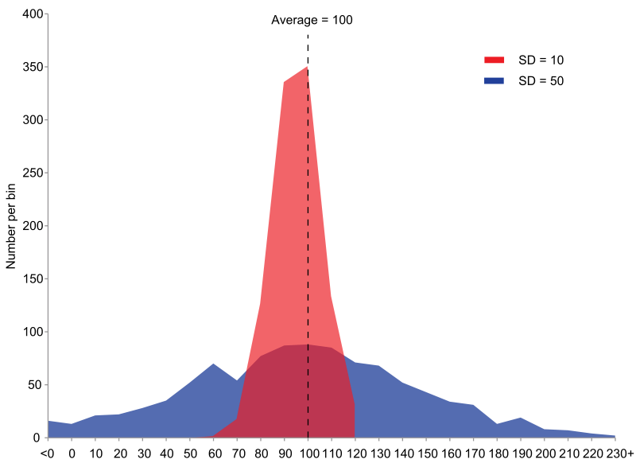

********************************
Probability and Statistics Terms
********************************

.. contents::
   :local:

mean, median and mode
=====================

.. sidebar:: Mean, media and mode

   .. image:: images/Comparison_mean_median_mode.svg

   Comparison of the arithmetic mean, median and mode 
   of two skewed (log-normal) distributions.

   .. image:: images/Visualisation_mode_median_mean.svg

   Geometric visualisation of the mode, median and mean 
   of an arbitrary probability density function.

In descriptive statistics, the mean may be confused with 
the median, mode or mid-range, as any of these may be 
called an "average" (more formally, a measure of central 
tendency). The **mean** of a set of observations is the arithmetic 
average of the values; however, for skewed distributions, the 
mean is not necessarily the same as the middle value (**median**), 
or the most likely value (**mode**). For example, mean income is 
typically skewed upwards by a small number of people with very 
large incomes, so that the majority have an income lower than the mean. 
By contrast, the median income is the level at which half the population 
is below and half is above. The mode income is the most likely income, 
and favors the larger number of people with lower incomes. While the median 
and mode are often more intuitive measures for such skewed data, many skewed 
distributions are in fact best described by their mean, including the exponential 
and Poisson distributions.

Mean of a probability distribution
==================================

The mean of a probability distribution is the long-run arithmetic average value 
of a random variable having that distribution. In this context, it is also known 
as the expected value. For a discrete probability distribution, the mean is given by 
:math:`{\sum xP(x),}` where the sum is taken over all possible 
values of the random variable and *P(x)* is the **probability mass function**. For a 
continuous distribution,the mean is :math:`{\textstyle \int_{-\infty}^{\infty}xf(x)\,dx}`,  
where *f(x)* is the **probability density function**. In all cases, including those in 
which the distribution is neither discrete nor continuous, the mean is the Lebesgue integral 
of the random variable with respect to its probability measure. The mean need not exist or 
be finite; for some probability distributions the mean is infinite :math:`(+\infty\ or\ -\infty)`, 
while others have no mean.

Mode
====

The mode of a set of data values is the value that appears most often. 
It is the value x at which its PMF takes its maximum value. 
In other words, it is the value that is most likely to be sampled.

Like the statistical mean and median, the mode is a way of expressing, 
in a (usually) single number, important information about a random variable 
or a population. The numerical value of the mode is the same as that of the 
mean and median in a normal distribution, and it may be very different in 
highly skewed distributions.

The mode is not necessarily unique to a given discrete distribution, since the PMF 
may take the same maximum value at several points x1, x2, etc. The most extreme 
case occurs in uniform distributions, where all values occur equally frequently.

When the PDF of a continuous distribution has multiple local maxima it is common 
to refer to all of the local maxima as modes of the distribution. Such a continuous 
distribution is called multimodal (as opposed to unimodal). A mode of a continuous 
probability distribution is often considered to be any value x at which its PDF 
has a locally maximum value, so any peak is a mode.

In symmetric unimodal distributions, such as the normal distribution, 
the mean (if defined), median and mode all coincide. For samples, if 
it is known that they are drawn from a symmetric distribution, the 
sample mean can be used as an estimate of the population mode.

Variance
========

In probability theory and statistics, variance is the expectation of the squared 
deviation of a random variable from its mean. Informally, it measures how far a 
set of numbers are spread out from their average value. Variance has a 
central role in statistics, where some ideas that use it include descriptive 
statistics, statistical inference, hypothesis testing, goodness of fit, and Monte 
Carlo sampling. Variance is an important tool in the sciences, where statistical 
analysis of data is common. The variance is the square of the **standard deviation**, 
the second central moment of a distribution, and the covariance of the random 
variable with itself, and it is often represented by :math:`\sigma ^{2}`, 
:math:`\operatorname {Var}(X).`

   Comparsion standard deviations

   Example of samples from two populations with the same mean 
   but different variances. The red population has mean 100 
   and variance 100 (SD=10) while the blue population has 
   mean 100 and variance 2500 (SD=50).

By definition, The variance of a random variable **X** is 
the expected value of the squared deviation from the mean of 
:math:`X, {\mu = \operatorname{E}[X]}`:

.. math::

   \operatorname{Var} (X) = \operatorname{E} \left[(X-\mu)^{2}\right].

This definition encompasses random variables that are generated by processes 
that are discrete, continuous, neither, or mixed. The variance can also be 
thought of as the covariance of a random variable with itself:

.. math::

   \operatorname{Var} (X) = \operatorname{Cov} (X,X).

The variance is typically designated as 
:math:`\operatorname{Var} (X)`, or simply :math:`\sigma^2` (pronounced "sigma squared"). 
The expression for the variance can be expanded:

.. math::

   {{\begin{aligned}
         \operatorname{Var} (X) &= \operatorname{E} \left[(X - \operatorname{E} [X])^{2}\right] \\
         &= \operatorname{E} \left[X^{2} - 2X\operatorname{E} [X] + \operatorname{E} [X]^{2}\right] \\
         &= \operatorname{E} \left[X^{2}\right] - 2\operatorname{E} [X] \operatorname{E} [X] + \operatorname{E} [X]^{2} \\
         &= \operatorname{E} \left[X^{2}\right] -  \operatorname{E} [X]^{2}
   \end{aligned}}}

A mnemonic for the above expression is "mean of square minus square of mean". 
This equation should not be used for computations using floating point arithmetic 
because it suffers from catastrophic cancellation if the two components of the 
equation are similar in magnitude. There exist numerically stable alternatives.

If the random variable **X** represents samples generated by a continuous distribution 
with PDF **f(x)**, then the population variance is given by

.. math::

   {{\begin{aligned}
      \operatorname{Var} (X) &= \int (x-\mu )^{2}f(x)\,dx \\ 
      &= \int x^{2}f(x)\,dx - 2\mu \int xf(x)\,dx + \int \mu^{2}f(x)\,dx \\
      &= \int x^{2}f(x)\,dx-\mu ^{2},
   \end{aligned}}}

where :math:`\mu` is the expected value of **X** given by :math:`{\mu =\int xf(x)\,dx,}`
and where the integrals are definite integrals taken for *x* ranging over the range of **X.**

If the generator of random variable **X** is discrete with PMF 
:math:`{ x_{1} \mapsto p_{1},x_{2} \mapsto p_{2},\ldots ,x_{n} \mapsto p_{n}}` then
:math:`\operatorname{Var} (X) = \sum_{i=1}^{n} {p_{i} \cdot (x_{i}-\mu )^{2}},`
or equivalently :math:`{\operatorname{Var} (X) = \left(\sum_{i=1}^{n}{p_{i}x_{i}^{2}}\right) - \mu ^{2},}`
where :math:`\mu`  is the average value, i.e. :math:`{\mu =\sum_{i=1}^{n}p_{i}x_{i}.}`

The variance of a set of n equally likely values can be written as
:math:`{\operatorname{Var} (X)= {\frac {\sum_{i=1}^{n}(x_{i}-\mu )^{2}}{n}},}`
where :math:`\mu` is the expected value, i.e., :math:`{\mu ={\frac {\sum_{i=1}^{n}x_{i}}{n}}.}`
The variance of a set of n equally likely values can be equivalently expressed, without directly 
referring to the mean, in terms of squared deviations of all points from each other:

.. math::

   \operatorname{Var} (X) = {\frac {1}{n^{2}}} \sum_{i=1}^{n}\sum_{j=1}^{n}{\frac {(x_{i}-x_{j})^{2}}{2}}
                          = {\frac {1}{n^{2}}} \sum_{i}\sum_{j>i}(x_{i}-x_{j})^{2}.

Probability density function
============================

.. sidebar:: PDF Example

   .. image:: images/Boxplot_vs_PDF.svg
   
   Boxplot and probability density function of 
   a normal distribution :math:`N(0, {\sigma}^2)`.

In probability theory, a :abbr:`PDF (probability density function)`, or density 
of a continuous random variable, is a function, whose value at any given sample 
(or point) in the sample space (the set of possible values taken by the random 
variable) can be interpreted as providing a relative likelihood that the value 
of the random variable would equal that sample. In other words, while the absolute 
likelihood for a continuous random variable to take on any particular value is 0 
(since there are an infinite set of possible values to begin with), the value of 
the PDF at two different samples can be used to infer, in any particular draw 
of the random variable, how much more likely it is that the random variable would 
equal one sample compared to the other sample.

In a more precise sense, the PDF is used to specify the probability of the random 
variable falling within a particular range of values, as opposed to taking on any 
one value. This probability is given by the integral of this variable’s PDF over 
that range—that is, it is given by the area under the PDF but above the horizontal 
axis and between the lowest and greatest values of the range. The PDF is non-negative 
everywhere, and its integral over the entire space is equal to one.

The terms "probability distribution function" and "probability function" have also sometimes 
been used to denote the PDF. However, this use is not standard among probabilists and statisticians. 
In other sources, "probability distribution function" may be used when the probability distribution 
is defined as a function over general sets of values, or it may refer to the cumulative distribution 
function, or it may be a :abbr:`PMF (probability mass function)` rather than the density. 
"Density function" itself is also used for the probability mass function, leading to further confusion. 

In general though, the PMF is used in the context of discrete random variables (random variables that 
take values on a discrete set), while PDF is used in the context of continuous random variables.

Probability mass function
=========================

Introduction
------------

.. sidebar:: Probability mass function

   .. image:: images/Discrete_probability_distrib.svg

   The graph of a probability mass function. All the values 
   of this function must be non-negative and sum up to 1.

In probability and statistics, a :abbr:`PMF(probability mass function)` is a function that gives 
the probability that a discrete random variable is exactly equal to some value. The PMF is often 
the primary means of defining a discrete probability distribution, and such functions exist for 
either scalar or multivariate random variables whose domain is discrete.

A PMF differs from a :abbr:`PDF (probability density function)` in that the latter is associated 
with continuous rather than discrete random variables; the values of the PDF are not probabilities 
as such: a PDF must be integrated over an interval to yield a probability.

The value of the random variable having the largest probability mass is called the **mode**.

Formal definition
-----------------

Suppose that :math:`X: S \rightarrow A (A \subseteq R)` is a discrete random variable 
defined on a sample space S. Then the PMF :math:`f_X: A \rightarrow [0, 1]` for *X* is 
defined as :math:`f_{X}(x) = \Pr(X=x) = \Pr(\{s \in S:X(s)=x\}).` Thinking of probability 
as mass helps to avoid mistakes since the physical mass is conserved as is the total 
probability for all hypothetical outcomes *x*:

.. math::

   \sum_{x \in A} f_{X}(x) = 1

When there is a natural order among the potential outcomes *x*, it may be convenient to assign 
numerical values to them (or n-tuples in case of a discrete multivariate random variable) and 
to consider also values not in the image of *X*. That is, :math:`f_X` may be defined for all 
real numbers and :math:`f_X(x) = 0` for all :math:`x \notin X(S)` as shown in the figure.

Since the image of *X* is countable, the PMF :math:`f_X(x)` is zero for all but a countable number 
of values of *x*. The discontinuity of PMF is related to the fact that the **cumulative distribution function** 
of a discrete random variable, when it is meaningful because there is a natural ordering, is also 
discontinuous. Where it is differentiable, the derivative is zero, just as the PMF is zero at all 
such points.
