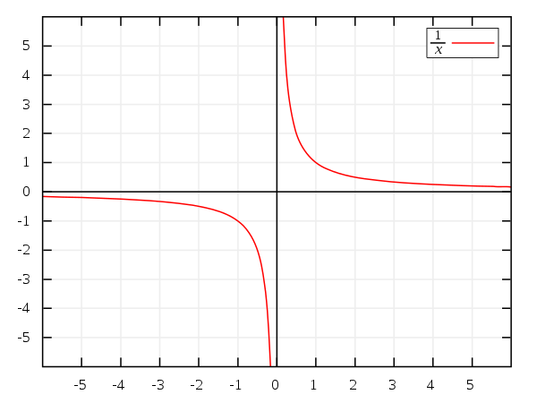

Terminology
===========

| algebra
| algebraic
| Definition: the part of mathematics in which letters and other general symbols are used to represent numbers and quantities in formulae and equations.
| 
| quadratic
| Definition: (mathmatics) involving an unknown quantity that is multiplied by itself once only
| usage: a quadratic equation. [二次方程]
| 
| congruent
| Definition: (geometry) having the same size and shape.
| Usage: congruent triangles. [全等三角形]
| 
| tangnential
| Definition: hardly touching a matter; peripheral
| Usage: The reforms were tangnential to efforts to maintain a basic standard of life.
| Definition: (geometry) of  or along a tangent
| Usage: a tangential line.
|
| Pythagorean theorem: :math:`a^2 + b^2 = c^2` [勾股定理]
|

.. image:: images/right_triangle.png

| convex polygon [凸多边形]
| similar triangle [相似三角形]
| corresponding side [对应边] 
| exponential distribution
| uniform distribution
| normal distribution
| standard deviation   σ
| mean  μ
| 
| divergent  发散
| convergent 收敛
| permutation 排列
| combination 组合
| 
| asymptote
| Definition: a line that continually approaches a given curve but doesn’t meet it at any finite length.
| 
| prime number
| Definition: (mathematics) a number that can be divided exactly only by itself and 1, for example 7, 17 and 41.
| Antonyms: composite number [质数]
| 
| polynomial
| Definition: (mathematics) 多项式的
|
| multiplicative inverser
| Definition: In mathematics, a **multiplicative inverse** or **reciprocal** for a number x, denoted by :math:`\frac{1}{x}` or :math:`x^{−1}`, is a number which when multiplied by x yields the multiplicative identity, 1. The multiplicative inverse of a fraction :math:`\frac{a}{b}` is :math:`\frac{b}{a}`. For the multiplicative inverse of a real number, divide 1 by the number. For example, the reciprocal of 5 is one fifth (1/5 or 0.2), and the reciprocal of 0.25 is 4. The reciprocal function, the function f(x) that maps x to :math:`\frac{1}{x}`, is one of the simplest examples of a function which is its own inverse (an involution).

   The reciprocal function: :math:`y = \frac{1}{x}`. For every x except 0, y represents its multiplicative inverse.

|
