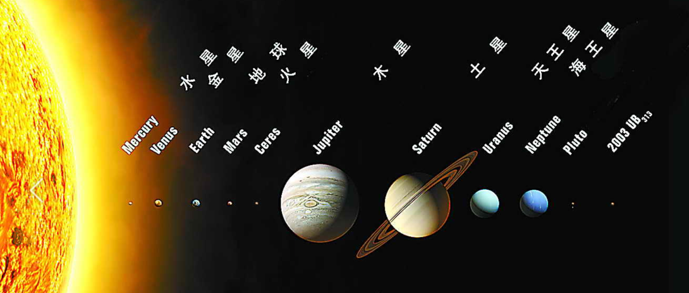
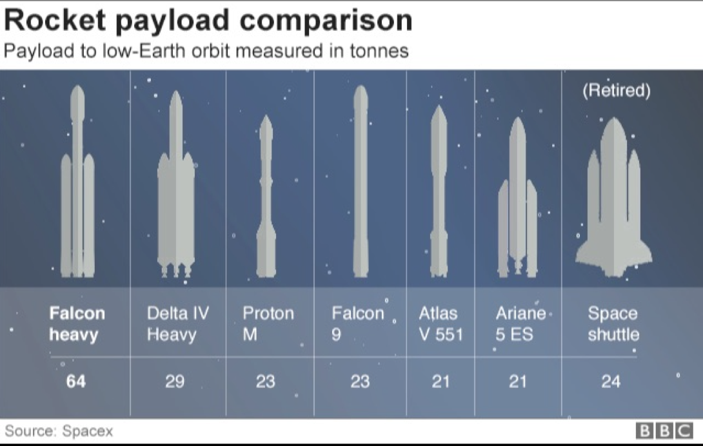
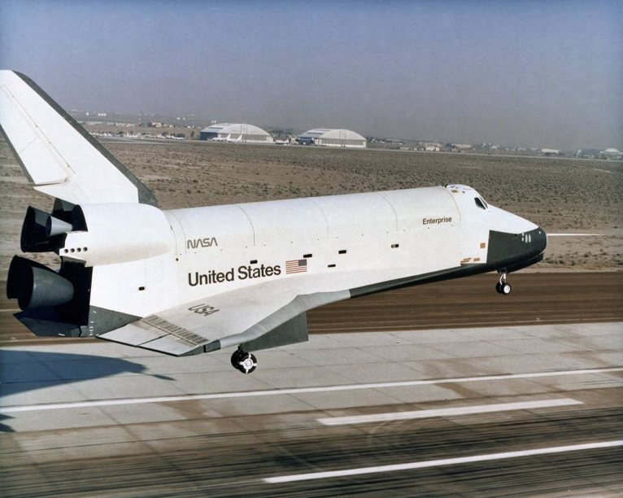
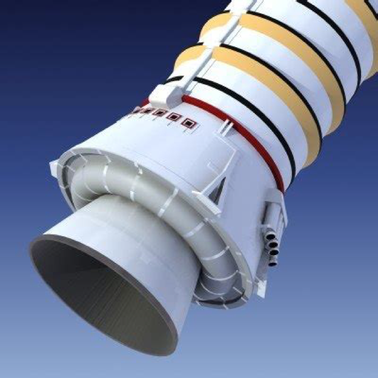
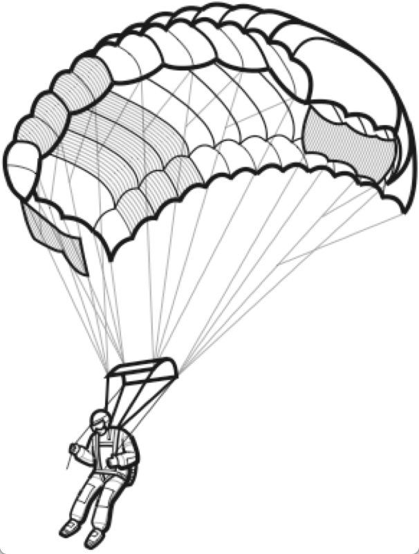

Millitary Terms
===============

| MIA -- missing-in-action [失踪]
| KIA -- killed-in-action [阵亡]
| Allied Powers [盟军]
| Axis Powers [轴心国]
| United Nations [联合国]
| appeasement policy [绥靖政策]
| Nazi-Soviet non-aggression pact [苏德互不侵犯条约]
| Nazi German
| Soviet Union
| government-in-exile [流亡政府]
| war machine
| unification of China
| the Northern Expedition [北伐战争]
| puppet state [附庸国]
| 
| embargo  [禁运]
| Definition: an official ban on trade or other commercial activity with a particular country.
| Usage: The United States sought to bring the Japenest war effort to a complete halt by imposing a full embargo on all trade between the United States to it.
| 
| ouster  [罢黜，流放]
| Definition: Dismissal or expulsion from a position.
| Usage: A showdown that may lead to his ouster as leader of the party.
| Definition: Ejection from a freehold or other possession; deprivation of inheritance.
| 
| Confederate
| Definition: joined by an agreement or treaty.
| 
| inter [埋葬]
| Definition: place (a corpse) in a grave or tomb, typically with funeral rites.
| Usage: He was interred with the millitary honors due to him. 
| 
| loot
| Definition: goods, especially private property, take from an enemy in war. [战利品]
| Definition: stolen money or valuables. [赃款]
| Usage: The theif made off  with $5 million in loot.
| 
| militia  [民兵，预备役]
| Definition: a millitary force that is raised from the civil population to supplement a regular army in an emergency.
| 
| mercenary [雇佣兵]
| Definition: a professional soldier hired to serve in a foreign country.
| Definition: a person primarily concerned with material reward at the expense of ethics.
| Usage: Sanchez was accused of being the biggest mercenary for leaving Arsenal for Manchester United by Arsenal’s legend Martin Keown.
| 
| insurrection [起义]
| Definition: a violent uprising against the current authority or government.
| Usage: Opposition to the new regime lead to armed insurrection.
| 
| regime
| Definition: a government, especially an authoritarian one.
| 
| mass grave [万人坑]
| Definition: a pit dug in the ground to receive a large number of corpses.
| 
| medieval [中世纪]
| Definition: relating to the Middle Ages (about AD 1000 to AD 1450).
| Usage: A medieval castle.
| Definition: very old-fashioned or primitive.
| Usage: The guerrillas’ medieval behavior has become an embarassment to their supporters.
| 
| Fiorentina [佛罗伦萨]
| The Renaissance [文艺复兴]
| Definition: The Renaissance was the period in Europe, especially Italy, in the 14th, 15th, and 16th centuries, when there was a new interest in art, literature, science, and learning.
| Usage: Science took a new and different turn in the Renaissance.
|
| Mediterranean Sea - 地中海
| The straits of Gibraltar are the gate of the Mediterranean. [直布羅陀海峡]
| The Suez Canal joins the Mediterranean and the Red Sea. [蘇伊士運河]
|
| workhorse
| Definition: a workhorse is a horse is used to do a job, for example to pull a plough.
| Definition: If you describe a person or machine as a workhorse, you mean that they can be relied upon to do a large amount of work, especiall work that is dull or routine.
| Usage: My husband nerver even looked at me. I was just a workhorse bring up three children.
| Usage: Falcon 9, the workhorse of SpaceX.
| 
| constellation
| Definition: a constellation is a group of stars which form a pattern and have a name. [星系]
| Definition: a constellation of similar things is a group of them.
| Usage: Most patients have a constellation of diseases, with few clear-up distinctions between them. 
| 
| Solar system
|

| Falcon heavy
| Delta IV Heavy
| Proton M
| Falcon 9
| Atlas V 551
| Ariane 5 ES
|

| Space shuttle
|

| booster
|

| parachute
|

|
| condolence
| Usage: President Vladimir Putin has expressed his condolences to the victims’s families.
| Usage: a letter of condolence. [吊唁信]
| 
| archenemy
| arch-enemy [世仇]
| Definition: a person who is extremely hostile or opposed to someone or something.
| Usage: The twins were archenemies. [天生不和]
| 
| cockpit
| Definition: a compartment for the pilot and sometimes also the crew in an aircraft or spacecraft.
| Usage:  The company was banned from operating international flights when surprise inspectors found someone other than the flight crew in a cockpit. [驾驶舱]
| 
| confiscate
| Definition: take or seize (someone’s property) with authority. [没收]
| Usage: The guards confiscated his camera.
|  
| secession
| Definition: the action of withdraw formally from membership of a federation or body, especially a political state.
| Usage: The referendum on independence [独立公投] in September showed that more than 90% of the 3.3 million people who voted had supported secession.
| 
| mandate
| Definition: an offical order or commission to do something.
| Usage: A mandate to seek the release of political prisoners.
| 
| annul
| Definition: declare invalid (an offical aggreement, decision, or result).
| Usage: The elections were annulled by the general amid renewed protests.
|

