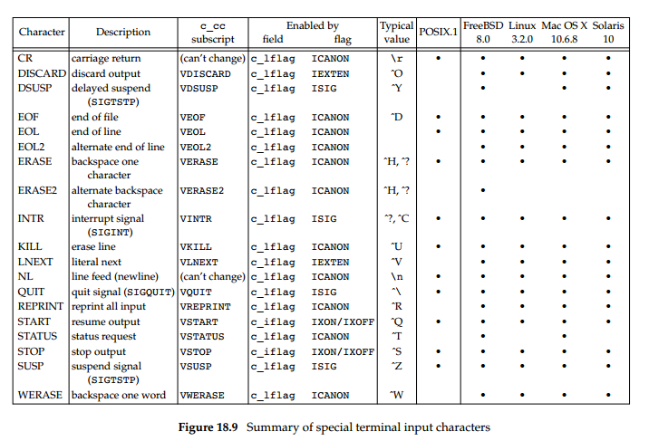

******************
Control Characters
******************

   Summer of special terminal input characters

   Refer to *Advanced Programming in UNIX Environment - 
   18.3 Special Input Characters* for further information.

#. end-of-file - Ctrl + D (logout, or quit interactive mode)
#. suspend character - Ctrl + Z (generate SIGTSTP)
#. start character - Ctrl + Q (resume terminal output)
#. stop character - Ctrl + S (freeze terminal output)
#. quit character - Ctrl + \\ (generate SIGQUIT)
#. interrupt character - Ctrl + C (generate SIGINTR)
#. line-erase character - Ctrl + U (erase a line)
#. backspace one character - Ctrl + H (erase a character)
#. backspace one word - Ctrl + W (erase a word)
   

.. note::

   the difference between INTR and QUIT is that
   the QUIT character not only terminates the process 
   by default, but also generates a core file.