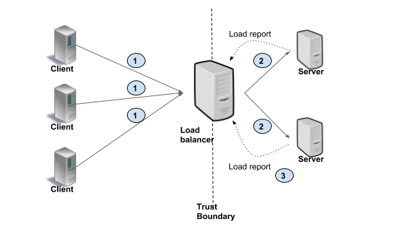

GRPC Load Balancing Note
========================

gRPC is a modern RPC protocol implemented on top of HTTP/2.
gRPC has many advantages over traditional HTTP/REST/JSON mechanism such as

    - Binary protocol (HTTP/2),
    - Multiplexing many requests on one connection (HTTP/2)
    - Header compression (HTTP/2)
    - Strongly typed service and message definition (Protobuf)
    - Idiomatic client/server library implementations in many languages

In addition, gRPC integrates seamlessly with ecosystem components like service discovery,
name resolver, load balancer, tracing and monitoring, among others.

Approaches to Load Balancing include:

    - Proxy Model (server-side load balancing)
    - Balancing-aware Client (Client side load balancing)
    - External Load Balancing Service

    Server-side load balancing

.. figure:: images/client_side_load_balancing.png

    Client-side load balancing

.. figure:: images/external_load_balancing.png

    External load balancing service

The primary mechanism for load-balancing in gRPC is **external load-balancing**,
where an external load balancer provides simple clients with an up-to-date list of servers.

It is worth noting that load-balancing within gRPC happens on a per-call
basis, not a per-connection basis. In other words, even if all requests
come from a single client, we still want them to be load-balanced across
all servers.

.. rubric:: Footnotes

.. [#] https://grpc.io/blog/grpc-load-balancing/

