*********
APUE Note
*********

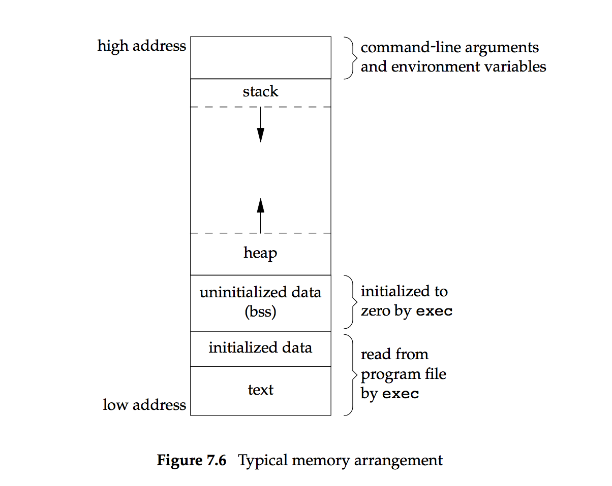
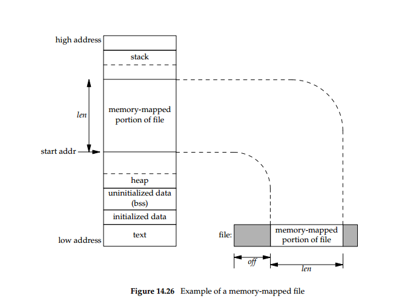

   Memory-mapped file example

   .. code-block::c

      void *mmap(void *addr, size_t len, int prot, int flag, int fd, off_t off );
      // start addr is the return value of mmap

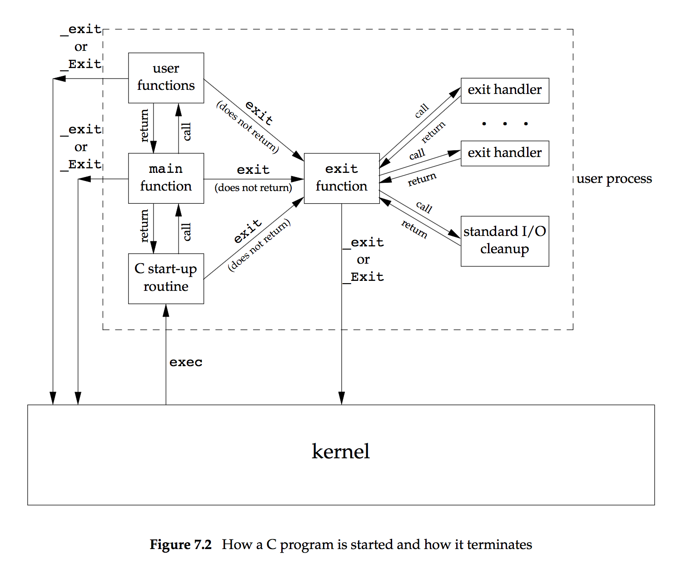

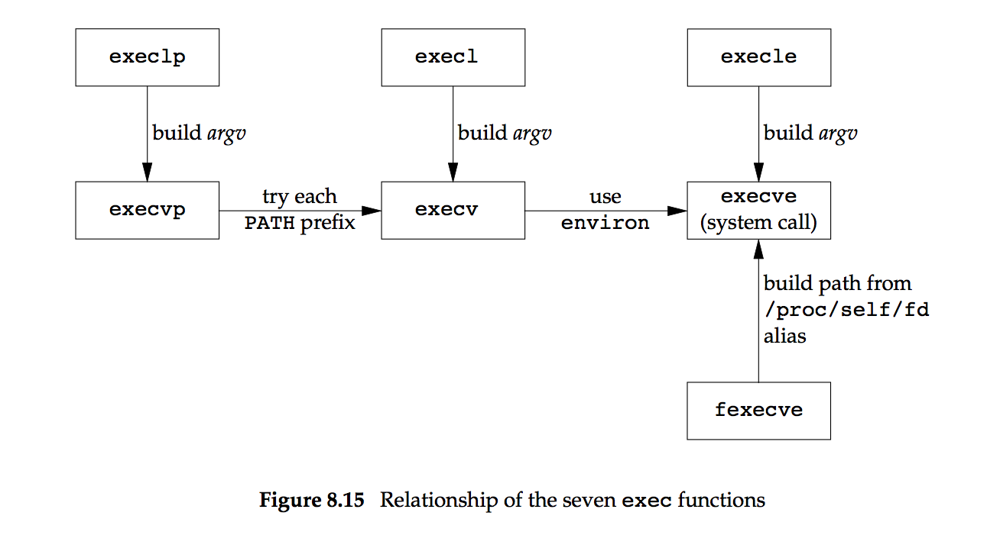

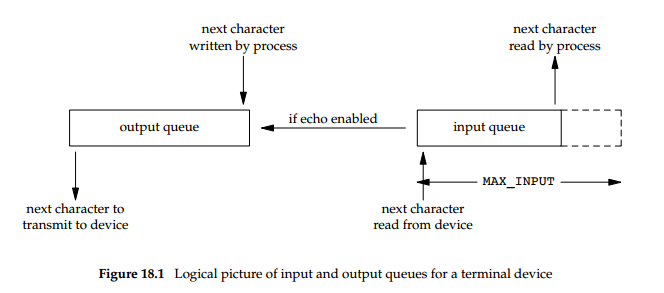

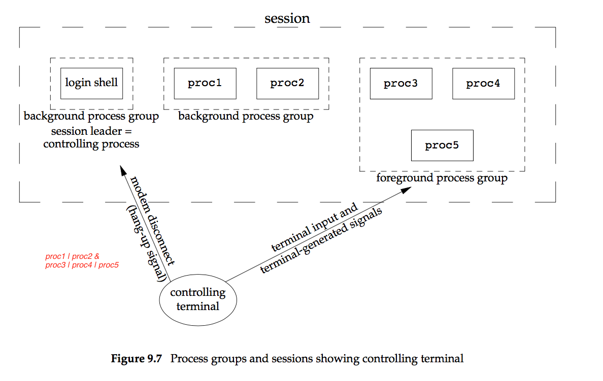
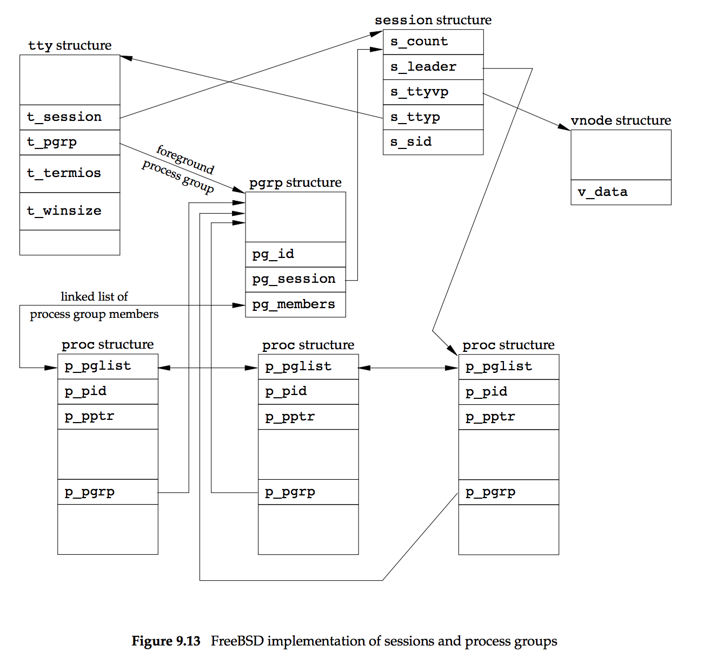

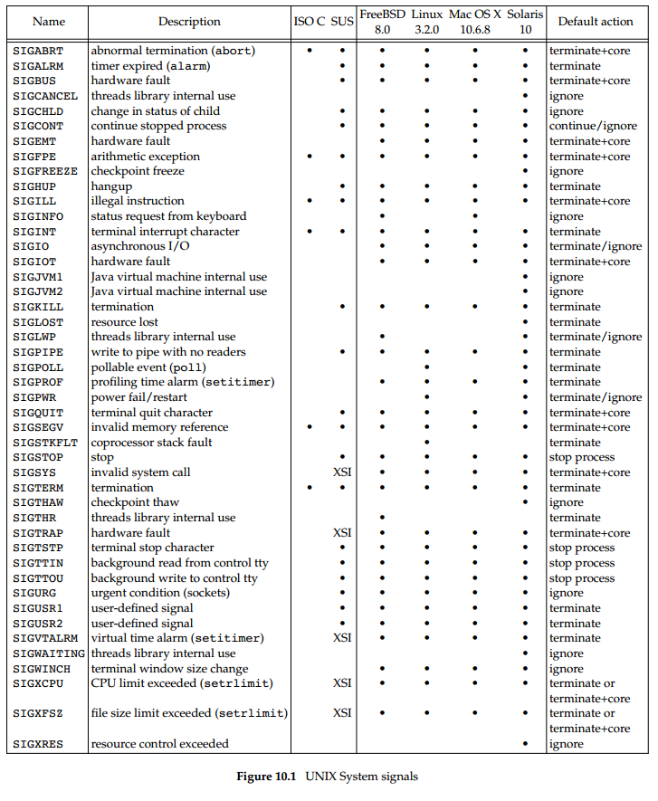

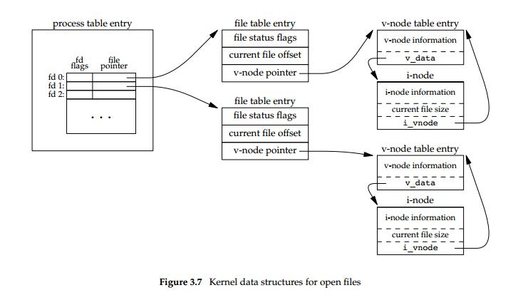
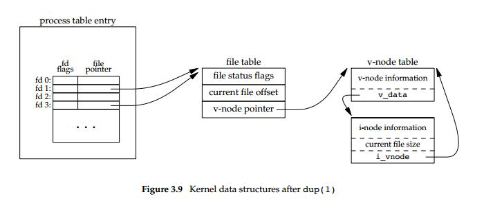
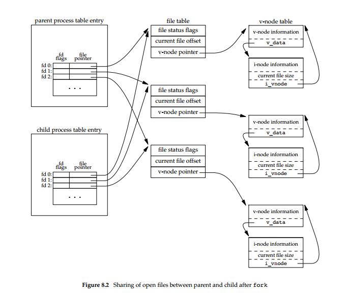
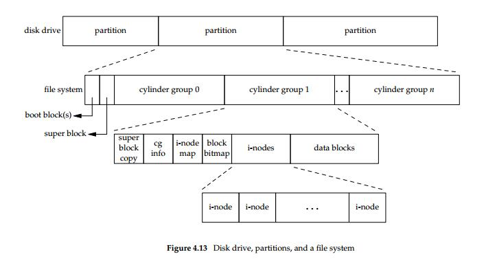
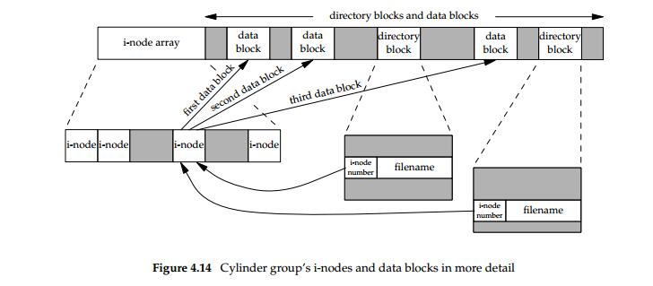
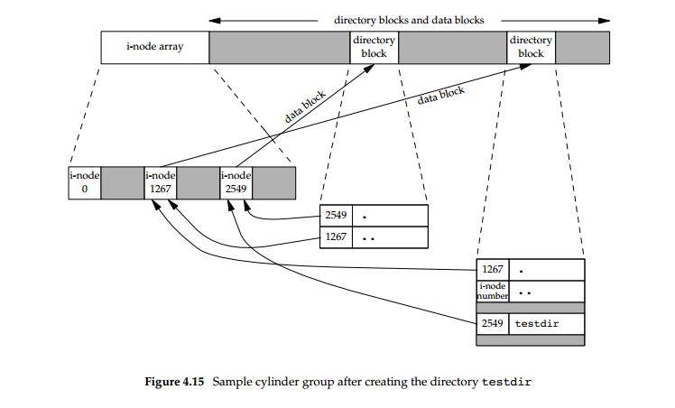

.. rubric:: Footnotes

.. [#] https://github.com/banool/apue-exercises/blob/master/exercises.md