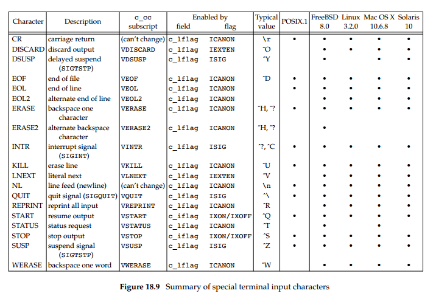

******************
Control Characters
******************

   Summer of special terminal input characters

   Refer to *Advanced Programming in UNIX Environment - 
   18.3 Special Input Characters* for further information.

#. end-of-file - Ctrl + D (logout, or quit interactive mode)
#. suspend character - Ctrl + Z (generate SIGTSTP)
#. start character - Ctrl + Q (resume terminal output)
#. stop character - Ctrl + S (freeze terminal output)
#. quit character - Ctrl + \\ (generate SIGQUIT)
#. interrupt character - Ctrl + C (generate SIGINTR)
#. line-erase character - Ctrl + U (erase a line)
#. backspace one character - Ctrl + H (erase a character)
#. backspace one word - Ctrl + W (erase a word)
#. escape sequence - Ctrl + V, then Esc (not all shell support escape sequence, use "\033" instead)
   

.. note::

   the difference between INTR and QUIT is that
   the QUIT character not only terminates the process 
   by default, but also generates a core file.

#. Bash formatting
   
   .. code-block:: sh

      $ echo -e "Normal \033[5mBlink\033[0m"
      $ echo -e "Normal \033[7mInvert\033[0m"
      $ echo -e "Normal \033[8mHidden\033[0m"

   **Note:** The ``\033[0m`` sequence removes all attributes (formatting and colors). 

    ======  ====================
    Code    Format              
    ======  ====================
    1       Bold                
    2       Dim                 
    4       Underline           
    5       Blink               
    7       Reverse             
    8       Hidden (passwords)  
    ======  ====================

#. Bash Foreground (text) color
  
   .. code-block:: sh

      $ echo -e "Normal \033[39mDefault color\033[0m"
      $ echo -e "Normal \033[31mRed\033[0m"
      $ echo -e "Normal \033[32mGreen\033[0m"
      $ echo -e "Normal \033[34mBlue\033[0m"

   ======  ===============
   Code    Color          
   ======  ===============
   39      Default        
   30      Black          
   31      Red            
   32      Green          
   33      Yellow         
   34      Blue           
   35      Magneta        
   36      Cyan           
   37      Light gray     
   90      Dark gray      
   91      Light red      
   92      Light green    
   93      Light yellow   
   94      Light blue     
   95      Light magenta  
   96      Light cyan     
   97      White          
   ======  ===============

#. Bash Background color
   
   .. code-block:: sh

      $ echo -e "Default \033[49mDefault\033[0m"
      $ echo -e "Default \033[40mBlack\033[0m"
      $ echo -e "Default \033[107mWhite\033[0m"

   ======  ===============
   Code    Color          
   ======  ===============
   49      Default        
   40      Black          
   41      Red            
   42      Green          
   43      Yellow         
   44      Blue           
   45      Magneta        
   46      Cyan           
   47      Light Gray     
   100     Dark gray      
   101     Light red      
   102     Light green    
   103     Light yellow   
   104     Light blue     
   105     Light magenta  
   106     Light cyan     
   107     White          
   ======  ===============

   .. code-block:: sh

      echo -e "\033[1;31;47mBold,red,Light gray\033[0m"

