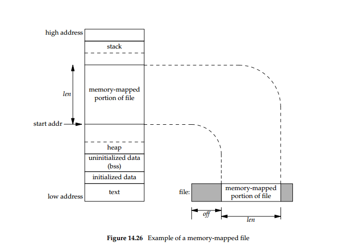

**********************
Memory-Mapped I/O APIs
**********************

.. contents::
   :local:

map or unmap files or devices into memory
=========================================

**DESCRIPTION**

   .. code-block:: c

      #include <sys/mman.h>
      int munmap(void *addr, size_t len);
      void *mmap(void *addr, size_t len, int prot, int flags, int fd, off_t offset);

   ``mmap()`` creates a new mapping in the virtual address space of the calling process.
   The starting address for the new mapping is specified in *addr*. The *len* argument
   specifies the length of the mapping.

   If *addr* is NULL, then the kernel chooses the address at which to create the mapping;
   this is the most portable method of creating a new mapping. If *addr* is not NULL, then
   the kernel takes it as a hint about where to place the mapping; on Linux, the mapping
   will be created at a nearby page boundary. The address of the new mapping is returned
   as the result of the call.

   The contents of a file mapping (as opposed to an anonymous mapping; see ``MAP_ANONYMOUS`` below),
   are initialized using *len* bytes starting at offset *offset* in the file (or other object)
   referred to by the file descriptor ``fd``. *offset* must be a multiple of the page size as
   returned by ``sysconf(_SC_PAGE_SIZE)``.

   The *prot* argument describes the desired memory protection of the mapping (and must not
   conflict with the open mode of the file). It is either ``PROT_NONE`` or the bitwise OR of
   one or more of the following flags::

      PROT_EXEC  Pages may be executed.
      PROT_READ  Pages may be read.
      PROT_WRITE Pages may be written.
      PROT_NONE  Pages may not be accessed.

   The *flags* argument determines whether updates to the mapping are visible to other processes
   mapping the same region, and whether updates are carried through to the underlying file. This
   behavior is determined by including exactly one of the following values in flags:

      MAP_SHARED 
         Share this mapping. Updates to the mapping are visible to other processes that map this file,
         and are carried through to the underlying file. The file may not actually be updated until
         :manpage:`msync(2)` or :manpage:`munmap()` is called.

      MAP_PRIVATE
         Create a private copy-on-write mapping. Updates to the mapping are not visible to other processes
         mapping the same file, and are not carried through to the underlying file. It is unspecified whether
         changes made to the file after the :manpage:`mmap()` call are visible in the mapped region.

   In addition, zero or more of the following values can be ORed in flags:

      MAP_ANONYMOUS
         The mapping is not backed by any file; its contents are initialized to zero. The *fd* and *offset* arguments
         are ignored; however, some implementations require *fd* to be *-1* if ``MAP_ANONYMOUS`` is specified, and
         portable applications should ensure this. The use of *MAP_ANONYMOUS* in conjunction with *MAP_SHARED* is
         supported on Linux only since kernel 2.4.

      MAP_FIXED
         Don't interpret *addr* as a hint: place the mapping at exactly that address. *addr* must be a multiple of
         the page size. If the memory region specified by *addr* and *len* overlaps pages of any existing mapping(s),
         then the overlapped part of the existing mapping(s) will be discarded. If the specified address cannot be used,
         ``mmap()`` will fail. Because requiring a fixed address for a mapping is less portable, the use of this option 
         is **discouraged**.

      MAP_GROWSDOWN
         Used for stacks. Indicates to the kernel virtual memory system that the mapping should extend downward in memory.

      MAP_LOCKED (since Linux 2.5.37)
         Lock the pages of the mapped region into memory in the manner of :manpage:`mlock(2)`. This flag is ignored in older kernels.

      MAP_NORESERVE
         Do not reserve swap space for this mapping. When swap space is reserved, one has the guarantee that it is possible to
         modify the mapping. When swap space is not reserved one might get ``SIGSEGV`` upon a write if no physical memory is
         available. See also the discussion of the file :file:`/proc/sys/vm/overcommit_memory` in :manpage:`proc(5)`.
         In kernels before 2.6, this flag had effect only for private writable mappings.

   Memory mapped by ``mmap()`` is preserved across :manpage:`fork(2)`, with the same attributes.
   A file is mapped in multiples of the page size. For a file that is not a multiple of the page size,
   the remaining memory is zeroed when mapped, and writes to that region are not written out to the file.
   The effect of changing the size of the underlying file of a mapping on the pages that correspond to
   added or removed regions of the file is unspecified.

   The :manpage:`munmap()` system call deletes the mappings for the specified address range, and causes further references to addresses
   within the range to generate invalid memory references. The region is also automatically unmapped when the process is terminated.
   On the other hand, closing the file descriptor does not unmap the region.

   The address *addr* must be a multiple of the page size. All pages containing a part of the indicated range are unmapped,
   and subsequent references to these pages will generate ``SIGSEGV``. It is not an error if the indicated range does not
   containnany mapped pages.

   For file-backed mappings, the *st_atime* field for the mapped file may be updated at any time between the ``mmap()``
   and the corresponding unmapping; the first reference to a mapped page will update the field if it has not been already.

   The *st_ctime* and *st_mtime* field for a file mapped with ``PROT_WRITE`` and ``MAP_SHARED`` will be updated after
   a write to the mapped region, and before a subsequent :manpage:`msync(2)` with the ``MS_SYNC`` or ``MS_ASYNC`` flag,
   if one occurs.

**RETURN VALUE**

   On success, ``mmap()`` returns a pointer to the mapped area. On error, the value ``MAP_FAILED`` (that is, ``(void *) -1``)
   is returned, and *errno* is set appropriately. On success, ``munmap()`` returns ``0``, on  failure  ``-1``, and errno is set
   (probably to ``EINVAL``).

**NOTES**

   On some hardware architectures (e.g., i386), ``PROT_WRITE`` implies ``PROT_READ``. It is
   architecture dependent whether ``PROT_READ`` implies ``PROT_EXEC`` or not. Portable programs
   should always set ``PROT_EXEC`` if they intend to execute code in the new mapping.

   The portable way to create a mapping is to specify *addr* as 0 (``NULL``), and omit ``MAP_FIXED`` from flags.
   In this case, the system chooses the address for the mapping; the address is chosen so as not to conflict with
   any existing mapping, and will not be 0. 

**BUGS**

   POSIX specifies that the system shall always zero fill any partial page at the end of the object
   and that system will never write any modification of the object beyond its end. On Linux, when
   you write data to such partial page after the end of the object, the data stays in the page cache
   even after the file is closed and unmapped and even though the data is never written to the file itself,
   subsequent mappings may see the modified content. In some cases, this could be fixed by calling :manpage:`msync(2)`
   before the unmap takes place; however, this doesn't work on tmpfs (for example, when using POSIX shared memory
   interface documented in :manpage:`shm_overview(7)`).

**EXAMPLE**

   The following program prints part of the file specified in its first command-line argument to standard output.
   The range of bytes to be printed is specified via *offset* and *length* values in the second and third command-line arguments.
   The program creates a memory mapping of the required pages of the file and then uses write(2) to output the desired bytes.

   .. code-block:: c

      #include <sys/mman.h>
      #include <sys/stat.h>
      #include <fcntl.h>
      #include <stdio.h>
      #include <stdlib.h>
      #include <unistd.h>

      #define handle_error(msg) \
            do { perror(msg); exit(EXIT_FAILURE); } while (0)

      int main(int argc, char *argv[])
      {
         if (argc < 3 || argc > 4) {
            fprintf(stderr, "%s file offset [length]\n", argv[0]);
            exit(EXIT_FAILURE);
         }

         int fd = open(argv[1], O_RDONLY);
         if (fd == -1)
            handle_error("open");

         struct stat sb;
         if (fstat(fd, &sb) == -1)  /* To obtain file size */
            handle_error("fstat");

         /* offset for mmap() must be page aligned */
         off_t offset = atoi(argv[2]);
         off_t pa_offset = offset & ~(sysconf(_SC_PAGE_SIZE) - 1);

         if (offset >= sb.st_size) {
            fprintf(stderr, "offset is past end of file\n");
            exit(EXIT_FAILURE);
         }

         size_t length;
         if (argc == 4) {
            length = atoi(argv[3]);
            /* Can't display bytes past end of file */
            if (offset + length > sb.st_size)
               length = sb.st_size - offset;
         } else {
            /* No length arg ==> display to end of file */
            length = sb.st_size - offset;
         }

         char* addr = (char*)mmap(NULL, length + offset - pa_offset, PROT_READ,
                                                      MAP_PRIVATE, fd, pa_offset);
         if (addr == MAP_FAILED)
            handle_error("mmap");

         ssize_t s = write(STDOUT_FILENO, addr + offset - pa_offset, length);
         if (s != length) {
            if (s == -1)
               handle_error("write");

             fprintf(stderr, "partial write");
            exit(EXIT_FAILURE);
         }

         exit(EXIT_SUCCESS);
      }

msync - synchronize a file with a memory map
============================================

**DESCRIPTION**

   .. code-block:: c

      #include <sys/mman.h>
      int msync(void *addr, size_t length, int flags);

   msync() flushes changes made to the in-core copy of a file 
   that was mapped into memory using mmap(2) back to the filesystem.  
   Without use of this call, there is no guarantee that changes are 
   written back before munmap(2) is called. To be more precise, 
   the part of the file that corresponds to the memory area starting 
   at *addr* and having length *length* is updated.

   The flags argument should specify exactly one of **MS_ASYNC** and **MS_SYNC,**
   and may additionally include the MS_INVALIDATE bit. 
   These bits have the following meanings::

      MS_ASYNC
      Specifies that an update be scheduled, but the call returns immediately.

      MS_SYNC
      Requests an update and waits for it to complete.

      MS_INVALIDATE
      Asks to invalidate other mappings of the same file 
      (so that they can be updated with the fresh values just written).

**RETURN VALUE**

   On success, zero is returned.  On error, -1 is returned, and errno is set appropriately.

mprotect - set protection on a region of memory
===============================================

**DESCRIPTION**

   .. code-block:: c

      #include <sys/mman.h>
      int mprotect(void *addr, size_t len, int prot);

   mprotect() changes protection for the calling process's memory page(s) 
   containing any part of the address range in the interval ``[addr, addr+len-1].``  
   *addr* must be aligned to a page boundary.

   If the calling process tries to access memory in a manner that violates the protection, 
   then the kernel generates a **SIGSEGV** signal for the process.

   prot is either PROT_NONE or a bitwise-or of the other values in the following list::

      PROT_NONE  The memory cannot be accessed at all.
      PROT_READ  The memory can be read.
      PROT_WRITE The memory can be modified.
      PROT_EXEC  The memory can be executed.

**RETURN VALUE**

   On success, mprotect() returns zero.  
   On error, -1 is returned, and errno is set appropriately.

.. code-block:: c
  
   #include "apue.h"
   #include <sys/mman.h>
   #include <sys/stat.h>

   int main(int argc, char* argv[])
   {
      if(argc != 2)
         err_quit("Usage: %s file", argv[0]);
   
      int fd = open(argv[1], O_RDONLY);
      if(fd < 0)
         err_sys("open(%s) error", argv[1]);
   
      struct stat sbuf;
      if(fstat(fd, &sbuf) < 0)
         err_sys("fstat error");
   
      void* addr = mmap(0, sbuf.st_size, PROT_READ, MAP_PRIVATE, fd, 0);
      if(addr == MAP_FAILED)
         err_sys("mmap failed");
      
      // not work as expected when mmap using MAP_PRIVATE
      if(mprotect(addr, sbuf.st_size, PROT_READ|PROT_WRITE) < 0) 
         err_sys("mprotect failed");
      
      if(munmap(addr, sbuf.st_size)<0)
         err_sys("munmap error");
      
      return 0;
   }
   
