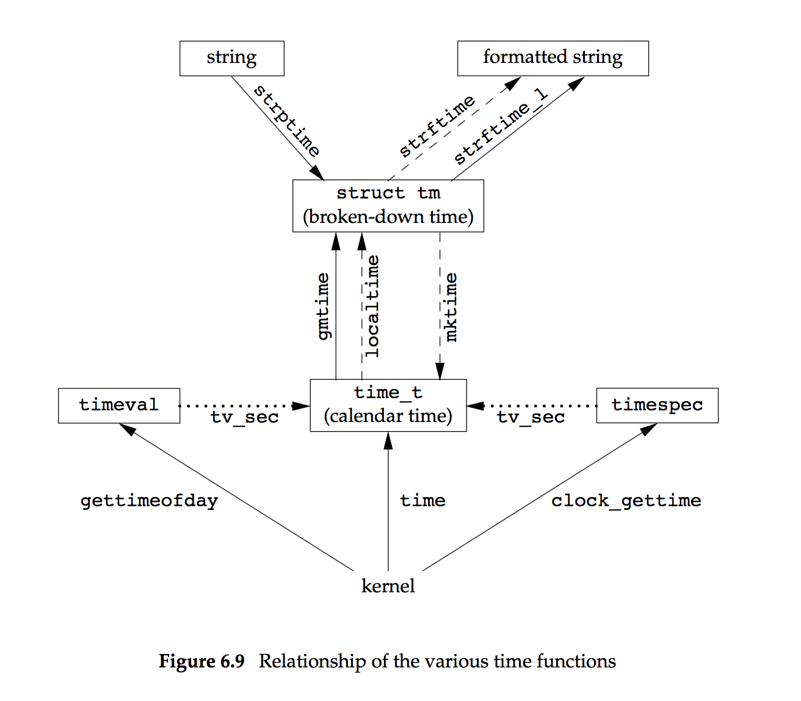

*********
Time APIs
*********

#. time - get time in seconds

   **DESCRIPTION**
   
      .. code-block:: c
      
         #include <time.h>
         time_t time(time_t *tloc);
   
      *time()* returns the time as the number of seconds since the Epoch, 1970-01-01 00:00:00 +0000 (UTC).
      If *tloc* is non-NULL, the return value is also stored in the memory pointed to by *tloc*.
   
   **RETURN VALUE**
   
      On success, the value of time in seconds since the Epoch is returned.  
      On error, ``((time_t) -1)`` is returned, and errno is set appropriately.

#. clock_getres, clock_gettime, clock_settime - clock and time functions

   **DESCRIPTION**
   
      .. code-block:: c
      
         #include <time.h>
         
         int clock_getres(clockid_t clk_id, struct timespec *res);
         int clock_gettime(clockid_t clk_id, struct timespec *tp);
         int clock_settime(clockid_t clk_id, const struct timespec *tp);
   
      The function *clock_getres()* finds the resolution (precision) 
      of the specified clock *clk_id*, and, if *res* is non-NULL, stores 
      it in the struct timespec pointed to by *res.* 
   
      If the time value pointed to by the argument *tp* of *clock_settime()* 
      is not a multiple of *res*, then it is truncated to a multiple of *res.*
   
      The *res* and *tp* arguments are timespec structures, 
      as specified in ``<time.h>``::
   
         struct timespec {
             time_t   tv_sec;        /* seconds */
             long     tv_nsec;       /* nanoseconds */
         };
   
      The *clk_id* argument is the identifier of the particular clock on which to act.  
      A clock may be system-wide and hence visible for all processes, or per-process 
      if it measures time only within a single process.
   
      All implementations support the system-wide real-time clock, which is identified 
      by ``CLOCK_REALTIME``.  Its time represents seconds and nanoseconds since the Epoch. 
      When its time is changed, timers for a relative interval are unaffected, but timers 
      for an absolute point in time are affected.
   
   **RETURN VALUE**
      
      Return 0 for success, or -1 for failure (in which case *errno* is set appropriately).

#. transform date and time to broken-down time or ASCII

   **DESCRIPTION**
      
      .. code-block:: c
   
         #include <time.h>
         
         char *asctime(const struct tm *tm);
         char *asctime_r(const struct tm *tm, char *buf);
   
         char *ctime(const time_t *timep);
         char *ctime_r(const time_t *timep, char *buf);
   
         struct tm *gmtime(const time_t *timep);
         struct tm *gmtime_r(const time_t *timep, struct tm *result);
   
         struct tm *localtime(const time_t *timep);
         struct tm *localtime_r(const time_t *timep, struct tm *result);
   
         time_t mktime(struct tm *tm);
   
   
      The ctime(), gmtime() and localtime() functions all take an argument of data type time_t, 
      which represents calendar time.  When interpreted as an absolute time value, it represents 
      the number of seconds elapsed since the Epoch, 1970-01-01 00:00:00 +0000 (UTC).
   
      The asctime() and mktime() functions both take an argument representing broken-down time, 
      which is a representation separated into year, month, day, and so on.
   
      Broken-down time is stored in the structure tm, which is defined in <time.h> as follows::
   
         struct tm {
             int tm_sec;    /* Seconds (0-60) */
             int tm_min;    /* Minutes (0-59) */
             int tm_hour;   /* Hours (0-23) */
             int tm_mday;   /* Day of the month (1-31) */
             int tm_mon;    /* Month (0-11) */
             int tm_year;   /* Year - 1900 */
             int tm_wday;   /* Day of the week (0-6, Sunday = 0) */
             int tm_yday;   /* Day in the year (0-365, 1 Jan = 0) */
             int tm_isdst;  /* Daylight saving time */
         };
   
      The members of the tm structure are::
   
         tm_sec    The number of seconds after the minute, normally in the range 0 to 59, 
                   but can be up to 60 to allow for leap seconds.
   
         tm_min    The number of minutes after the hour, in the range 0 to 59.
         tm_hour   The number of hours past midnight, in the range 0 to 23.
         tm_mday   The day of the month, in the range 1 to 31.
         tm_mon    The number of months since January, in the range 0 to 11.
         tm_year   The number of years since 1900.
         tm_wday   The number of days since Sunday, in the range 0 to 6.
         tm_yday   The number of days since January 1, in the range 0 to 365.
   
         tm_isdst  A flag that indicates whether daylight saving time is in effect at the time described.  
         The value is positive if daylight saving time is in effect, zero if it is not, and negative
         if the information is not available.
   
      The call ``ctime(t)`` is equivalent to ``asctime(localtime(t)).`` It converts the calendar 
      time into a null-terminated string of the form ``"Wed Jun 30 21:49:08 1993\n"``
   
      The *gmtime()* function converts the calendar time *timep* to broken-down time representation, 
      expressed in Coordinated Universal Time (UTC). The *localtime()* function converts the calendar 
      time *timep* to broken-down time representation, expressed relative to the user's specified timezone.  
      
      The *asctime()* function converts the broken-down time value tm into a null-terminated string 
      with the same format as *ctime().* 
   
      The *mktime()* function converts a broken-down time structure, expressed as local time, 
      to calendar time representation.  
   
   **RETURN VALUE**
   
      Each of these functions returns the value described, or NULL (-1 in case of mktime()) 
      in case an error was detected.

#. strftime - format date and time

   **DESCRIPTION**
   
      .. code-block:: c
      
         #include <time.h>
         size_t strftime(char *s, size_t max, const char *format,
                             const struct tm *tm);
      
      The *strftime()* function formats the broken-down time *tm* according to 
      the format specification *format* and places the result in the character 
      array *s* of size *max.*
      
      The format specification is a null-terminated string and may contain 
      special character sequences called conversion specifications, each of 
      which is introduced by a '%' character and terminated by some other 
      character known as a **conversion specifier character.** All other 
      character sequences are ordinary character sequences.
   
   **RETURN VALUE**
   
      Provided that the result string, including the terminating null byte, 
      does not exceed max bytes, *strftime()* returns the number of bytes 
      (excluding the terminating null byte) placed in the array s. 
      Otherwise, *strftime()* returns 0, and the contents of the array are undefined.
   
      Note that the return value 0 does not necessarily indicate an error. 
      For example, in many locales %p yields an empty string. 
      An empty format string will likewise yield an empty string.

#. strptime - convert a string representation of time to a time tm structure

   **DESCRIPTION**
   
      .. code-block:: c
      
         #include <time.h>
         char *strptime(const char *s, const char *format, struct tm *tm);
      
      The *strptime()* function is the converse of *strftime();* it converts the 
      character string pointed to by *s* to values which are stored in the broken-down 
      time structure pointed to by tm, using the format specified by *format*.
   
   **RETURN VALUE**
   
      The return value of the function is a pointer to the first character not processed 
      in this function call. In case the input string contains more characters than required 
      by the format string, the return value points right after the last consumed input character.  
      In case the whole input string is consumed, the return value points to the null byte at the 
      end of the string. If *strptime()* fails to match all of the format string and therefore an 
      error occurred, the function returns NULL.
