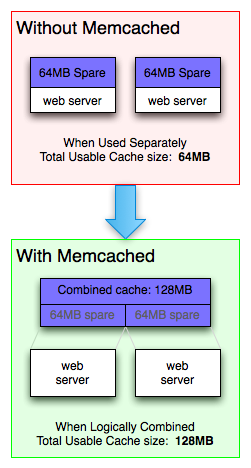

Memcached Inroduction
=====================

memcached allows you to take memory from parts of your system where you have
more than you need and make it accessible to areas where you have less than you need.

memcached also allows you to make better use of your memory.
If you consider the diagram to the right, you can see two deployment scenarios:

    - Each node is completely independent.
    - Each node can make use of memory from other nodes.

The first scenario illustrates the classic deployment strategy,
however you'll find that it's both wasteful in the sense that the
total cache size is a fraction of the actual capacity of your web farm,
but also in the amount of effort required to keep the cache consistent
across all of those nodes.

With memcached, you can see that all of the servers are looking into the same virtual pool of memory.
This means that a given item is always stored and always retrieved from the same location in your entire web cluster.

Also, as the demand for your application grows to the point where you need to have more servers,
it generally also grows in terms of the data that must be regularly accessed.
A deployment strategy where these two aspects of your system scale together just makes sense.

.. rubric:: Footnotes

.. [#] https://www.memcached.org/about
