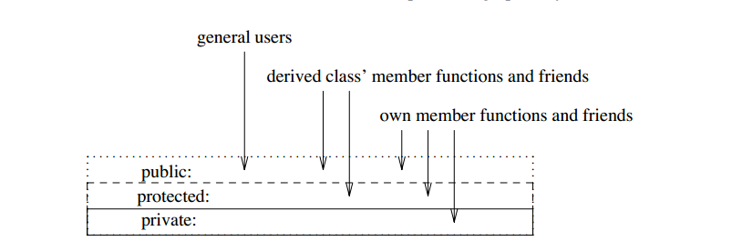

:orphan:

****************
C++ Class Tricks
****************

.. toctree::
   :titlesonly:
   
   cpp_operator_precedence
   cpp_operator_overloading

.. contents::
   :local:

Access control
==============

``delete this`` in c++
======================

Basically you are not advised to do ``delete this`` operation unless

   * The class you delete was allocated on heap or free store.
   * You will **NEVER** use the pointer again after you delete it.

Declare class constructor as ``private/protected``
==================================================

Here are some of the uses of private constructor :

   * Objects can only be created on heap
   * Singleton Design Pattern
   * To limit the number of instance creation
   * To give meaningful name for object creation using static factory method
   * Static Utility Class or Constant Class
   * To prevent Subclassing (lose the chance to be inherited) [private only]
   * Builder Design Pattern and thus for creating immutable classes

Declare class destructor as ``private/protected``
=================================================

Basically, any time you want some other class to be responsible for the life cycle of your class' objects,
or you have reason to prevent the destruction of an object, you can make the destructor private.

For instance, if you're doing some sort of **reference counting** thing, you can have the object
(or manager that has been "friend"ed) responsible for counting the number of references to itself
and delete it when the number hits zero. A private destructor would prevent anybody else from
deleting it when there were still references to it.

.. code-block:: c++

   class Water
   {
      // ...
   protected:
      ~Water() {}
   };
   delete w;
   // error C2248: 'Water::~Water' : cannot access protected member declared in class 'Water'

Declare class destructor as ``virtual``
=======================================

Many classes require some form of cleanup for an object before it goes away. Since the abstract
class Ival_box cannot know if a derived class requires such cleanup, it must assume that it does
require some. We ensure proper cleanup by defining a virtual destructor Ival_box::~Ival_box()
in the base and overriding it suitably in derived classes. For example::

   class Ival_box
   {
      // ...
      virtual ~Ival_box() {}
   };

   void f(Ival_box* p)
   {
      // ...
      delete p;
   }

The ``delete`` operator explicitly destroys the object pointed to by *p*. We have no way of knowing
exactly to which class the object pointed to by *p* belongs, but thanks to Ival_box’s virtual
destructor, proper cleanup as (optionally) defined by that class’ destructor will be called.

Difference between assignment and copy constructor
==================================================

Copy constructor initializes an uninitialized object with an initialized one;
while assignment re-initilizes an initialized object with another initialized one.

You could replace copy construction by default construction plus assignment, 
but that would be less efficient.

.. code-block:: cpp

   A(const A& other): m_data(other.m_data) {}
   A& operator=(const A& other) 
   {
      if(this != &other)
      {
         cleanup(m_data);
         m_data = other.m_data;
      }
      return *this;
   }

C++ class example
=================

.. code-block:: c++ 
   :caption: class example

   #include <stdio.h>
   #include <string.h>
   
   struct  Integer
   {
      Integer():
         size(0), data(NULL)
      {
         printf("Default constructor\n");
      }
   
      Integer(int n):
         size(n), data(NULL)
       {
         data = new int[size];
         printf("1-Argument constructor\n");
      }
   
      Integer(const Integer& other) {
         size = other.size;
         data = new int[size];
         memcpy(data, other.data, size*sizeof(int));
         printf("Copy constructor\n");
      }
   
       Integer& operator=(const Integer& other) {
         if(data != NULL) {
            delete[] data;
            size = 0;
         }
         
         size = other.size;
         data = new int[size];
         memcpy(data, other.data, size*sizeof(int));
         printf("operator=()\n");
      
         return *this;
      }
   
      ~Integer() {
         delete[] data;
         data = NULL;
         size = 0;
         printf("Destructor\n");
      }
   
      int size;
      int* data;
   };
   
   
   int main()
   {
      Integer a(2);
   
      a.data[0] = 123456;
      a.data[1] = 11;
   
      if(true)
      {
         Integer b = a;
         printf("%p\n", a.data);
         printf("%p\n", b.data);
      }
   
      Integer c(3);
      c = a;
   
      printf("%d\n", c.data[0]);
   
      return 0;
   }

   class Base
   {
   public:
      Base() { a = 1; printf("Base()\n"); }
      Base(int x) : a(x) { printf("Base(int)\n"); }
   
   protected:
      int a;
   };
   
   class Derived : public Base
   {
   public:
      Derived(int x) : /*Base(x),*/b(x) {}
      void func() { printf("a = %d, b = %d\n", a, b); }
   
   private:
      int b;
   };

C++ enumerator example
======================

.. code-block:: c++

   enum FileMode
   {
      FileMode_none = 0,
      FileMode_readOnly = 0x01,
      FileMode_writeOnly = 0x10,
      FileMode_readWrite = 0x100
   };

   FileMode operator | (FileMode l, FileMode r)
   {
      return FileMode(int(l) | int(r));
   }

   FileMode operator & (FileMode l, FileMode r)
   {
      return FileMode(int(l) & int(r));
   }
      

Reference count example
=======================

.. code-block:: c++

   class ControlPanel
   {
   public:
      static void  createInstance()
      {

         if(++m_refCount == 1)
            m_instance = new(ControlPanel);
      }

      static void destroyInstance()
      {
         if(--m_refCount == 0) 
         {
            delete m_instance;
            m_instance = NULL;
         }
      }

      static ControlPanel* instance() {return m_instance;}

   private:
      ControlPanel() {}
      ControlPanel(const ControlPanel& other);
      ControlPanel& operator=(const ControlPanel& other);

   private:
      static int m_refCount;
      static ControlPanel* m_instance;
   };

   int ControlPanel::m_refCount = 0;
   ControlPanel* ControlPanel::m_instance = NULL;

Friendship
==========

Friendship is neither inherited nor transive. For example::

   class A
   {
      friend class B;
      int a;

      void f(B* p)
      {
         p->b++; // error: A is not a friend of B, despite B is a friend of A
      }
   };

   class B
   {
      friend class C;
      int b;
   };

   class C
   {
      void f(A* p)
      {
         p->a++; // error: C is not a friend of A, despite being a friend of a friend of A
      }
   };

   class D: public B
   {
      void f(A* p)
      {
         p->a++; // error: D is not a friend of A, despite being derived from a friend of A
      }
   };

Design pattern - Lazy loading
=============================

Lazy loading is a design pattern commonly used in computer programming to defer initialization of an object 
until the point at which it is needed. It can contribute to efficiency in the program's operation if properly 
and appropriately used.

.. code-block:: cpp
   :caption: a common sample implementation

   // widget.h
   class Widget
   {
   public:
      void setOpts(Options opts);
      void setNeedUpdate(bool enabled) { m_needUpdate = enabled;}
      App mostOftenUsed();

   protected:
      void updateIfNeeded();
      void update();

   private:
      bool m_needUpdate;
      Options m_opts;
      App m_mostOftenUsedItem;
      // ...
   };

   // widget.cpp
   void Widget::setOpts(Options opts)
   {
      if(m_opts != opts)
      {
         m_opts = opts;
         setNeedUpdate(true);
      }
   }

   App widget::mostOftenUsed()
   {
      updateIfNeeded();
      return m_mostOftenUsedItem;
   }

   void updateIfNeeded()
   {
      if(m_needUpdate)
      {
         m_needUpdate = false;
         update();
      }
   }

   void Widget::update()
   {
      // perform some works
   }