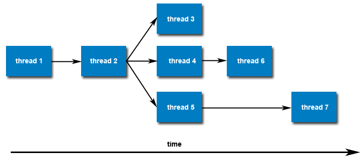

********************************
Creating and Terminating Threads
********************************

**Creating Threads**

Initially, your ``main()`` program comprises a single, default thread.
All other threads must be explicitly created by the programmer.

``pthread_create`` creates a new thread and makes it executable.
The maximum number of threads that may be created by a process is implementation dependent.
Programs that attempt to exceed the limit can fail or produce wrong results.

.. code-block:: sh

   $ ulimit -a
   core file size          (blocks, -c) unlimited
   data seg size           (kbytes, -d) unlimited
   file size               (blocks, -f) unlimited
   open files                      (-n) 256
   pipe size            (512 bytes, -p) 8
   stack size              (kbytes, -s) 2032
   cpu time               (seconds, -t) unlimited
   max user processes              (-u) 256 # current limit
   virtual memory          (kbytes, -v) unlimited

   $ ulimit  -Hu # maximum of user process OS surpports
   256

   $ ulimit  -u 128
   $ ulimit -a
   core file size          (blocks, -c) unlimited
   data seg size           (kbytes, -d) unlimited
   file size               (blocks, -f) unlimited
   open files                      (-n) 256
   pipe size            (512 bytes, -p) 8
   stack size              (kbytes, -s) 2032
   cpu time               (seconds, -t) unlimited
   max user processes              (-u) 128
   virtual memory          (kbytes, -v) unlimited

Once created, threads are peers, and may create other threads.
There is no implied hierarchy or dependency between threads.

**Thread Attributes**

By default, a thread is created with certain attributes.
Some of these attributes can be changed by the programmer
via the thread attribute object. ``pthread_attr_init``
and ``pthread_attr_destroy`` are used to initialize or destroy
the thread attribute object.

Other routines are then used to query/set specific attributes
in the thread attribute object. Attributes include:

   * Detached or joinable state
   * Scheduling inheritance
   * Scheduling policy
   * Scheduling parameters
   * Scheduling contention scope
   * Stack size
   * Stack address
   * Stack guard (overflow) size

**Thread Binding and Scheduling**

The Pthreads API provides several routines that may be used to specify
how threads are scheduled for execution. For example, threads can be
scheduled to run :abbr:`FIFO (first-in first-out)`, :abbr:`RR (round-robin)` ,
:abbr:`OTHER (operating system determines)`. It also provides the ability
to set a thread's scheduling priority value.

These topics are not covered here, however a good overview of "how things work"
under Linux can be found in the ``sched_setscheduler`` man page.

The Pthreads API does not provide routines for binding threads to specific cpus/cores.
However, local implementations may include this functionality - such as providing the
non-standard ``pthread_setaffinity_np`` routine. Note that "_np" in the name stands
for "non-portable".

Also, the local OS may provide a way to do this. e.g. Linux provides the ``sched_setaffinity`` routine.

**Terminating Threads**

There are several ways in which a thread may be terminated:

   * The thread returns normally from its starting routine.
   * The thread makes a call to the ``pthread_exit`` subroutine.
   * The thread is canceled by another thread via the ``pthread_cancel`` routine.
   * The entire process is terminated due to making a call to either the ``exec()`` or ``exit()``.
   * If ``main()`` finishes first, without calling ``pthread_exit`` explicitly itself.

The ``pthread_exit()`` routine allows the programmer to specify an optional
termination status parameter. This optional parameter is typically returned
to threads "joining" the terminated thread.

In subroutines that execute to completion normally, you can often dispense with
calling ``pthread_exit()`` - unless you want to pass the optional status back.

the ``pthread_exit()`` routine does not close files; any files opened
inside the thread will remain open after the thread is terminated.

Discussion on calling ``pthread_exit()`` from ``main()``:

   There is a definite problem if ``main()`` finishes before the threads
   it spawned if you don't call ``pthread_exit()`` explicitly. All of the
   threads it created will terminate because ``main()`` is done and no
   longer exists to support the threads.

   By having ``main()`` explicitly call ``pthread_exit()`` as the last thing
   it does, ``main()`` will block and be kept alive to support the threads
   it created until they are done.

.. note::

   Using *fork* causes execution to continue in the same location with a different return code,
   whereas using a new thread explicitly provides a pointer to a function where the new thread
   should start executing.

   When a thread terminates, it calls the *pthread_exit* function, much as a process calls *exit*
   when it terminates. This function terminates the calling thread, returning a pointer to an object.
   **Never use it to return a pointer to a local variable, because the variable will cease to exist
   when the thread does so, causing a serious bug.**
