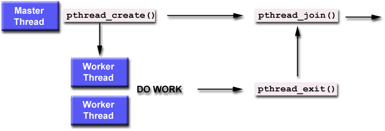

*****************
Thread Management
*****************

**Passing Arguments to Threads**

``The pthread_create()`` routine permits the programmer to pass one argument 
to the thread start routine. For cases where multiple arguments must be passed, 
this limitation is easily overcome by creating a structure which contains all 
of the arguments, and then passing a pointer to that structure in the 
``pthread_create()`` routine. All arguments must be passed by reference and cast to ``void*``.

.. note::

   Question: How can you safely pass data to newly created threads,
   given their non-deterministic start-up and scheduling? 

   ANSWER: Make sure that all passed data is thread safe - that
   it can not be changed by other threads.

**Example 1**

This code fragment demonstrates how to pass a simple integer to each thread. 
The calling thread uses a unique data structure for each thread, insuring that 
each thread's argument remains intact throughout the program.

.. code-block:: c

   long taskids[NUM_THREADS];
   
   for(long t=0; t<NUM_THREADS; t++)
   {
      taskids[t] = t;
      printf("Creating thread %ld\n", t);
      rc = pthread_create(&threads[t], NULL, PrintHello, (void *) taskids[t]);
      ...
   }

:download:`View source file <src_files/hello_arg1.c>`

**Example 2**

This example shows how to setup/pass multiple arguments via a structure. 
Each thread receives a unique instance of the structure.

.. code-block:: c

   struct thread_data{
      int  thread_id;
      int  sum;
      char *message;
   };
   
   struct thread_data thread_data_array[NUM_THREADS];
   
   void *PrintHello(void *threadarg)
   {
      struct thread_data *my_data;
      ...
      my_data = (struct thread_data *) threadarg;
      taskid = my_data->thread_id;
      sum = my_data->sum;
      hello_msg = my_data->message;
      ...
   }
   
   int main (int argc, char *argv[])
   {
      ...
      thread_data_array[t].thread_id = t;
      thread_data_array[t].sum = sum;
      thread_data_array[t].message = messages[t];
      rc = pthread_create(&threads[t], NULL, PrintHello, 
           (void *) &thread_data_array[t]);
      ...
   }

:download:`View source file <src_files/hello_arg2.c>`

**Example 3 (Incorrect)**

This example performs argument passing incorrectly. 
It passes the address of the variable, which is shared memory space 
and visible to all threads. As the loop iterates, the value of this 
memory location changes, possibly before the created threads can access it.

.. code-block:: c

   int rc;
   long t;
   
   for(t=0; t<NUM_THREADS; t++) 
   {
      printf("Creating thread %ld\n", t);
      rc = pthread_create(&threads[t], NULL, PrintHello, (void *) &t);
      ...
   }

:download:`View source file <src_files/hello_arg3.c>`

**Joining and Detaching Threads**

**Joining**

"Joining" is one way to accomplish synchronization between threads. For example:

The ``pthread_join()`` subroutine blocks the calling thread until the specified 
threadid thread terminates. The programmer is able to obtain the target thread's 
termination return status if it was specified in the target thread's call to 
``pthread_exit().``

A joining thread can match one ``pthread_join()`` call. It is a logical error 
to attempt multiple joins on the same thread.
  
**Joinable or Not?**

When a thread is created, one of its attributes defines whether it is joinable or detached. 
Only threads that are created as joinable can be joined. If a thread is created as detached, 
it can never be joined.
  
The ``pthread_detach()`` routine can be used to explicitly detach a thread even though 
it was created as joinable. and there is no converse routine.

Recommendations:

   * If a thread requires joining, consider explicitly creating it as joinable. 
     This provides portability as not all implementations may create threads 
     as joinable by default.

   * If you know in advance that a thread will never need to join with 
     another thread, consider creating it in a detached state. 
     Some system resources may be able to be freed.
     
**Example: Pthread Joining**

.. code-block:: c

   for(t=0; t<NUM_THREADS; t++) 
   {
      rc = pthread_join(thread[t], &status);
      if (rc) 
      {
         fprint(stderr, "pthread_join() error: %s\n", strerror(rc));
         exit(1);
      }
      printf("Main: completed join with thread %ld having a status of %ld\n",t,(long)status);
   }

:download:`View source file <src_files/join.c>`

**Stack Management**

Exceeding the default stack limit is often very easy to do, 
with the usual results: program termination and/or corrupted data.
Safe and portable programs do not depend upon the default stack limit, 
but instead, explicitly allocate enough stack for each thread by using 
the ``pthread_attr_setstacksize`` routine.

The ``pthread_attr_getstackaddr`` and ``pthread_attr_setstackaddr`` routines 
can be used by applications in an environment where the stack for a thread 
must be placed in some particular region of memory.

:download:`View source file <src_files/stack_management.c>`
 
**Miscellaneous Routines**

Note that for both of these routines, the thread identifier objects are opaque 
and can not be easily inspected. Because thread IDs are opaque objects, ``==`` 
should not be used to compare two thread IDs against each other, or to compare 
a single thread ID against another value.

``pthread_once`` executes the ``init_routine`` exactly once in a process. 
The first call to this routine by any thread in the process executes the 
given ``init_routine``, without parameters. Any subsequent call will have no effect.
The ``init_routine`` routine is typically an initialization routine.
The ``once_control`` parameter is a synchronization control structure that requires 
initialization prior to calling ``pthread_once``. For example::
  
   pthread_once_t once_control = PTHREAD_ONCE_INIT;

:doc:`GO TO THE EXERCISE HERE <exercise>`