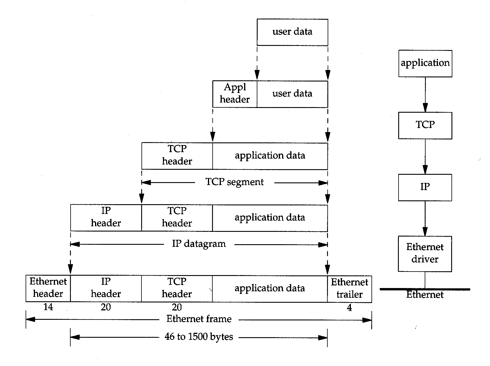

******************
TCP/IP Terminology
******************

The Four layers of TCP/IP suite:

+-------------+-----------------------------------+
| Application | Telnet, FTP, e-mail, etc          |
+-------------+-----------------------------------+
| Transport   | TCP, UDP                          |
+-------------+-----------------------------------+
| Network     | IP, ICMP, IGMP                    |
+-------------+-----------------------------------+
| Linker      | device drivers and interface card |
+-------------+-----------------------------------+

.. image:: images/ethernet_frame_demultiplex.gif

| IP = Internet Protocol
| ICMP = Internet Control Message Protocol
| IGMP = Internet Group Management Protocol
| TCP = Transport Control Protocol
| UDP = User Datagram Protocol
| FTP = File Transfer Protocol
| SMTP = Simple Mail Transport Protocol
| SNMP = Simple Network Management Protocol
| LAN = Local Area Network
| Wan = Wide Area Network
| ARP = Address Resolution Protocol
| RARP = Reverse Address Resolution Protocol
| DNS = Domain Name System
| 
| multiplex
| Definition: consisting of many elements in a complex relationship
| Usage: multiplex ties of work and friendship.
| Definition: involving simultaneous transmission of several messages along a single channel of communication.
| Definition: (of a movie theater) having several separate screens within one building.

.. rubric:: Footnotes

.. [#] `Multiplexing and Demultiplexing <http://macao.communications.museum/eng/Exhibition/secondfloor/moreinfo/2_8_6_Multiplexing.html>`_