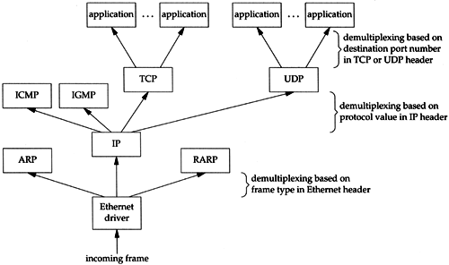

******************
TCP/IP Terminology
******************

The Four layers of TCP/IP suite:

+-------------+-----------------------------------+
| Application | Telnet, FTP, e-mail, etc          |
+-------------+-----------------------------------+
| Transport   | TCP, UDP                          |
+-------------+-----------------------------------+
| Network     | IP, ICMP, IGMP                    |
+-------------+-----------------------------------+
| Linker      | device drivers and interface card |
+-------------+-----------------------------------+

Range for 5 different classes of IP addresses:

+-------+------------------------------+
| Class | Range                        |
+=======+==============================+
| A     | 0.0.0.0 to 127.255.255.255   |
+-------+------------------------------+
| B     | 128.0.0.0 to 191.255.255.255 |
+-------+------------------------------+
| C     | 192.0.0.0 to 223.255.255.255 |
+-------+------------------------------+
| D     | 224.0.0.0 to 239.255.255.255 |
+-------+------------------------------+
| E     | 240.0.0.0 to 255.255.255.255 |
+-------+------------------------------+

IP address structures::

   A: 0    | netid(7 bits)  | hostid(24 bits)
   B: 10   | netid(14 bits) | hostid(16 bits)
   C: 110  | netid(21 bits) | hostid(8 bits)
   D: 1110 | multicast group ID(28 bits)
   D: 1111 | reserved(28 bits)

.. image:: images/tcpip_data_flow_encapsulation.gif

| IP = Internet Protocol
| ICMP = Internet Control Message Protocol
| IGMP = Internet Group Management Protocol
| TCP = Transport Control Protocol
| UDP = User Datagram Protocol
| FTP = File Transfer Protocol
| SMTP = Simple Mail Transport Protocol
| SNMP = Simple Network Management Protocol
| LAN = Local Area Network
| Wan = Wide Area Network
| ARP = Address Resolution Protocol
| RARP = Reverse Address Resolution Protocol
| DNS = Domain Name System
| RFC = Request For Comment
| 
| multiplex
| Definition: consisting of many elements in a complex relationship
| Usage: multiplex ties of work and friendship.
| Definition: involving simultaneous transmission of several messages along a single channel of communication.
| Definition: (of a movie theater) having several separate screens within one building.
|

.. code-block:: sh
   :caption: Snacks

   $ grep ^telnet /etc/services
   telnet           23/udp     # Telnet
   telnet           23/tcp     # Telnet
   $ grep ^domain /etc/services
   domain           53/udp     # Domain Name Server
   domain           53/tcp     # Domain Name Server

.. rubric:: Footnotes

.. [#] `Multiplexing and Demultiplexing <http://macao.communications.museum/eng/Exhibition/secondfloor/moreinfo/2_8_6_Multiplexing.html>`_