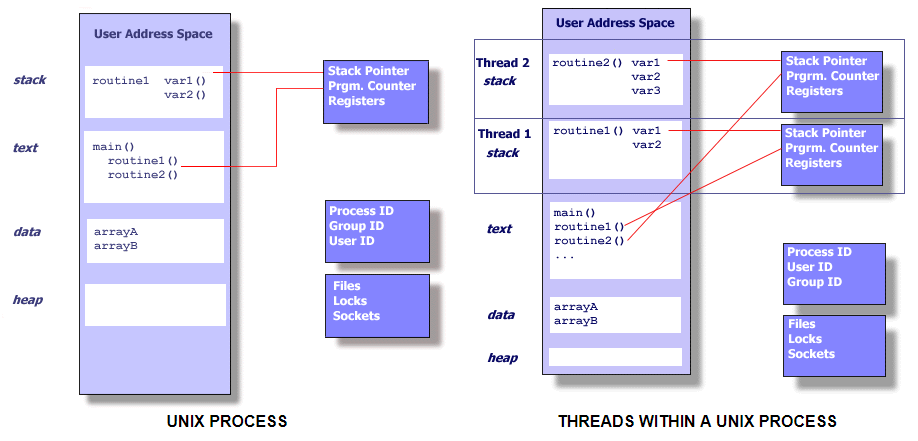

What is a Thread?
=================

* Technically, **a thread is defined as an independent stream of instructions that can be scheduled to run as such by the operating system**. But what does this mean?

* To the software developer, the concept of a "procedure" that runs independently from its main program may best describe a thread.

* To go one step further, imagine a main program (a.out) that contains a number of procedures. Then imagine all of these procedures being able to be scheduled to run simultaneously and/or independently by OS. That would describe a "multithreaded" program.

* How is this accomplished?
  
* Before understanding a thread, one first needs to understand a UNIX process. A process is created by OS, and requires a fair amount of "overhead". Processes contain information about program resources and program execution state, including:
   * Process ID, process group ID, user ID, and group ID
   * Environment
   * Working directory.
   * Program instructions
   * Registers
   * Stack
   * Heap
   * File descriptors
   * Signal actions
   * Shared libraries
   * Inter-process communication tools (such as message queues, pipes, semaphores, or shared memory).

* Threads use and exist within these process resources, yet are able to be scheduled by OS and run as independent entities largely because they duplicate only the bare essential resources that enable them to exist as executable code. This independent flow of control is accomplished because a thread maintains its own:
   * Stack pointer
   * Registers
   * Scheduling properties (such as policy or priority)
   * Set of pending and blocked signals
   * Thread specific data.

* So, in summary, in the UNIX environment a thread:
   * Exists within a process and uses the process resources
   * Has its own independent flow of control as long as its parent process exists and the OS supports it
   * Duplicates only the essential resources it needs to be independently schedulable
   * May share the process resources with other threads that act equally independently (and dependently)
   * Dies if the parent process dies - or something similar
   * Is "lightweight" because most of the overhead has already been accomplished through the creation of its process.

* Because threads within the same process share resources:
   * Changes made by one thread to shared system resources (such as closing a file) will be seen by all other threads.
   * Two pointers having the same value point to the same data.
   * Reading and writing to the same memory locations is possible, and therefore requires explicit synchronization by the programmer.

fork vs pthread
===============

Just in case you don’t know about forking or threads, here is a little clarification. Forking is a UNIX term. 
When you fork a process (a running program), you basically duplicate it, and both resulting processes keep running
from the current point of execution, each with its own copy of the memory (variables and such).
One process (the original one) will be the parent process, while the other (the copy) will be the child.
If you’re a science fiction fan, you might think of parallel universes; the forking operation creates a fork in the timeline,
and you end up with two universes (the two processes) existing independently. Luckily, the processes are able to determine
whether they are the original or the child (by looking at the return value of the :meth:`fork` function), so they can act differently.
(If they couldn’t, what would be the point, really? Both processes would do the same job, and you would just bog down your computer.)

In a forking server, a child is forked off for every client connection.
The parent process keeps listening for new connections, while the child deals with the client.
When the client is satisfied, the child process simply exits.
Because the forked processes run in parallel, the clients don’t need to wait for each other.
Because forking can be a bit resource intensive (each forked process needs its own memory), an alternative exists: threading.
Threads are lightweight processes, or subprocesses, all of them existing within the same (real) process, sharing the same memory.
This reduction in resource consumption comes with a downside, though.
Because threads share memory, you must make sure they don’t interfere with the variables for each other,
or try to modify the same things at the same time, creating a mess. These issues fall under the heading of “synchronization.”

With modern operating systems (except Microsoft Windows, which doesn’t support forking), forking is actually quite fast,
and modern hardware can deal with the resource consumption much better than before.
If you don’t want to bother with synchronization issues, then forking may be a good alternative.

fork
====

The UNIX standards, specifically IEEE Std 1003.1, 2004 Edition, defines a process as 
“an address space with one or more threads executing within that address space, and
the required system resources for those threads."

See :doc:`fork man page <fork_info>`

Pthread API
===========

See :doc:`Pthread API Introduction <pthread/pthread_api>`.